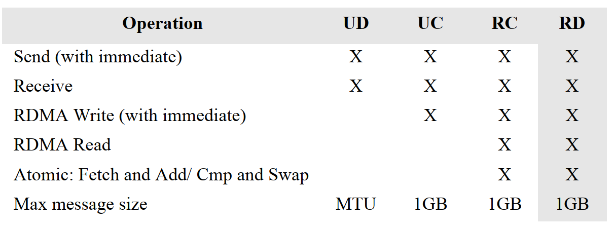

# 目录

## 1 RDMA架构概览

### 1.1 InfiniBand

InfiniBand的一个关键功能是支持原生的远程直接内存访问(RDMA)。

### 1.2 Virtual Protocol Interconnect （VPI）

Mellanox VPI体系结构为支持InfiniBand和以太网的网络适配器和交换机之间的通信提供了高性能、低延迟和可靠的手段。一个VPI适配器或交换机的每个端口都可以设置成IB或以太网模式。

例如，可以将双端口VPI适配器配置为以下选项之一:

- An adapter (HCA) with two InfiniBand ports 
- A NIC with two Ethernet ports 
- An adapter with one InfiniBand port and one Ethernet port at the same time 

类似地，VPI交换机可以有IB端口、以太网端口或两者的混合端口同时工作三种模式。

基于mellanox的VPI适配器和交换机同时支持InfiniBand RDMA和以太网RoCE解决方案。

### 1.3 RDMA over Converged Ethernet (RoCE) 

RoCE是以太网上RDMA的标准，也是由IBTA组织定义和指定的。RoCE为以太网提供了真正的RDMA语义，因为它不需要复杂和低性能的TCP传输(iWARP需要)。

RoCE是目前最有效的低延迟以太网解决方案。它需要非常低的CPU开销，并利用数据中心桥接以太网中的优先级流控制实现无损连接。RoCE自OFED 1.5.1发布以来一直得到Open fabric软件的全面支持。

### 1.4 RDMA技术比较

有三种技术支持RDMA：InfiniBand, Ethernet RoCE and Ethernet iWARP。三种技术都使用相同的用户API，但物理和链路层不一样。**RDMA和传统网络的关键区别在于RDMA提供了一个消息传递服务，应用程序可以使用该服务直接访问远程计算机上的虚拟内存。消息传递服务可用于进程间通信、与远程服务器通信、与存储设备通信，通过使用上层协议(ULPs)，例如RDMA的iSCSI扩展 (iSCSI Extensions for RDMA ，ISER)和SCSI RDMA协议(SRP)，存储消息块(SMB)、Samba、Lustre、ZFS等等**。

RDMA提供的主要好处来自于向应用程序提供RDMA消息服务的方式，以及用于传输和交付这些消息的底层技术。RDMA提供基于通道的IO。该通道允许使用RDMA设备的应用程序直接读写远程虚拟内存。

在传统的套接字网络中，应用程序通过代表它们执行事务的API从操作系统请求网络资源。然而，**RDMA使用操作系统来建立通道，然后允许应用程序直接交换消息，而无需进一步操作系统干预**。消息可以是RDMA读操作、RDMA写操作或Send/Receive操作。IB和RoCE也支持多播传输

IB链路层提供了一些特性，比如用于拥塞控制的基于信用的流控制机制。它还允许使用虚拟通道(VLs)，这允许简化更高层次的协议和高级服务质量。它保证在给定的路径VL内的强有序。

IB传输层提供可靠性和交付保证

IB使用的网络层具有使直接在应用程序的虚拟内存之间传输消息变得简单的特性，即使应用程序实际位于不同的服务器上。因此，将IB传输层与软件传输接口结合起来可以更好地理解为RDMA消息传输服务。整个堆栈，包括软件传输接口，组成了IB消息传递服务。

最重要的一点是，每个应用程序都可以直接访问fabric中设备的虚拟内存。这意味着应用程序不需要向操作系统发出请求来传输消息。与此相反，传统的网络环境中，共享的网络资源由操作系统拥有，用户应用程序不能访问。因此，应用程序必须依赖于操作系统的参与，才能将数据从应用程序的虚拟缓冲区空间通过网络堆栈移动到网络上（全局变量和局部变量的思想）。类似地，在另一端，应用程序必须依赖于操作系统在网络上代表它检索数据，并将其放置在虚拟缓冲区空间中。

TCP/IP/以太网是一种面向字节流的传输方式，用于在套接字应用程序之间传递字节信息。TCP/IP在设计上是有损耗的，但使用了传输控制协议(TCP)实现了可靠性方案。TCP/IP需要操作系统(OS)对每个操作进行干预，包括在连接的两端进行缓冲区复制。在面向字节流的的网络中，消息的边界的概念就丢失了（in a byte stream-oriented network, the idea of a message boundary is lost）。当应用程序要发送数据包时，OS将字节放入属于操作系统的主内存中的匿名缓冲区中，当字节传输完成时，OS将缓冲区中的数据复制到应用程序的接收缓冲区中。每次数据包到达时都会重复这个过程，直到接收到整个字节流为止。TCP负责重新传输由于拥塞而丢失的数据包。

**在IB中，完整的消息直接传递给应用程序。一旦应用程序请求传输RDMA读或写，IB硬件根据需要将超出大小的消息分割成数据包，数据包的大小由fabric路径最大传输单元决定。这些数据包通过IB网络传输，并直接交付到接收应用程序的虚拟缓冲区，在那里它们被重新组装成完整的消息。一旦接收到整个消息，接收应用程序就会收到通知。因此，在整个消息被发送到接收应用程序的缓冲区之前，发送应用程序和接收应用程序都不涉及。**（HCA有没有自己的内存？还是每次传输都要绑定应用的内存？）

### 1.5 关键组件

我们不讨论电缆和连接器。

#### Host Channel Adapter （HCA）

HCA在操作系统的控制下提供地址转换机制，允许应用程序直接访问HCA。相同的地址转换机制是HCA代表用户层应用程序访问内存的方法。**（地址转换机制的意思：）应用程序引用虚拟地址，而HCA能够将这些地址转换为物理地址，从而影响实际的消息传输**。

#### Range Extenders 

InfiniBand range extension is accomplished by encapsulating the InfiniBand traffic onto the
WAN link and extending sufficient buffer credits to ensure full bandwidth across the WAN 。

#### Subnet Manager 

InfiniBand子网管理器将本地标识符(LIDs)分配给连接到IB网络中每个端口，维护了一个基于所分配的LID的路由表。IB子网管理器是软件定义网络(SDN)的一个概念，它消除了互连的复杂性，并支持创建非常大规模的计算和存储基础设施。

#### Switches 

IB交换机在概念上类似于标准网络交换机，但其设计目的是满足IB的性能要求。它们实现了IB链路层的流控制，以防止丢包，并支持拥塞避免和自适应路由功能，并具有高级的服务质量（QoS）。**许多交换机包括子网管理器。配置IB结构至少需要一个子网管理器**。

### 1.6 支持现有应用和ULP

## 2 RDMA-Aware 编程概览

VPI体系结构允许直接以用户模式访问硬件。Mellanox提供了一个动态加载的库，通过verb API创建对硬件的访问。此文档包含verbs及其相关的输入、输出、描述和通过操作系统编程接口公开的功能。

> 注意：此编程手册及其verbs仅对用户空间有效。有关内核空间verbs，请参见头文件。

使用谓词编程允许定制和优化RDMA-Aware网络。这种定制和优化应该只由具有高级知识和VPI系统经验的程序员来完成。<!-- This customizing and optimizing should be done only by programmers with advanced knowledge and experience in the VPI systems  -->

为了执行RDMA操作，首先需要建立到远程主机的连接，并设置适当的权限。实现这一点的机制是队列对(QP)。对于那些熟悉标准IP堆栈的人来说，QP大致相当于套接字。QP需要在连接的两端初始化。通信管理器(CM)可用于在实际QP设置之前交换有关QP的信息。一旦建立了QP，verbs API就可以用来执行RDMA读取、RDMA写入和原子操作。还可以执行与套接字读/写类似的串行发送/接收操作。

### 2.1 可用的通信操作

#### 2.1.1 Send/Send With Immediate 

**

#### 2.1.2 Receive 

#### 2.1.3 **RDMA Read

从远程主机读取内存的一部分。调用者指定要复制到的远程虚拟地址和本地内存地址。在执行RDMA操作之前，远程主机必须提供访问其内存的适当权限。一旦设置了这些权限，RDMA读取操作将在不通知远程主机的情况下执行。对于RDMA读和写，远程端都不知道正在执行此操作(除了准备权限和资源之外)。

#### 2.1.5 Atomic Fetch and Add / Atomic Compare and Swap 

### 2.2  传输模式

在建立QP时，您可以选择几种不同的传输模式。每种模式下可用的操作如下表所示。RD不受此API支持。

### 2.2.1 Reliable Connection (RC) 

队列对只与另一个QP关联。

由一个QP的发送队列传输的消息可靠地传递到另一个QP的接收队列。

数据包按顺序发送。

RC连接非常类似于TCP连接。

#### 2.2.2 Unreliable Connection (UC) 

- 队列对只与另一个QP关联。
- 连接不可靠，因此数据包可能丢失。
- transport 不会重试带有错误的消息，错误处理必须由更高级别的协议提供。

#### 2.2.3 Unreliable Datagram (UD) 

- 队列对可以向任何其他UD QP发送和接收单包消息。
- 顺序和交付没有保证，并且交付的包可能被接收者丢弃。
- 支持多播消息(一对多)。
- UD连接非常类似于UDP连接。

### 2.3 关键概念

#### 2.3.1 Send Request (SR) 

SR定义将发送多少数据，从何处、如何发送以及使用RDMA将数据发送到何处。
结构ibv_send_wr用于实现SRs。

#### 2.3.2 Receive Request (RR) 

RR定义了为非rdma操作接收数据的缓冲区。如果没有定义缓冲区，并且发送器试图立即执行发送操作或RDMA写操作，则会发送一个接收未就绪(RNR)错误。结构ibv_recv_wr用于实现RRs。

#### 2.3.3 Completion Queue 

完成队列是一个对象，它包含已发布到工作队列(WQ)的已完成工作请求。每一个完成都表明一个特定的WR已经完成
(成功完成WRs和未成功完成WRs)。完成队列是一种通知应用程序关于已结束工作的信息的机制
请求(状态、操作码、大小、源)。CQs有n个完成队列条目(CQE)。创建CQ时指定CQEs的数量。CQ可以为发送队列、接收队列或两者都提供服务。
来自多个QPs的工作队列可以与单个CQ关联。struct ibv_cq用于实现CQ。

#### 2.3.4 Memory Registration 

内存注册是一种机制，它允许应用程序将一组虚拟连续内存位置或一组物理上连续的内存位置描述给网络适配器，作为使用虚拟地址的虚拟连续缓冲区。

注册过程将内存页固定(以防止页被交换出去，并保持物理<->虚拟映射)。

在注册期间，OS检查已注册块的权限。
注册过程将虚拟到物理地址表写入网络适配器。

注册内存时，将为该区域设置权限。权限包括本地写、远程读、远程写、原子和绑定。
每个MR都有一个远程和一个本地密钥(r_key, l_key)。本地HCA使用本地键访问本地内存，例如在接收操作期间。远程键被赋予远程,允许远程进程在RDMA操作期间访问系统内存。

相同的内存缓冲区可以注册多次(即使具有不同的访问权限)，每次注册都会产生一组不同的密钥。
struct ibv_mr用于实现内存注册。

#### 2.3.5 Memory Window 

MW允许应用程序更灵活地控制对其内存的远程访问。内存窗口适用于以下情况:

- 希望以动态方式授予和撤消对已注册区域的远程访问权限，其性能损失小于使用注销/注册或重新注册。
- 希望向不同的远程代理授予不同的远程访问权限，并/或在注册区域内的不同范围内授予这些权限。

将MW与MR相关联的操作称为绑定。

#### 2.3.6 Address Vector 

#### 2.3.7 Global Routing Header (GRH) 

2.3.9 Asynchronous Events 

## 3 VPI Verbs API

