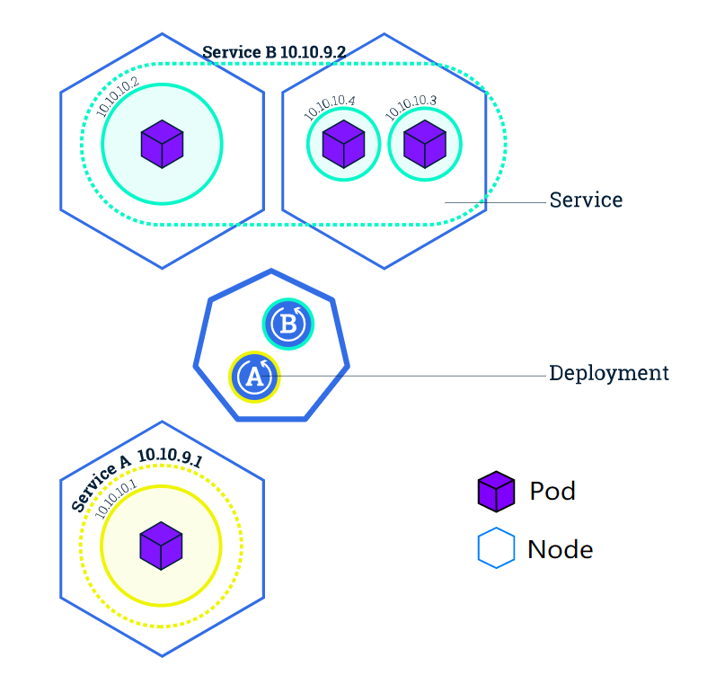

[TOC]

## 基础

### Pod

### Service

A Service in Kubernetes is an abstraction which defines a logical set of Pods and a policy by which to access them.Discovery and routing among dependent Pods (such as the frontend and backend components in an application) is handled by Kubernetes Services.

Services match a set of Pods using [labels and selectors](https://kubernetes.io/docs/concepts/overview/working-with-objects/labels), a grouping primitive that allows logical operation on objects in Kubernetes:

标签可以在创建时或之后附加到对象上。它们可以随时修改。

### control-plane

control-plane node指的是control-plane组件运行的机器。control-plane组件包括etcd和api server。api server是kubectl访问的服务端。