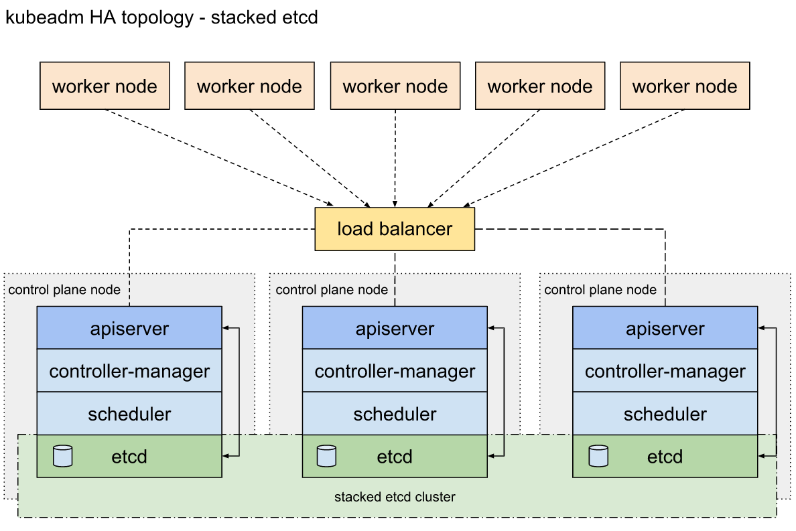
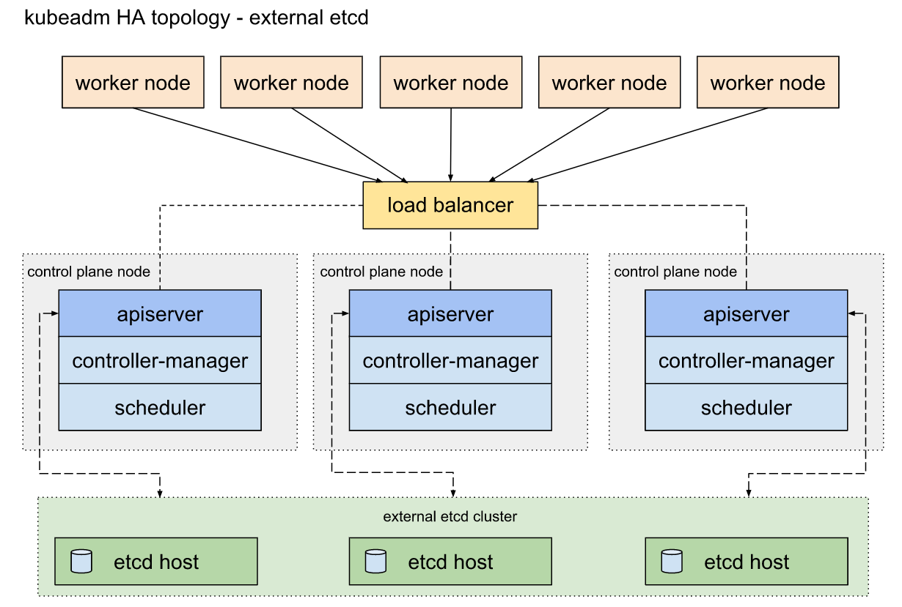

[TOC]


# Getting Started

## 生产环境

### 使用部署工具安装k8s

#### kubeadm

#####  高可用拓扑

https://kubernetes.io/docs/setup/production-environment/tools/kubeadm/ha-topology/

这个页面解释了配置高可用性(HA) Kubernetes集群拓扑的两个选项：

- 使用堆叠的控制平面节点，etcd节点与控制平面节点部署在一起
- 使用外部etcd节点，etcd在与控制平面不同的节点上运行

在设置HA集群之前，应该仔细考虑每种拓扑的优缺点。

###### 堆叠的etcd拓扑

堆叠的HA集群是一种拓扑结构，etcd提供的分布式数据存储集群被堆叠在kubeadm管理的节点形成的集群的顶部。

每个控制平面节点运行一个kube-apiserver，kube-scheduler和kube-controller-manager实例。kube-apiserver使用负载均衡暴露给worker节点。**每个控制平面节点创建一个本地etcd成员，该etcd成员仅与该节点的kube-apiserver通信。kube-controller-manager和kube-scheduler也一样，只和本地apiserver进行通信**。

这种拓扑将控制平面和etcd成员耦合在相同的节点上。它的设置比使用外部etcd节点的集群更简单，而且对于冗余的管理也更简单。但是，如果一个节点宕机，etcd成员和控制平面实例都将丢失，冗余也将受到影响。您可以通过添加更多的控制平面节点来降低这种风险。因此，您应该为一个HA集群运行至少三个堆叠的控制平面节点。这种拓扑是kubeadm的默认拓扑，如下图所示：



###### 外部etcd拓扑

带有外部etcd的HA集群是一种拓扑结构，其中etcd提供的分布式数据存储集群位于运行控制平面组件的节点形成的集群的外部。

与堆叠的etcd拓扑一样，外部etcd拓扑中的每个控制平面节点都运行一个kube-apiserver、kube-scheduler和kube-controller-manager实例。但是，etcd成员运行在不同的主机上，每个etcd主机与每个控制平面节点的kube-apiserver通信。

该拓扑将控制平面和etcd成员解耦。因此，它提供了一个HA设置，丢失一个控制平面实例或etcd成员影响较小，并且对集群冗余的影响不像堆栈HA拓扑那么大。

但是，这种拓扑需要的主机数量是堆叠HA拓扑的两倍。对于具有这种拓扑结构的HA集群，至少需要3台用于控制平面节点的主机和3台用于etcd节点的主机。



#### 使用kubeadm创建高可用集群

https://kubernetes.io/docs/setup/production-environment/tools/kubeadm/high-availability/

本页解释了使用kubeadm设置高可用的Kubernetes集群的两种不同方法:

- 使用堆叠的控制平面节点
- 使用外部的etcd集群

**外部etcd集群**

使用外部etcd节点设置集群与使用堆叠etcd的过程类似，但是您应该首先设置etcd，并且您应该在kubeadm配置文件中传递etcd信息。


# Tutorials

## 基础

https://kubernetes.io/docs/tutorials/kubernetes-basics/

### K8S简介

现代的web服务，用户希望应用程序能够7*24小时全天候可用，而开发人员希望一天能够部署几次这些应用程序的新版本。容器化帮助打包软件来实现这些目标，使应用程序能够以一种简单而快速的方式发布和更新，而不需要停机。Kubernetes帮助您确保这些容器化应用程序在您需要的地方和时间运行，并帮助它们找到工作所需的资源和工具。

### 创建一个K8S集群

集群就是一群连起来的计算节点。k8s会将容器部署到集群中，而不需指定单个机器。

Kubernetes集群由两类资源组成:

- Master节点协调集群
- Node节点运行应用

Master负责管理集群，协调集群中的所有活动，比如调度应用程序、维护应用程序所需的状态、扩展应用程序和推出新的更新。

Node是作为Kubernetes集群中的worker的VM或物理计算机。每个节点都有一个Kubelet，它是管理节点并与Kubernetes主机通信的代理。节点还应该具有处理容器操作的工具，如Docker或rkt。处理生产流量的Kubernetes集群应该至少有三个节点。

在Kubernetes上部署应用时，告诉master启动应用容器，master将容器调度到集群中的一个节点运行。节点使用master 暴露的Kubernetes API与主节点通信。终端用户还可以直接使用Kubernetes API与集群交互。


### 部署一个应用

部署应用到K8S上需要创建一个Deployment配置文件。Deployment指导Kubernetes如何创建和更新应用的实例。一旦创建了Deployment，Kubernetes master就会将应用实例放到集群中的各个节点上。

一旦创建了应用实例，Kubernetes部署控制器就会持续监视这些实例。如果承载实例的节点宕机或被删除，部署控制器将使用集群中另一个节点上的实例替换该实例。这提供了一种自修复机制来处理机器故障或维护。

Kubectl使用Kubernetes API与集群交互。

创建Deployment时，需要为应用指定容器镜像和要运行的副本数量。稍后可以通过更新Deployment来更改这些信息。

Pod中的容器共享以下资源：

- 共享存储，如卷
- 网络，使用唯一的集群IP地址
- 关如何运行每个容器的信息，如容器映像版本或要使用的特定端口

Pod中的容器是相对紧密耦合的。Pod中的容器共享一个IP地址和端口空间，总是同时定位和同时调度，并在同一节点上的共享上下文中运行。

每个Node节点包括：

- Kubelet，负责Kubernetes主节点和节点之间通信的进程;它管理运行在机器上的Pod和容器
- 容器运行时，如Docker

应用通常发送到STDOUT的任何内容都会成为Pod中容器的日志。

# Tasks

## 配置Pod和容器

### 为容器和Pod分配内存

https://kubernetes.io/docs/tasks/configure-pod-container/assign-memory-resource/#before-you-begin

卡在执行以下命令：

```shell
kubectl top pod memory-demo --namespace=mem-example
```


## 管理K8S对象

### 使用配置文件对Kubernetes对象进行声明式管理

通过在一个目录中存储多个对象配置文件并使用kubectl apply按需递归地创建和更新这些对象，可以创建、更新和删除Kubernetes对象。

声明性对象配置需要对Kubernetes对象定义和配置有深入的理解。


### Managing Kubernetes Objects Using Imperative Commands


## 运行应用

### 使用Deployment运行一个无状态应用


## 监控，日志，调试
### Resource metrics pipeline

资源使用度量，例如容器CPU和内存使用，可以通过度量API在Kubernetes中获得。这些指标可以由用户直接访问，例如使用kubectl top命令，也可以由集群中的控制器使用，如Horizontal Pod Autoscaler，来做决定。

**The Metrics API**
API要求在集群中部署metrics服务器。否则它将不可用。这个API不存储度量值，因此无法获得给定节点10分钟前使用的资源总量


## something

### 配置对多个集群的访问

在一个或多个配置文件中定义了集群、用户和上下文之后，可以使用`kubectl config use-context`命令在集群之间快速切换。需要注意的是，用于配置对集群的访问的文件有时称为kubeconfig文件，这是关于配置文件的一种通用叫法。这并不意味着有一个名为kubeconfig的文件。

假设您有两个集群，一个用于开发工作，另一个用于临时工作。在开发集群中，前端开发人员在名为frontend的名称空间中工作，而存储开发人员在名为storage的名称空间中工作。在scratch集群中，开发人员使用默认的名称空间，或者创建他们认为合适的辅助名称空间。访问开发集群需要通过证书进行身份验证。访问scratch集群需要通过用户名和密码进行身份验证。

KUBECONFIG环境变量是一系列配置文件的路径列表。如果您有一个KUBECONFIG环境变量，请熟悉列表中的配置文件。


# Reference

## 标准术语表

### 基本术语

**API server**

也称为:kube-apiserver。API server是控制平面的一个组件，它公开了Kubernetes API。API server是Kubernetes控制平面的前端。kube-apiserver被设计成水平伸缩——也就是说，它通过部署更多实例来伸缩。您可以运行kube-apiserver的多个实例，并在这些实例之间平衡流量。


## 访问API

### K8S API的访问控制

用户使用kubectl、client库或通过REST请求访问API。可以对人类用户和Kubernetes服务帐户进行API访问授权。当一个请求到达API时，它会经历几个阶段，如下图所示:


在一个典型的Kubernetes集群中，API服务于端口443。API服务器提供一个证书。这个证书通常是自签名的，用户机器上的$USER/.kube/config通常包含API服务器证书的根证书，当指定该证书时，它将代替系统默认的根证书。当你自己使用kube-up.sh创建集群时，此证书通常自动写入您的$USER/.kube/config。如果集群有多个用户，那么创建者需要与其他用户共享证书。

#### 身份验证（Authentication）

一旦建立了TLS, HTTP请求就转移到身份验证步骤。这在图中显示为步骤1。集群创建脚本或集群管理员将API服务器配置为运行一个或多个Authenticator模块。Authenticator在这里有更详细的描述。认证步骤的输入是整个HTTP请求，但是，它通常只检查报头和/或客户端证书。身份验证模块包括客户端证书、密码和普通令牌、引导令牌和JWT令牌(用于服务帐户)。可以指定多个身份验证模块，在这种情况下，依次尝试每个模块，直到其中一个成功为止。在GCE上，客户端证书、密码、普通令牌和JWT令牌都是启用的。

如果请求不能通过身份验证，它将被HTTP状态码401拒绝。否则，用户将被认证为特定的用户名，后续步骤可以使用该用户名进行决策。一些验证器还提供用户的组成员身份，而其他验证器不提供。虽然Kubernetes使用用户名进行访问控制决策和请求日志记录，但它没有用户对象，也不将用户名或其他关于用户的信息存储在其对象存储中。


#### 授权（Authorization）

在将请求验证为来自特定用户之后，必须对该请求进行授权。如图2所示。请求必须包含请求者的用户名、请求的操作和受操作影响的对象。如果现有策略声明用户具有完成请求操作的权限，则请求将被授权。

Kubernetes授权要求您使用公共REST属性与现有的组织级或云提供程序级访问控制系统进行交互。使用REST格式很重要，因为这些控制系统可能与Kubernetes API之外的其他API交互。

Kubernetes支持多个授权模块，如ABAC模式、RBAC模式和Webhook模式。当管理员创建集群时，他们配置了API服务器中应该使用的授权模块。如果配置了多个授权模块，Kubernetes将检查每个模块，如果有任何模块授权请求，则可以继续执行请求。如果所有模块都拒绝请求，那么请求将被拒绝(HTTP状态码403)。


#### 许可控制（Admission Control）

许可控制模块是可以修改或拒绝请求的软件模块。除了授权模块可用的属性之外，允许控制模块还可以访问正在创建或更新的对象的内容。**它们作用于正在创建、删除、更新或连接的对象(代理)，但不作用于读取**。

可以配置多个允许控制器。每一个都是按顺序调用的。如图3所示。

与身份验证和授权模块不同，如果任何许可控制器模块拒绝，则请求立即被拒绝。

除了拒绝对象之外，允许控制器还可以为字段设置复杂的默认值。一旦请求通过了所有的许可控制器，就已经使用验证例程为对应的API对象完成了验证，然后将其写入对象存储(如步骤4所示)。

> 1.16默认启用的准入控制模块是：NamespaceLifecycle, LimitRanger, ServiceAccount, TaintNodesByCondition, Priority, DefaultTolerationSeconds, DefaultStorageClass, StorageObjectInUseProtection, PersistentVolumeClaimResize, MutatingAdmissionWebhook, ValidatingAdmissionWebhook, RuntimeClass, ResourceQuota


### 身份验证

#### 用户

所有Kubernetes集群都有两类用户:Kubernetes管理的服务帐户和普通用户。

普通用户被认为是由外部独立的服务管理的。一个管理员分发私人密钥，一个用户存储像Keystone或谷歌帐户，甚至一个文件与用户名和密码的列表。在这方面，Kubernetes没有代表普通用户帐户的对象。不能通过API调用将普通用户添加到集群中。

相反，服务帐户是由Kubernetes API管理的用户。它们被绑定到特定的名称空间，并由API服务器自动创建或通过API调用手动创建。服务帐户被绑定到一组作为Secret存储的凭证，这些凭证被挂载到pod中，允许集群内的进程与Kubernetes API通信。

API请求与普通用户或服务帐户绑定，或者作为匿名请求处理。这意味着集群内外的每个进程，从在工作站上输入kubectl的用户到节点上的kubelet，再到控制平面上的成员，在向API服务器发出请求时都必须进行身份验证，否则将被视为匿名用户。

#### 身份验证策略

Kubernetes使用客户端证书、承载令牌、认证代理或HTTP基本认证来通过认证插件对API请求进行认证。当HTTP请求被发送到API服务器时，插件尝试将以下属性与请求关联起来:

- Username: 标识最终用户的字符串。常见值可能是kube-admin or jane@example.com
- UID: 标识最终用户并试图比用户名更一致和唯一的字符串
- Groups: 一组字符串，它将用户与一组分组的用户相关联
- Extra fields: 其他授权人可能会觉得有用的信息

所有值对身份验证系统都是不透明的，只有在由授权方解释时才有意义。您可以同时启用多个身份验证方法。你通常应该使用至少两种方法:

- 服务帐户令牌用于服务帐户
- 至少一种用于用户身份验证的其他方法

当启用多个验证器模块时，第一个模块将成功验证请求短路评估。API服务器不保证验证器的运行顺序。

system:authenticated组包含在所有已验证用户的组列表中。可以使用身份验证代理或身份验证webhook完成与其他身份验证协议(LDAP、SAML、Kerberos、备用x509方案等)的集成。

##### X509 Client Certs

通过将`--client-ca-file=SOMEFILE`选项传递给API服务器来启用client证书身份验证。

> 默认该证书文件在/etc/kubernetes/pki/ca.crt

引用的文件必须包含一个或多个证书颁发机构，用于验证提交给API服务器的客户端证书。如果提供了客户端证书并进行了验证，则使用subject的名称作为请求的用户名。从Kubernetes 1.4开始，客户端证书还可以使用证书的组织字段来指示用户的组成员关系。若要为用户包含多个组成员关系，请在证书中包含多个组织字段。例如，使用openssl命令行工具生成证书签名请求:


##### Service Account Tokens

服务帐户通常由API服务器自动创建，并通过ServiceAccount准入控制器与集群中运行的pod相关联。承载令牌被挂载到已知位置的pods中，并允许集群内的进程与API服务器通信。

服务帐户承载令牌在集群之外使用是完全有效的，可以用于为希望与Kubernetes API通信的长期作业创建身份。