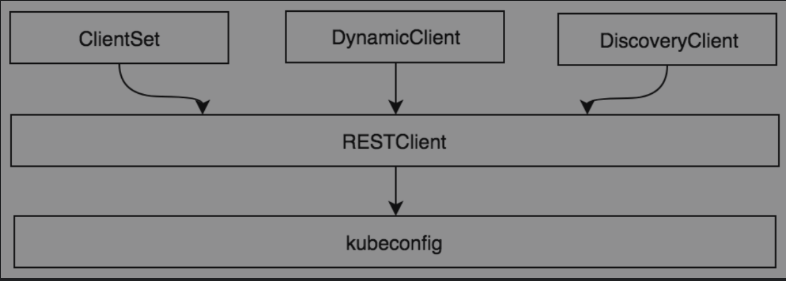
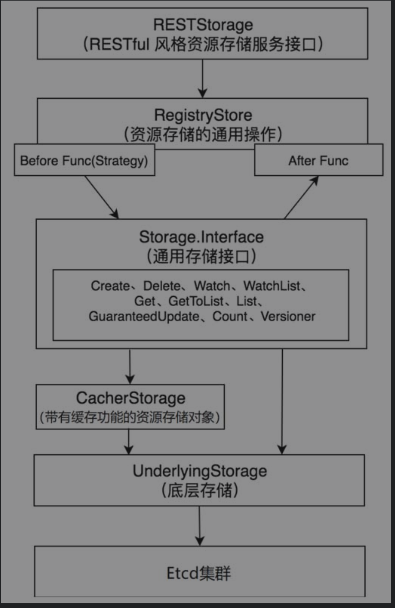

## 常识

- 不同版本的资源进行转换时，统一先转换成内部版本，再转换到目标版本

## Resource

 核心组资源放在：pkg/api 目录下

非核心组资源放在：pkg/apis 目录下

各个资源组的代码放在：pkg/apis/<group>/ ,其下各个目录和文件的作用：

- 本目录下的文件放 内部版本 的资源文件
- v1/v1beta1/v1beta2 放外部版本
- install 将本资源组的资源注册到全局注册表 (Scheme) 中，包括内部版本和外部版本，调用各个版本的 register.go 中的 AddToScheme 将本 Version 的资源注册到注册表中
- validation : 定义了资源的验证方法

k8s.io/kubernetes/pkg/api/legacyscheme.Scheme ：kube-apiserver组件的全局注册表


## 重要对象 

### runtime.Scheme

- SetVersionPriority : 设置同个资源组目录下的各个 Version 的优先级
- PreferredVersionAllGroups: 获取所有资源组及其首选版本
- PrioritizedVersionsForGroup：获取指定资源组的资源版本，按照优先级返回
- PrioritizedVersionsAllGroups：获取所有资源组的资源版本，按照优先级返回


### runtime.Object

它实际上是一个接口，定义在：vendor/k8s.io/apimachinery/pkg/runtime/interfaces.go 中，所有注册到Schem中的资源都必需实现该接口，它包含了两个方法：

- GetObjectKind() : 得到对象的 GVK (schema.ObjectKind)，k8s 的每个资源对象都嵌入了一个 metav1.TypeMeta 类，它们实现了该方法
- DeepCopyObject()

### runtime.Unstructured

表示非结构化数据，定义在：vendor/k8s.io/apimachinery/pkg/runtime/interfaces.go

### runtime.Scheme

资源注册表，是个结构体，定义在：vendor/k8s.io/apimachinery/pkg/runtime/scheme.go，它有以下 4 个字段：

- gvkToType: 存储 gvk 和 Type 的映射关系
- typeToGVK: 存储 type 和 gvk 的映射关系
- unversionedTypes: 存储 unversoinedType 和 gvk 的映射关系
- unvesionedKind : Kind 名称与 unversoinedType 的映射关系

方法：

```go
AddKnownTypes //将 KnownType 资源添加到注册表
AddUnversionedTypes // 将 UnversionedType 资源添加到注册表, Kind 默认使用 reflect.Type 的名字
AddKnownTypeWithName // 需提供 Kind 的名字

// 查询指定 GV 下的资源类型
func (s *Scheme) KnownTypes(gv schema.GroupVersion) map[string]reflect.Type

// 所有 gv 下的资源
func (s *Scheme) AllKnownTypes() map[schema.GroupVersionKind]reflect.Type

// 查询资源对象所属的 gvk，一个资源对象可能对应多个 gvk，如果资源对象是 unversioned，则返回 true，如果 obj 不是一个指针或没有注册，则返回 err
func (s *Scheme) ObjectKinds(obj Object) ([]schema.GroupVersionKind, bool, error)

// 查询 gvk 对应的对象，如果没有注册，则返回 err
func (s *Scheme) New(kind schema.GroupVersionKind) (Object, error)

// 判断资源组是否已注册
func (s *Scheme) IsGroupRegistered(group string) bool

// 判断 gvk 是否已注册
func (s *Scheme) Recognizes(gvk schema.GroupVersionKind) bool

// 判断资源对象是否属于 UnversionedType 类型
func (s *Scheme) IsUnversioned(obj Object) (bool, bool)
```


- 

### metav1.Verbs

vendor/k8s.io/apimachinery/pkg/apis/meta/v1/types.go


### 资源对象

5 个必需字段：

- apiVersion
- kind
- metadata
- spec: 定义期望状态 (desired state)
- status: 实际状态 (actual state)


## Codec 编解码器

代码路径：vendor/k8s.io/apimachinery/pkg/runtime/interfaces.go

Serializer 接口：

```go
type Serializer interface {
	Encoder
	Decoder
}
type Codec Serializer
```

k8s 目前支持 3 种序列化器：json/yaml/protobuf，对 etcd 集群中的数据进行编解码操作


## Client-go

几种 Client 客户端：




- ClientSet 是代码生成的，只能处理 kubernetes 内置资源
- 由于Kubernetes的事件是一种资源对象，因此它们存储在KubernetesAPI Server的Etcd集群中。为避免磁盘空间被填满，故强制执行保留策略：在最后一次的事件发生后，删除1小时之前发生的事件

## 代码生成器

### client-gen

代码生成器是一个可执行文件，它会生成 ClientSet 代码，源码位置：k8s.io/code-generator/cmd/client-gen

除手动构建client-gen代码生成器并生成代码外，也可以执行Kubernetes提供的代码生成脚本，后者的代码生成过程与上述过程完全相同。Kubernetes代码生成脚本的路径为hack/update-codegen.sh

tags : // +genclient


###  lister-gen

为资源生成 Lister，即 Get 和 List 方法

lister-gen代码生成器与其他代码生成器相比，其并没有可用的Tags，它依赖于client-gen的代码生成器//+genclient标签

### informer-gen

## Etcd

Etcd集群是分布式K/V存储集群，提供了可靠的强一致性服务发现

存储架构：



### RESTStorage
实现了RESTful风格的对外资源存储服务的API接口

Kubernetes的每种资源实现的RESTStorage接口一般定义在pkg/registry/<资源组>/<资源>/storage/storage.go中

### RegistryStore

代码路径：vendor/k8s.io/apiserver/pkg/registry/generic/registry/store.go


- Storage.Interface
- CacherStorage
- UnderlyingStorage：底层存储，也被称为BackendStorage（后端存储），是真正与Etcd集群交互的资源存储对象，CacherStorage相当于UnderlyingStorage的缓存层。UnderlyingStorage同样也是Storage.Interface通用存储接口的实现