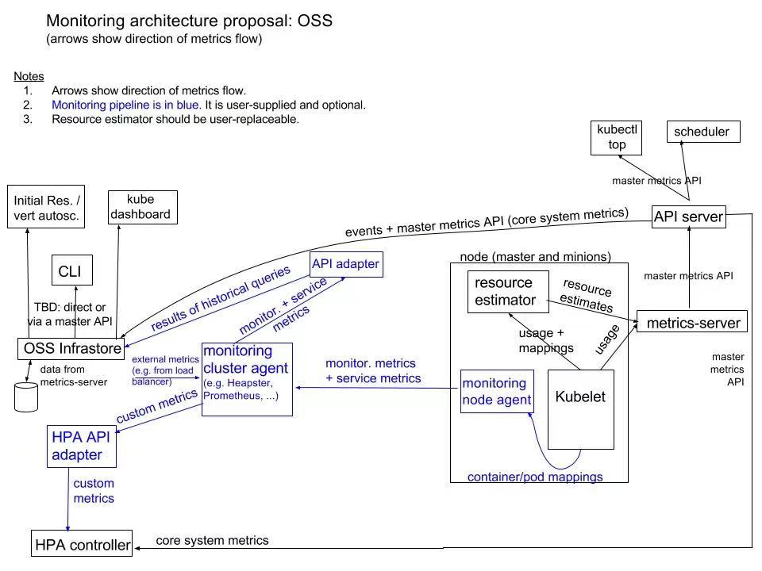
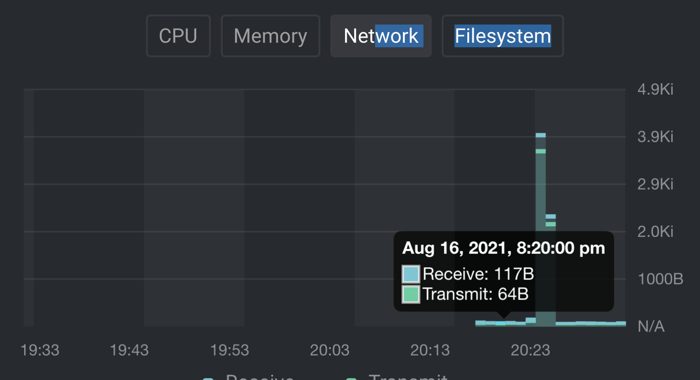

[TOC]

## metrics-server 安装

下载 manifest

```shell
wget https://github.com/kubernetes-sigs/metrics-server/releases/download/v0.5.0/components.yaml
```
修改 components.yaml 文件，在 args 下面添加以下两行内容，不校验证书，不然会报 x509 错误
```
- --kubelet-preferred-address-types=InternalIP,Hostname,InternalDNS,ExternalDNS,ExternalIP
- --kubelet-insecure-tls
```


## Core metrics

https://kubernetes.io/docs/tasks/debug-application-cluster/resource-metrics-pipeline/

Metrics API 不存储 metrics 数据（应该是存储在 api-server 的 etcd 中），所以它只能用来获取 pod 或 node 当前的资源使用量，不能用来获取历史的数据。

CPU 使用量信息的获取：操作系统内核中有一个累积的 CPU 计数器，通过一定速率的采集得到。kubelet 会选择计算速率的窗口

Metrics Server 从 Summary API 采集数据，这个 API 是由 kubelet 暴露的。


https://yasongxu.gitbook.io/container-monitor/yi-.-kai-yuan-fang-an/di-1-zhang-cai-ji/metrics-server

Metrics Server 会注册到 api-server 的聚合层，这样请求到 api-server 的 `/apis/metrics.k8s.io/` 就会转发给 Metrics Server，然后 metrics-server 通过调用 Kubelet Summary API 获取数据




metrics-server属于Core metrics(核心指标)，提供API metrics.k8s.io，仅提供Node和Pod的CPU和内存使用情况。而其他Custom Metrics(自定义指标)由Prometheus等组件来完成

https://www.servicemesher.com/blog/prometheus-monitor-k8s-1/

**cAdvisor**: 来自 Google 的容器监控工具，也是 Kubelet 内置的容器资源收集工具。它会自动收集本机容器 CPU、内存、网络和文件系统的资源占用情况，并对外提供 cAdvisor 原生的 API。随 kubelet 启动 –cadvisor-port = 1


## Custom metrics

- [node-exporter](https://github.com/prometheus/node_exporter)：prometheus的export，收集Node级别的监控数据

- [prometheus](https://prometheus.io/)：监控服务端，从node-exporter拉数据并存储为时序数据。

- [kube-state-metrics](https://github.com/kubernetes/kube-state-metrics)：将prometheus中可以用PromQL查询到的指标数据转换成k8s对应的数

- [k8s-prometheus-adpater](https://github.com/directxman12/k8s-prometheus-adapter)：聚合进apiserver，即一种[custom-metrics-apiserver](https://github.com/kubernetes-incubator/custom-metrics-apiserver)实现

开启Kubernetes aggregator功能（参考上文metric-server）

Pod 的网络流量：



## 问题

- 如何查询历史数据？

