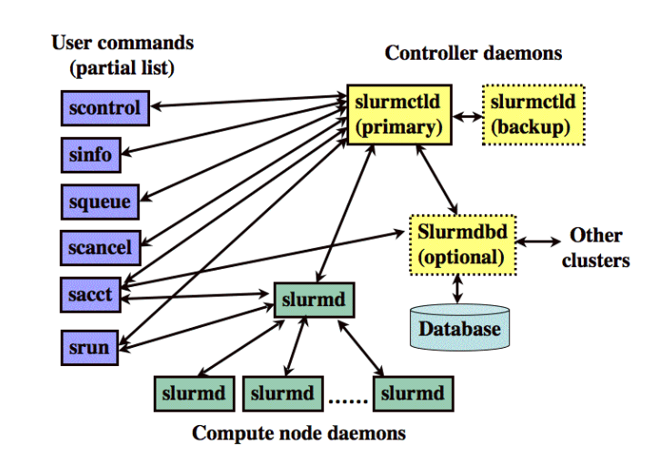

[TOC]

# 安装


## 安装

### CentOS

```shell
# 创建全局用户
export MUNGEUSER=991
groupadd -g $MUNGEUSER munge
useradd  -m -c "MUNGE Uid 'N' Gid Emporium" -d /var/lib/munge -u $MUNGEUSER -g munge  -s /sbin/nologin munge
export SLURMUSER=992
groupadd -g $SLURMUSER slurm
useradd  -m -c "SLURM workload manager" -d /var/lib/slurm -u $SLURMUSER -g slurm  -s /bin/bash slurm

# 创建munge key
yum install epel-release
yum install munge munge-libs munge-devel -y
yum install rng-tools -y
rngd -r /dev/urandom

/usr/sbin/create-munge-key -r
dd if=/dev/urandom bs=1 count=1024 > /etc/munge/munge.key
chown munge: /etc/munge/munge.key
chmod 400 /etc/munge/munge.key
chown -R munge: /etc/munge/ /var/log/munge/
chmod 0700 /etc/munge/ /var/log/munge/
systemctl enable munge
systemctl start munge

# 创建slurm rpm包
wget https://download.schedmd.com/slurm/slurm-20.02.0.tar.bz2
# 解压源码
tar --bzip -x -f  slurm-20.02.0.tar.bz2
# 编译安装
cd slurm-20.02.0
./configure
make
make install

# 启动slurm
vim /usr/local/etc/slurm.conf # 可以在网页上生成配置文件
slurmctld  # 可能要把/var/spool的权限改一下，如777
cp cgroup.conf.example /usr/local/etc/cgroup.conf
slurmd


# rpm安装（未成功）
yum install rpm-build
yum install readline-devel perl pam-devel perl-ExtUtils-MakeMaker.noarch python3
yum install openssl openssl-devel pam-devel numactl numactl-devel hwloc hwloc-devel lua lua-devel readline-devel rrdtool-devel ncurses-devel man2html libibmad libibumad -y
yum install perl-ExtUtils-MakeMaker
yum install gcc
rpmbuild -ta slurm-20.02.0.tar.bz2

# 安装slurm rpm包
cd /root/rpmbuild/RPMS/x86_64
yum localinstall slurm-*.rpm
```

### Ubuntu

```shell
# 创建全局用户
export MUNGEUSER=991
groupadd -g $MUNGEUSER munge
useradd  -m -c "MUNGE Uid 'N' Gid Emporium" -d /var/lib/munge -u $MUNGEUSER -g munge  -s /sbin/nologin munge
export SLURMUSER=992
groupadd -g $SLURMUSER slurm
useradd  -m -c "SLURM workload manager" -d /var/lib/slurm -u $SLURMUSER -g slurm  -s /bin/bash slurm


# 直接用apt-get安装munge
sudo apt-get install munge  # 安装munge
sudo /usr/sbin/create-munge-key # 生成munge密钥

# 启动munge
/etc/init.d/munge start

# /etc/apt/sources.list加入Ubuntu 18.04.3源： deb http://kr.archive.ubuntu.com/ubuntu bionic main universe
sudo apt-get install slurm-wlm # slurm-wlm 17.11.2
# 配置/etc/slurm-llnl/slurm.conf文件，该文件可以在网页上生成，在网页中填入ControlMachine，NodeName
# Process Tracking记得要选LinuxProc选项（对应配置：ProctrackType=proctrack/linuxproc），再填下日志（Event Logging）的位置
# CPU配置也可根据具体情况填
# scontrol: update NodeName=node10 State=RESUME
```


## 升级

```shell
yum install rpm-build
yum install readline-devel perl pam-devel perl-ExtUtils-MakeMaker.noarch
rpmbuild -ta slurm-19.05.3-2.tar.bz2 # 编译

# db/control节点
proxychains4 yum localupdate slurm-slurmd-19.05.3-2.el7.x86_64.rpm  slurm-19.05.3-2.el7.x86_64.rpm slurm-devel-19.05.3-2.el7.x86_64.rpm slurm-pam_slurm-19.05.3-2.el7.x86_64.rpm  slurm-slurmdbd-19.05.3-2.el7.x86_64.rpm  slurm-slurmctld-19.05.3-2.el7.x86_64.rpm   slurm-example-configs-19.05.3-2.el7.x86_64.rpm

# 非db节点
proxychains4 yum localupdate slurm-contribs-19.05.3-2.el7.x86_64.rpm slurm-19.05.3-2.el7.x86_64.rpm slurm-perlapi-19.05.3-2.el7.x86_64.rpm slurm-slurmdbd-19.05.3-2.el7.x86_64.rpm slurm-devel-19.05.3-2.el7.x86_64.rpm slurm-slurmd-19.05.3-2.el7.x86_64.rpm

```


# 官方文档


## 架构

各个组件：

- slurmctld：Slurm有一个集中的管理器在出现故障时，可能还会有一个备份管理器来承担这些职责。
- slurmd：每个计算服务器(节点)都有一个slurmd守护进程，可以将其与远程shell进行比较:它等待工作、执行工作、返回状态并等待更多的工作。slurmd守护进程提供容错的分级通信。
- slurmdbd（可选）：S数据库守护进程，可用于在单个数据库中记录多个Slurm管理的集群的会计信息。
- slurmrestd（可选）：Slurm REST API守护进程，可以通过它的REST API与Slurm交互
- srun：用于初始化作业
- scancel：停止排队或运行中的作业
- sinfo：报告系统状态
- squeue：报告作业的状态
- sacct：获取正在运行或已完成的作业信息
- scontrol：一个管理员工具，用来监控或修改集群中的配置和状态信息




Slurm有一个通用的插件机制，可以方便地支持各种基础设施。这允许使用构建块方法进行各种Slurm配置。这些插件目前包括:


## 配置

节点状态监控包括:处理器数量、实际内存大小、临时磁盘空间大小和状态(up、down等)。其他节点信息包括权重(分配工作的首选项)和特性(任意信息，如处理器速度或类型)。节点被分组到分区中，分区可能包含重叠的节点，因此最好将它们视为作业队列。分区信息包括:名称、相关的节点列表,状态(up or down),最大作业时间限制,每个作业最大节点计数，小组访问列表,优先级(如果节点在多个分区中)和共享的节点访问政策和可选的超额认购水平帮派调度(例如。是的,没有或力:2),如下：

```shell
(base) [root@sz-01 ~]# scontrol show partition
PartitionName=debug
   AllowGroups=ALL AllowAccounts=ALL AllowQos=ALL
   AllocNodes=ALL Default=YES QoS=N/A
   DefaultTime=NONE DisableRootJobs=NO ExclusiveUser=NO GraceTime=0 Hidden=NO
   MaxNodes=UNLIMITED MaxTime=UNLIMITED MinNodes=0 LLN=NO MaxCPUsPerNode=UNLIMITED
   Nodes=sz-01
   PriorityJobFactor=1 PriorityTier=1 RootOnly=NO ReqResv=NO OverSubscribe=NO
   OverTimeLimit=NONE PreemptMode=OFF
   State=UP TotalCPUs=1 TotalNodes=1 SelectTypeParameters=NONE
   JobDefaults=(null)
   DefMemPerNode=UNLIMITED MaxMemPerNode=UNLIMITED

```


# 常用命令

```shell
slurmd -C # 查看节点物理配置
squeue # 查看运行中的作业
srun <command> # 提交命令到slurm上执行 
scancel <jobid> # 停止作业
scontrol show partition # 显示分区信息
scontrol show node <name> # 显示节点信息
sinfo

```

