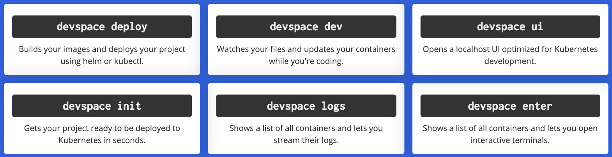

[TOC]

## 工作流

工作流：

- 下载包含 Dockerfile 的源码项目

- devspace init 生成 xxx.yaml, xxx.yaml中定义好了应用如何安装，以及开发时需要的一些参数，类似：

  ```shell
  version: v1beta10
  
  # `vars` specifies variables which may be used as ${VAR_NAME} in devspace.yaml
  vars:
  - name: IMAGE
    value: xinxinh002/app
  
  # `deployments` tells DevSpace how to deploy this project
  deployments:
  - name: devspace-quickstart-golang
    # This deployment uses `helm` but you can also define `kubectl` deployments or kustomizations
    helm:
      # We are deploying the so-called Component Chart: https://devspace.sh/component-chart/docs
      componentChart: true
      # Under `values` we can define the values for this Helm chart used during `helm install/upgrade`
      # You may also use `valuesFiles` to load values from files, e.g. valuesFiles: ["values.yaml"]
      values:
        containers:
        - image: ${IMAGE} # Use the value of our `${IMAGE}` variable here (see vars above)
        service:
          ports:
          - port: 8080
  
  # `dev` only applies when you run `devspace dev`
  dev:
    # `dev.ports` specifies all ports that should be forwarded while `devspace dev` is running
    # Port-forwarding lets you access your application via localhost on your local machine
    ports:
    - imageSelector: ${IMAGE} # Select the Pod that runs our `${IMAGE}`
      forward:
      - port: 8080
  
    # `dev.open` tells DevSpace to open certain URLs as soon as they return HTTP status 200
    # Since we configured port-forwarding, we can use a localhost address here to access our application
    # 自动打开应用入口
    open:
    - url: http://localhost:8080
  
    # `dev.sync` configures a file sync between our Pods in k8s and your local project files
    sync:
    - imageSelector: ${IMAGE} # Select the Pod that runs our `${IMAGE}`
      excludePaths:
      - .git/
      uploadExcludePaths:
      - Dockerfile
  
    # `dev.terminal` tells DevSpace to open a terminal as a last step during `devspace dev`
    terminal:
      imageSelector: ${IMAGE} # Select the Pod that runs our `${IMAGE}`
      # With this optional `command` we can tell DevSpace to run a script when opening the terminal
      # This is often useful to display help info for new users or perform initial tasks (e.g. installing dependencies)
      # DevSpace has generated an example ./devspace_start.sh file in your local project - Feel free to customize it!
      command:
      - ./devspace_start.sh
  
    # Since our Helm charts and manifests deployments are often optimized for production,
    # DevSpace let's you swap out Pods dynamically to get a better dev environment
    replacePods:
    - imageSelector: ${IMAGE} # Select the Pod that runs our `${IMAGE}`
      # Since the `${IMAGE}` used to start our main application pod may be distroless or not have any dev tooling, let's replace it with a dev-optimized image
      # DevSpace provides a sample image here but you can use any image for your specific needs
      replaceImage: loftsh/go:latest
      # Besides replacing the container image, let's also apply some patches to the `spec` of our Pod
      # We are overwriting `command` + `args` for the first container in our selected Pod, so it starts with `sleep 9999999`
      # Using `sleep 9999999` as PID 1 (instead of the regular ENTRYPOINT), allows you to start the application manually
      patches:
      - op: replace
        path: spec.containers[0].command
        value:
        - sleep
      - op: replace
        path: spec.containers[0].args
        value:
        - "9999999"
      - op: remove
        path: spec.containers[0].securityContext
  
  # `profiles` lets you modify the config above for different environments (e.g. dev vs production)
  profiles:
    # This profile is called `production` and you can use it for example using: devspace deploy -p production
    # We generally recommend to use the base config without any profiles as optimized for development (e.g. image build+push is disabled)
  - name: production
  # This profile adds our image to the config so that DevSpace will build, tag and push our image before the deployment
    merge:
      images:
        app:
          image: ${IMAGE} # Use the value of our `${IMAGE}` variable here (see vars above)
          dockerfile: ./Dockerfile
  ```

  

- devspace use namespace xxx : 选择一个 namespace

- 构建镜像

- 推送镜像到 docker hub

- devspace dev
  - 安装 helm 应用 （使用构建好的镜像？）
  - 将副本数缩为 0
  - 创建一个 Pod
  - 端口转发
  - 文件同步（双向的文件同步）

## 产品对比



### deploy

Nocalhost 没有构建镜像这个环节（功能）

部署应用和 Nocalhost 的流程有什么区别

### dev

devspace 进入开发提供了 patches 通用改动的能力：

```yaml
  replacePods:
    - replaceImage: 'loftsh/go:latest'
      patches:
        - value:
            - sleep
          path: 'spec.containers[0].command'
          op: replace
        - value:
            - '9999999'
          path: 'spec.containers[0].args'
          op: replace
        - path: 'spec.containers[0].securityContext'
          op: remove
      imageSelector: xinxinh002/app
```


### ui

ui 实际上承担了部分 nocalhost 插件的功能，包括了：查看 logs，查看 manifest(只能看 Pod)，进入终端，有检索功能

和 Nocalhost Server 的区别？ DevSpace SaaS 版是基于这个做的？


Inactive 的判断：

所有对 Loft API server 的请求都会被统计起来，


## 虚拟集群

当一个团队中的多个人使用同一个 k8s 集群时，现在的常见做法是给每个人分配一个 namespace。实际上，在 k8s 的[官方文档](https://kubernetes.io/docs/concepts/overview/working-with-objects/namespaces/) 中，namespace 就被称为 “virtual clusters”。使用 namespace ，可以在一个 k8s 集群里为多个用户创建隔离的环境。

但 namespace 有一些局限性：它不能包含集群范围的资源。而许多应用需要创建或访问集群访问的资源，如 node,clusterrole,persistent volume和 storageclass 等等。还有一个更严重的问题是，有时候应用哦需要创建自己的 CRD 或者通过 APIService 扩展 API server。

解决这个问题的另外一个思路是，为每个人创建一个小的临时集群，用完就把它删了。但这种方式开销就比较大了，试想一个运行 1000 个容器的集群和 1000 个运行 1 个容器的集群，不仅系统本身的占用的资源比业务容器的占用的资源还要多，创建一个集群的时间也比运行一个容器的时间多很多。

本文提出的解决方案是扩展 namespace 的功能来虚拟化一个完整的 k8s 集群出来。

### How it word ?

虚拟化 k8s 集群的思路和虚拟化一个物理机类似：宿主机用于实际的计算，而其它的东西都是虚拟的。

### Existing Solutions for Virtual Clusters

现有的虚拟集群的解决方案有：

- [loft](https://github.com/loft-sh/loft)
- [Multi-Tenancy SIG Virtual Cluster](https://github.com/kubernetes-sigs/multi-tenancy/tree/master/incubator/virtualcluster)
- [k3v](https://github.com/ibuildthecloud/k3v)

本文主要讨论 loft 的实现。


### 其他细节

- command: nocalhost 支持 5 种类型的 command，而 devspace 的 command 是一个数组，可以定义任意多的 command，用户可以在 ui 上点击执行，但命令执行是在本地环境执行的

