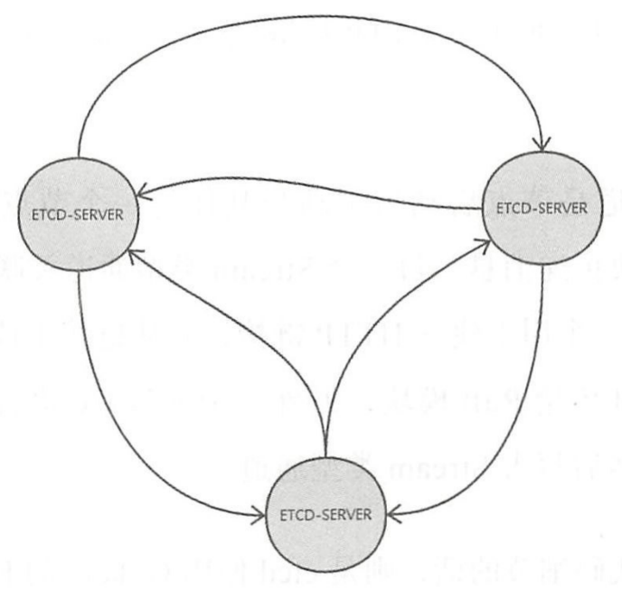

# Raft 协议

一个 Raft 集群中包含 3 种角色：

- Leader
- Candidate
- Follower

一开始时需要进行一次大选，所有参与者都可以参与竞选，所有群众都可以成为候选人，一旦某位候选人得到了半数以上群众的选票，就胜任那一任的领袖，开始一个任期，领袖会昭告天下，结束选举，其他候选人又回到群众身份并接受领袖的领导。

领导人拥有至高无上的权力，负责管理复制日志来维护节点间复制日志的一致性， 数据都是单向地从领导人流向其他服务器。

## 选举
### 心跳和选举计时器

选举中有两个很重要的概念：心跳和选举计时器

每个节点都会有一个选举计时器，Leader 在任期内必须定期向集群内的其他节点广播心跳包，昭告自己的存在， Follower 每次收到心跳包后就会主动将自己的选举定时器重置，如果选举定时器超时，则意味着在规定的一个选举超时时间周期内，Leader 的心跳包没有发给 Follower，Follower 就假定 Leader 已经不存在或者发送了故障，于是会发起一次新的选举。

任何当选的领导人都拥有之前任期提交的全部日志条目，Raft 算法使用投票的方式来阻止那些没有包含所有已提交日志条目的节点赢得选举，当 RequestVote RPC 的接收方发现自己的日志比 RPC 的调用方更新的时候，就会拒绝投票

还有另外一个限制，要求 Leader 在当前任期至少有一条日志被提交，防止提交的日志被新 Leader 推翻 

时序公式： broadcaseTime<<electionTime<<MTBF

- broadcaseTime: 网络传输时延+存储时延，一般在几毫秒到几十毫秒
- electionTimeout: 一般设置为 10ms ~ 500ms
- MTBF: 指单个节点发生故障的平均时间间隔

> 在 Raft 中，只要一个 Follower 认为 Leader 出现了问题，它就会发起一次选举，竞选 Leader， 如果有其他 Follower 也发现了 Leader 出了问题，那么这几个 Follower 就需要相互竞争

### 选举的过程

如果一个 Follower 决定开始参加选举，那么它会执行如下步骤：

- 将自己本地维护的当前任期号 current_term_id 加1
- 将自己的状态切回 Candidate，并为自己投票，每个 Candidate 的第一张选票来自于他自己
- 向其所在集群中的其他节点发送 RequestVote RPC，要求它们投票给自己

Candidate 有 3 种状态迁移的可能：

- 得到大多数节点的选票，成为 Leader
- 发现其他节点赢得了选举，主动切回 Follower
- 过一段时间发现没人赢得选举，重新发起一次选举

一个 Raft 节点最多只能为一个候选人投票，按照先来先得的原则，投给最早来拉票的候选人。

在参与选举时，候选人可能会收到来自其他节点声称自己的 Leader 的心跳包（空的 AppendEntries RPC），候选人会检查这个心跳包的任期号，如果比自己维护的当前任期要大，则承认该领导人合法，并主动将自己切回 Follower，反之则认为其不合法，拒绝此次 RPC, 并返回当前较新的任期号，以便让该 Leader 意识到自己的任期号已过期了，候选人的身份将保持不变。

如果多个 Follower 在同一时刻成为候选人，那选票就可能被多个候选人平分，使得没有哪个候选人的选票能过半数，此时各个候选人会自增任期号，发起新一轮的拉票活动。为了防止每次选票都被瓜分，选不出 Leader 的情况， Raft 设置了一个随机的选举超时重试区间（150~300ms），使得大多数情况下都会只有一个节点率先超时发起新一轮选举，该节点会在其它节点超时之前赢得选举，并向其它节点发送心跳信息。

## 核心 RPC

### RequestVote RPC

拉票的过程使用 RequestVote RPC,该 RPC 的发起方是候选人，接收方是集群中的所有其它节点

接收方的处理逻辑：

- 如果term<currentTerm，则拒绝投票给该候选人，并提醒该候选人其term过期了
- 如果之前没把票投个任何人或者已经把票投个当前候选人，则告诉候选人票投给他了，如果之前已经把票投给别人了，则不能投票

### AppendEntries RPC

调用方是 Leader，接收方是 Follower，除了用于复制日志之外，还可以用于广播 Leader 的心跳包

该 RPC 的 6 个参数：

- term: 领导人的任期
- leaderId: 领导人的 ID
- prevLogIndex: 领导人最新日志前一个位置日志的索引值
- prevLogTerm: 领导人最新日志前一个位置日志的任期号
- entries[]: 将要追加到 Follower 上的日志条目
- leaderCommit: Leader 为每个 Follower 都维护一个 leaderCommit, 表示 Leader 认为 Follower 已经提交的日志条目索引值

该 RPC 的 2 个返回值：

- term: RPC 中的 term 和 Follower 本地维护的 term 的较大值
- success: Follower 包含能够匹配 prevLogIndex 和 prevLogTerm 的日志，则为 true

接收方需要实现以下步骤：

- 如果 term<currentTerm，则返回 (currentTerm, false)
- 如果 Follower 在 preLogIndex 位置的日志的任期号与  prevLogTerm 不匹配，则返回 (term,false)
- 进行日志一致性检查
- 添加在已有日志中不存在的条目，删除多余条目

### InstallSnapshot RPC

调用方为 Leader

用于向 Follower 发送快照，这种情况通常发生在 Leader 因为做快照删除了还未发送给 Follower 的日志条目的情况下 当然，其实与 Leader 保持同步的 Follower 通常不需要 Leader 做这个操作，需要 Leader 发送的对 往是一个运行非常缓慢的 Follower 或者是一个新加人集群的节点

## Leader 的工作

接收客户端的请求，每个请求都会被解析成一条需要复制状态机执行的指令，领导人将这条指令作为一条新的日志条目加入它的日志文件中，然后并行地向其它节点发起 AppendEntries RPC（如果失败， Leader 会无限地重试），要求其它节点复制这个日志条目，当这条日志被安全地复制之后， Leader 会将这条日志 apply 到它的状态机中，并向客户端返回执行结果。

当 Leader 创建的条目已经被复制到半数以上节点上后，这个条目就被称为可提交的。一旦 Follower 得知某个日志条目已经被提交，那么它会将该条日志应用至本地的状态机。

Raft 算法是强领导人模型，一旦 Follower 与 Leader 发生了冲突，就将无条件服从 Leader，因此，Leader 的选举是 Raft 算法中非常重要的一环，如果选举出来的 Leader 自身的日志就是不正确的，那么将会直接影响到 Raft 算法正确稳定的运行。

## 日志

### 一致性

通过复制文件的方式来保证数据的强一致性

Raft 设计了以下日志机制来保证不同节点上日志的一致性：

- 如果不同（节点）的日志中的两个条目有着相同的索引和任期号，则它们所存储的命令是相同的
- 如果不同的日志中的两个条目有着相同的索引和任期号，则它们之前的所有条目都是完全一样的

当一个新的 Leader 刚上任时，它的日志和 Follower 的日志可能是不一致的。当出现不一致时（如 Leader 在故障前没有向其它节点完全复制日志文件中的所有条目），Leader 通过强制 Follower 复制它的日志来处理，Leader 需要找到 Follower 第一条与自己不一致的条目索引，删除该索引之后的条目，并替换成 Leader 的条目2

### 快照

- 每过一段时间会把日志条目压缩成快照
- 快照是由各个节点独立生成的

# Etcd

当客户端应用写一个 key 时，首先会存储到 etcd 的 Leader 上，然后再通过 Raft 协议复制到 etcd 集群的所有成员中，以此维护各个节点状态的一致性与实现可靠性。etcd 支持从非 Leader 节点读取数据以提高性能（写需要 Leader 支持）

容错性：即便 (n-1)/2 个节点发生了故障，只要剩下的(n+1)/2 个节点达成一致，也能操作成功

Etcd 使用 WAL(write ahead log， 预写式日志)作为数据持久化存储，WAL  记录了数据变化的全过程。etcd 的快照文件则存储了某一时刻的所有数据，某人每 10000 条记录做一次快照，做完快照后 WAL 文件即可删除

Etcd 每个节点都存储了完整的数据

## 架构

- 复制状态机的数据维护在内存中，定期持久化到磁盘，每次写请求都会持久化到 WAL 文件，并根据写请求的内容修改状态机的数据，在内存存有所有数据的状态

- Etcd 各个节点之间需要通过网络来传递数据，节点之间的网络拓扑是一个任意 2 个节点之间均有长连接的网状结构：

  

### 数据通道

两种数据通道：

- Stream: 传输数据量小的消息，两个节点之间只会维护一个长连接，并使用 2 个 gorouting 交替向连接中写入数据和读取数据
- Pipeline: 传输数据量大的消息，如 Snapshot，可使用一组 goroutine 并发地发送 Post 请求

