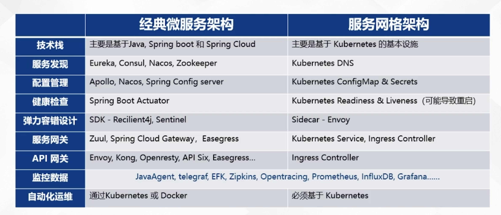

## 资源对象转换

### runtime.Object 转 map[string]interface{}

```
originUnstructuredMap, err := runtime.DefaultUnstructuredConverter.ToUnstructured(obj)
```


### runtime.Object 转 unstructured.Unstructured

```
obj.(*unstructured.Unstructured)
```


## 微服务


