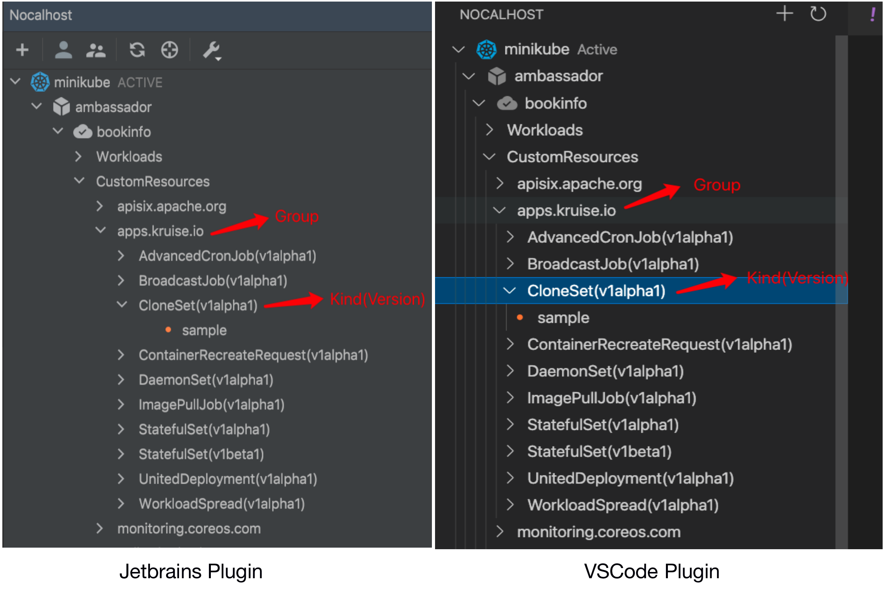
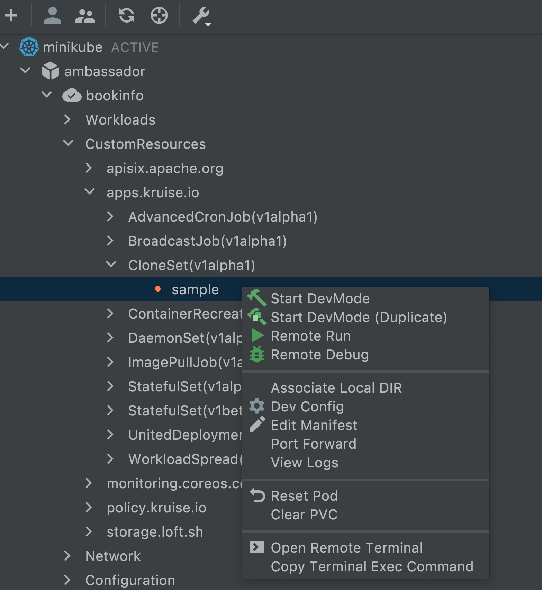

在 IDE 插件中新增了 `CustomResources` 的选项卡，展开该选项卡可以查看 CRD 资源列表：



在要开发的 CRD 资源对象上点击右键，弹出选项框，点击 `Start DevMode` 或 `Start DevMode(Duplicate)` 即可进入开发模式：



> CRD 类型对象的各个操作和 Workloads 中的 Deployment/StatefulSet 等 K8s 内置资源对象基本一致

Nocalhost 通过 `DevModeAction` 来定义如何对 CRD 进行开发，用户可以通过在 `~/.nh/nhctl/config` 中添加   `DevModeAction`  来使 Nocalhost 获得开发指定 CRD 的能力， `~/.nh/nhctl/config` 的配置样例如下：

```yaml
crdDevModeActions:
- crdType: statefulsets.v1beta1.apps.kruise.io
  devModeAction:
    podTemplatePath: /spec/template
    create: false
    scalePatches:
    - type: json
      patch: '[{"op":"replace","path":"/spec/replicas","value":1}]'
```

其中：
- crdType: 为 `resource.version.group` 的形式，resource/version/group 分别是 CRD 的 Resource/Version/Group，即 GVR 反过来写，指定该 `DevModeAction` 对应的 CRD 类型
- devModeAction: 用于控制 Nocalhost 让指定 CRD 对象进入 `DevMode` 时的行为
    - podTemplatePath: 指定 Pod 模板定义所在的路径，Nocalhost 会修改该模板，如将容器镜像修改成开发镜像，添加 sidecar 容器等
    - create: 指明 CRD 对象在进入 `DevMode` 时，是否需要创建一个新的 Deployment，在该 Deployment 上进行开发
        - 如果为 `true`，Nocalhost 会使用在 `podTemplatePath` 中找到的 Pod 模板定义来创建一个 Deployment，`DevMode` 下的所有操作都在改 Deployment 中进行
        - 如果为 `false`，Nocalhost 会直接修改 CRD 对象的 Pod 模板定义，`DevMode` 下的所有操作都在该 CRD 对象上进行
    - scalePatches: 配置 CRD 对象在进入开发模式前将副本数缩为 1 的 patch，如果副本数已经为 1 或不需要将副本数缩为 1，此项可不配置

另外，Nocalhost 对常见的开源 CRD 进行了内置支持，如 [Kruise](https://github.com/openkruise/kruise) 的 [CloneSet](https://openkruise.io/docs/user-manuals/cloneset/)、[Advanced StatefulSet](https://openkruise.io/docs/user-manuals/advancedstatefulset) 、 [Advanced DaemonSet](https://openkruise.io/docs/user-manuals/advanceddaemonset) 等，对于内置支持的 CRD，无需进行配置便直接使用 Nocalhost 对其进行开发。

