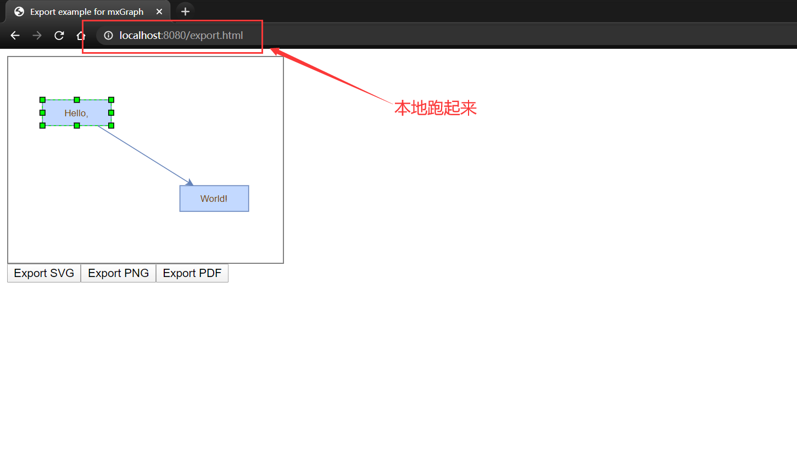
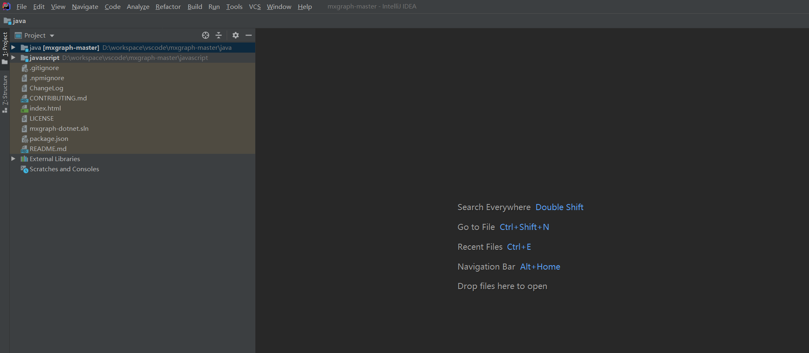
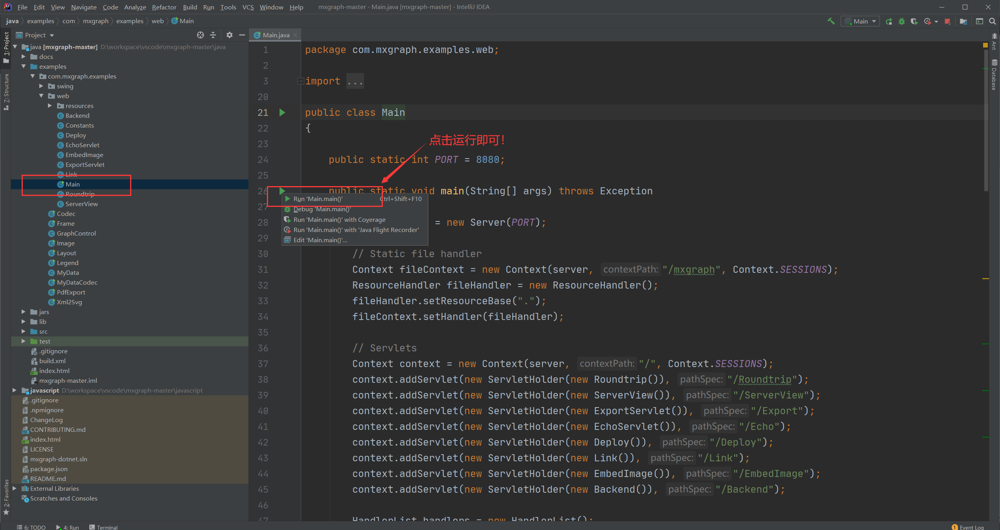
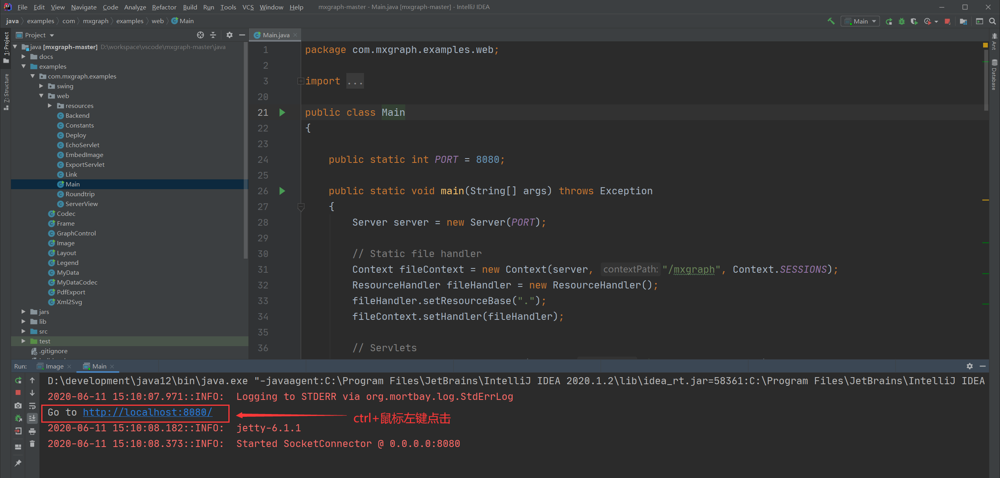
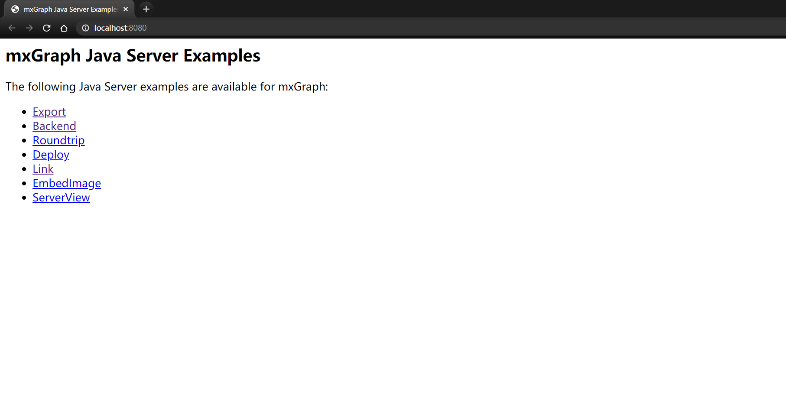

# MxGraph快速跑起来之：Java


相信很多人和我一样，使用mxgraph是为了在浏览器上根据后端数据生成有向图，来实现数据可视化的效果，甚至在浏览器上添加一些暂停快进的按钮，来控制后端程序的执行过程。但是千里之行，始于足下，这个mxgraph到底要怎么跑起来看看效果先呢？官方文档虽然有写，但是官方文档写的东西太多了，很多同学可能根本找不着！还有一些同学可能跟我一样对前端项目是一脸懵逼，要让我把一个前端项目跑起来？领导，请给我几个月时间好好学一学前端吧，一个全栈工程师即将诞生！然鹅，就这，都要搞几个月，领导还不把你开了。

好在，经过我的一番研(zhe)究(teng)，发现这东西跑起来非常容易，分分钟搞定的事，而且用Java就可以跑！按照本文步骤一步一步来，几分钟跑起MxGraph不再是梦！先看效果图：




## 1 下载项目源码

使用git或者直接在github上下载zip后解压：

```shell
git clone https://github.com/jgraph/mxgraph.git
```


## 2 使用Idea打开项目

实际上使用Eclipse也可以，官方文档说明就是用Eclipse的，但我用Idea打开用起来也完全没问题。这一步也简单，打开Idea，点击File -> Open -> 选择上一步下载的源码根目录，打开后如下图：




## 3 运行目录下的示例程序

这一步也很简单，点击项目目录java-> examples -> com.mxgraph.examples -> web -> Main，Main是个Java文件，点进来看到有个main方法，很开心，这是个可以直接运行的文件！所以点击运行main方法，如下：




## 4 打开浏览器


如果上一步运行顺利的话，就可以在下面的控制台中看到以下输出：



直接Ctrl+点击一下即可跳到浏览器界面：



点击任意连接就可以进入到相应的示例程序中，示例程序中的流程图还可以拖着玩：


好了，就这么简单，后面如果对这个东西有更深的研究，再来和大家分享吧~


