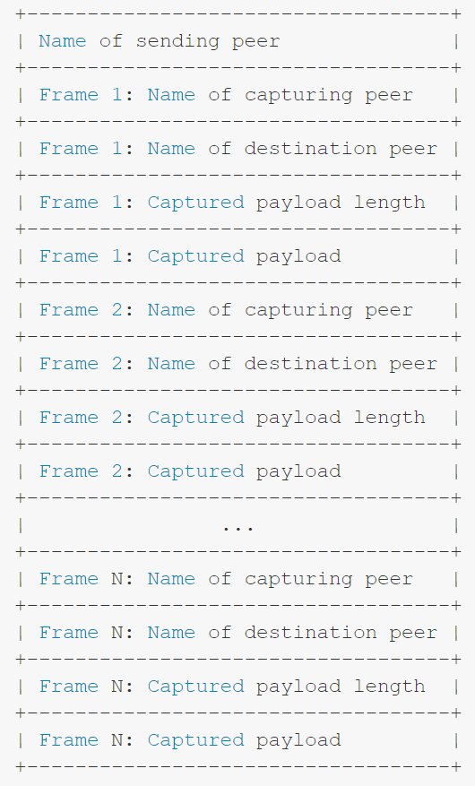

[TOC]


# Weave Net

参考文档：https://www.weave.works/docs/net/latest/overview/features/#virtual-ethernet-switch

## 特性

### 虚拟以太网交换机

Weave Net创建了一个用于连接多台主机上Docker容器的虚拟网络。对于应用容器而言，这个网络就像一个巨大的以太网交换机，所有容器都连在这个交换机上面，并且能够很容易地访问彼此的服务。

因为Weave Net使用了标准协议，常用的工具和应用都可以用于一个Weave网络的配置、监控和排错。

Weave Net也支持广播和多播协议。

### 快数据通道（Fast Datapath）

Weave Net会自动选择最快的方法来传输节点（Peer）之间的数据，快数据通道是性能提供了接近原生的吞吐量和延迟。

- [ ] todo: https://www.weave.works/docs/net/latest/tasks/manage/fastdp

- [ ] todo: https://www.weave.works/docs/net/latest/concepts/fastdp-how-it-works


### 和Docker无缝集成（Weave Docker API Proxy）

Weave Net包含了一个Docker API代理，可以用来使用Docker的命令行接口启动容器，并且在容器进程执行前加入到Weave网络中。通过命令``` eval $(weave env) ``` 使用代理，便可以用标准的Docker命令来启动和管理容器。

通过这种方式启动的容器，之后如果再重启，也会被代理加入到Weave网络中。

### Docker插件

Weave Net可以作为一个Docker插件使用。使用``` weave launch ``` 命令会创建一个名为weave的Docker网络，创建之后就可以通过以下方式来使用：

```shell
docker run --net=weave -ti weaveworks/ubuntu
```

- [ ] 使用Weave插件可以获得docker的网络功能：https://docs.docker.com/engine/extend/plugins_network/

有两种插件实现：Legacy插件不需要额外的集群存储，V2插件支持Docker的swarm模式


### CNI插件

Weave可以被支持CNI（[Container Network Interface](https://github.com/appc/cni)）的系统，如K8S、Mesosphere，作为一个插件使用。

详见：[Integrating Kubernetes and Mesos via the CNI Plugin](https://www.weave.works/docs/net/latest/kubernetes)

### IP地址管理（IPAM）

默认情况下，容器会被Weave自动分配一个唯一的IP地址，通过命令``` weave ps ``` 可以查看weave分配给容器的IP地址。

也可以显式给容器指定IP地址，详见： [How to Manually Specify IP Addresses and Subnets](https://www.weave.works/docs/net/latest/tasks/ipam/manual-ip-address)

关于Weave如何使用IPAM的讨论，详见：[Automatic IP Address Management](https://www.weave.works/docs/net/latest/tasks/ipam/ipam) 。关于寻址和私有网络的解释，详见：[the basics of IP addressing](https://www.weave.works/docs/net/latest/concepts/ip-addresses)

### 域名解析

命名容器会自动被注册到[weaveDNS](https://www.weave.works/docs/net/latest/tasks/weavedns/weavedns)，WeaveDNS还支持负载均衡，错误恢复和热替换。

### 应用隔离

一个单独的Weave网络就可以实现应用隔离，让同个应用的容器之间可以相互访问，而不同应用之间的容器相互隔离。

Weave利用了子网技术来隔离网络，这种通用策略让许多裸金属技术可以用于部署应用到容器上。

Weave实现应用隔离的原理详见： [Isolating Applications](https://www.weave.works/docs/net/latest/tasks/manage/application-isolation) 

### 网络策略

K8S相关

### 动态网络添加

有时候你可能不能之前知道一个容器的应用网络，这种场景下，你可以将容器动态添加到Weave网络或从中移除。详见： [Dynamically Attaching and Detaching Containers](https://www.weave.works/docs/net/latest/tasks/manage/dynamically-attach-containers)

### 安全

Weave网络中的加密用于满足一个特定的用户需求：无需复杂的设置来实现强大易用的安全。

关于Weave如何实现加密的细节详见：[Weave Encryption](https://www.weave.works/docs/net/latest/concepts/encryption) 和 [How Weave Implements Encryption](https://www.weave.works/docs/net/latest/concepts/encryption-implementation)

### 集成主机网络

Weave Net应用网络可以和一个主机网络集成，在主机和应用容器之间建立连接。详见： [Integrating with the Host Network](https://www.weave.works/docs/net/latest/tasks/manage/host-network-integration)

### 管理服务

### 多云网络

Weave可以让位于不同云厂商和数据中心的容器连接起来，例如，你可以运行一个应用，它的容器分布在谷歌云、AWS和本地数据中心中。详见：[Enabling Multi-Cloud networking and Muti-hop Routing](https://www.weave.works/docs/net/latest/tasks/manage/multi-cloud-multi-hop)

### 多跳路由

Weave网络中的容器在跨越超过两台主机的情况下建立连接。


### 动态拓扑

主机可以在一个网络中被动态添加或删除。详见：[Adding and Removing Hosts Dynamically](https://www.weave.works/docs/net/latest/tasks/manage/finding-adding-hosts-dynamically)

### 容器迁移

容器可以在主机之间进行迁移，无需重新配置，在大多数情况下也无需重启其他容器，只需要迁移的容器使用原来的IP即可。详见：[Managing Services - Exporting, Importing, Binding and Routing](https://www.weave.works/docs/net/latest/tasks/manage/service-management)，其中，Routing服务和容器迁移的相关性比较紧密。


### 容错

Weave节点会不断交换拓扑信息，监控和保持和其他节点的连接。

Weave Net Router容器是非常快，非常轻量级，并且用完就可销毁的。例如，如果Weave网络出问题时，可以简单地停止并重启它，应用容器无需重启，在router重启期间网络会有短暂的中断。

## 概念

### 理解Weave网络

一个Weave网络包含许多节点（peer）—— 位于不同主机上的Weave Net路由器。每个节点都有一个名字，名字在每次重启后不变，用于查看状态和日志输出。每个节点还有一个唯一的标识符（UID），UID每次启动时都不同。对于路由器来说，标识符是不透明的，虽然标识符的默认名字是mac地址。

Weave Net路由器之间建立TCP连接，它们在这个连接之上进行协议握手并交换拓扑信息。如果是这样配置的话，这些连接是加密的。节点之间也会建立UDP“连接”，这个“连接”也是可以加密的，它用于携带封装好（encapsulated）的网络包。这些“连接”是全双工的，并且可以穿过防火墙。

Weave Net会在宿主机上创建一个网桥。每个容器都通过一个veth pair连接到这个网桥上，容器端是一个由用户指定或Weave分配的IP地址。

Weave通过两种方法来路由不同宿主机上容器的网络包：快数据通道和sleeve方法。快数据通道完全在内核空间操作，而在sleeve方法中，发往其他主机的包会被内核捕获并有Weave Router在用户空间处理，通过UDP转发到其他主机的Weave Router上，目的主机上的router再把它注入到内核中，内核再把它传给本地的容器。

Weave Router会学习一个特定的MAC地址位于哪个宿主机上，它们把这些信息和拓扑信息结合起来，来做出路由选择，从而避免转发每个包到每个节点上。


### Weave Router封包

sleeve模式的封包类似下图：



发送节点的名字可以让接收节点识别出来UDP包的发送者，接下来的是一个或多个捕获的帧。如果Router在短时间内收到多个发往同一个目的节点的包时，会把帧打包到一起发送，它会尽可能多地把帧放到一个单独的UDP包里。

每个帧的元数据包含了捕获节点和目的节点的名字。因为帧名和源MAC地址相关，它可以让接收节点构建它的路由映射表。目的节点的名字让接收节点知道这个帧是发给它的还是要转发给另外一个节点的。目的节点的名字让中间的接收节点无需知道目的节点的MAC地址，只有最初捕获的节点需要决定目的节点的MAC。用这种方式，Weave节点不需要交换客户端的MAC信息，也不需要采取任何ARP和MAC发现？？？


### Weave网络如何翻译网络拓扑

#### 节点之间通信拓扑

拓扑信息记录了哪个节点连接到哪个节点。节点之间会同步拓扑信息，所以每个节点知道整个网络拓扑。节点之间的通信发生在TCP链路上，使用：a)基于生成树广播机制。 b)邻居gossip机制。

以下情况，拓扑信息会被一个节点发送：

- 一个连接新加进来；如果远程的节点像是新加入这个网络中的，整个拓扑信息都会发给它。对于增量更新，只是包含连接两端节点的信息，则通过广播。
- 当一个连接被标记为已建立时，意味着远端节点可以接收该源节点的UDP数据包了，通过广播更新包含本地节点的信息。
- 当一个连接断开，通过广播更新包含本地节点的信息。
- 周期性的，整个拓扑会被同步给周围的邻居。

接收者会把拓扑更新和本地的拓扑信息进行合并。


#### 移除节点

一个节点在接收完一个拓扑更新后，发现另外一个节点已经在网络中没有人和网连接了，则会丢掉该节点的所有信息。


#### 拓扑信息过时会发生什么

拓扑信息改变的传播不是立即的，因此，很有可能网络中某个节点有过时的拓扑信息。

如果一个包仍然能够到达目的节点，那么过时的信息导致了一条较为抵效的路由。

如果过时的拓扑信息导致包无法到达目的节点，这个包会被丢弃，在大多数协议如TCP中，一小段时间后会尝试重传，此时拓扑信息应该已经更新了。


#### 连接限制

对于N各节点的全连接网格，意味着有2^N条连接。为了限制资源的消耗、节点之间的通信以及路由计算的复杂度，一个节点能够连上远端节点的最大连接数是可以配置的，默认值100是安全的，在大多数部署中可以使用。启动时通过命令：``` weave launch --connlimit=100```可以显式设置。


### 快数据通道

在没有启用快数据通道的时候，每个包都有进行封装。router是一个用户态程序，包的流向在linux内核进进出出：


快通道使用linux内核的OVS模块，这个模块让Weave可以告诉内核如何处理这个包：


因为Weave直接把指令发送给内核，上下文切换减少了，因此使用了快数据通道CPU负载和延迟都会下降。包直接从应用到内核，在那里加上了VXLAN头（如果网卡支持VXLAN加速的话这一步可以放到网卡上处理）。

在1.2版本以前，Weave使用了一个自定义的封装格式。快通道使用了VXLAN。和Weave的自定义格式一样，VXLAN也是基于UDP的，所以不需要网络基础设施进行特殊配置。

> OVS的快数据通道和VXLAN特性在Linux内核3.12版本之后才有，如果内核版本过低，Weave会切换到用户态数据通道。

### IP地址、路由和网络

