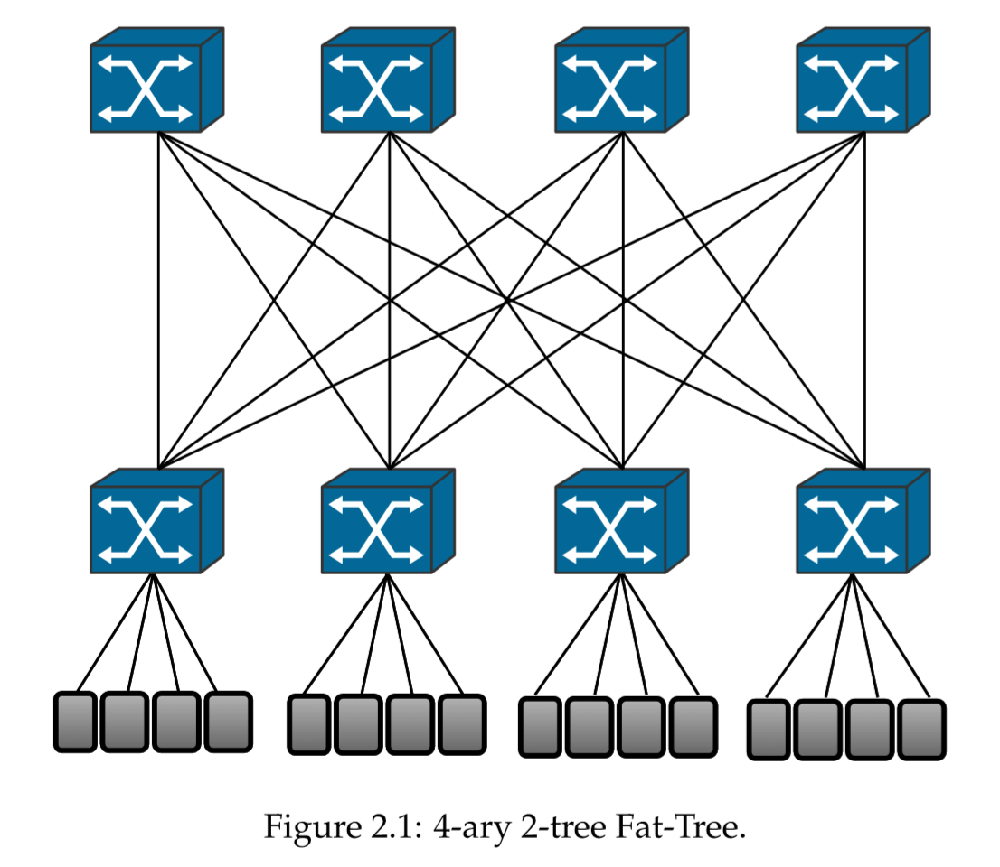
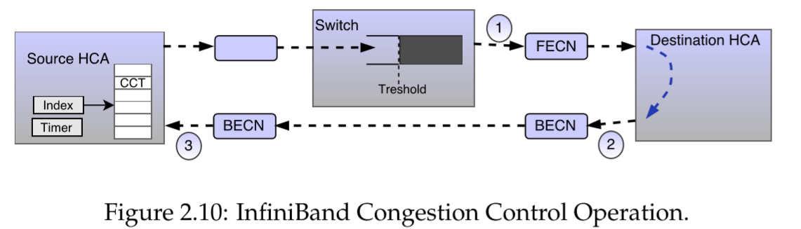
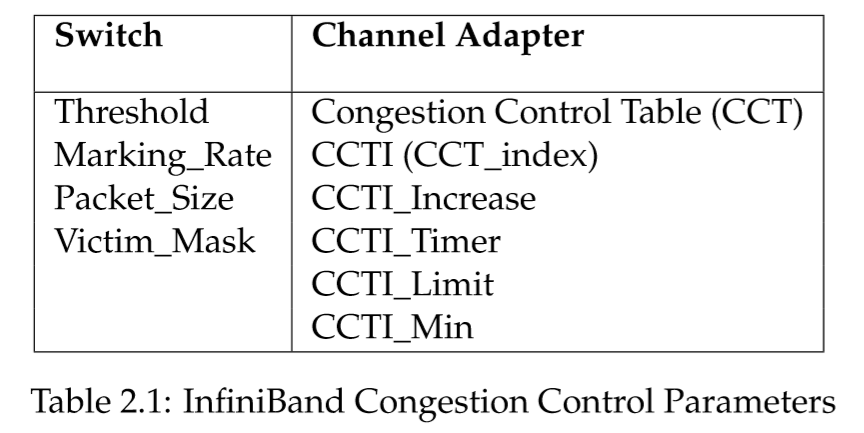
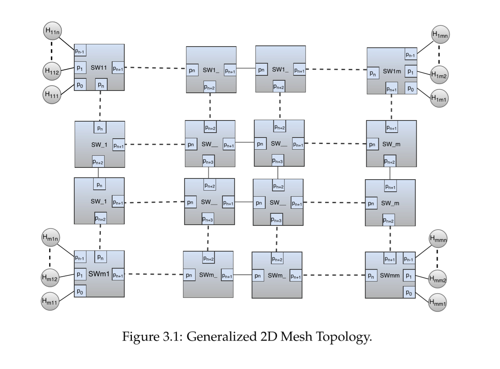

[TOC]

# Exploring InfifiniBand Congestion Control In Mesh Topologies

## 摘要

IB正在成为世界大多数超级计算机的领先互联技术。为了保证HPC和现代数据中心高带宽和低延迟的要求，IB架构支持一种需要指定一系列参数的拥塞控制机制。这个机制的效率很大程度上取决于一系列的参数。IB足够灵活来支持互通类型的拓扑，允许连接同时跨越多条链路。Mesh拓扑（网格拓扑）已经成为IB用来维持最高水平的带宽和延迟的最流行的互联网络之一。

在本文中，我们研究了IB拥塞控制（IB CC）在网格拓扑性能中的效果，并且探索一个选定的参数集来实现它们对这个机制的行为的影响，并评估了在这个拓扑下的性能收益。随着几个模拟在OMNeT++平台上使用了CC特性的IB模型，我们取得了令人鼓舞的结果，证明了这些参数集的作用和IB CC机制的效率。结果分析证明了拥塞的副作用，比如HOL blocking和parking lot问题，可以成功地通过这个机制和参数值Marking_rate=1和CCTI_Timer=250避免，从而提升了51.6%的网络性能。

## 1 简介

互联网络曾被誉为一种高效的通信基础设施，用于满足当前和未来超级计算机系统极高的通信要求。其后，它正在逐渐渗透到各种各样的应用领域比如高性能计算（HPC），云计算和现代数据中心等等。这些应用的高性能要求也影响了有损和无损互联网络的选择。在有损网络如Internet中，但拥塞发生时丢包是可能的。然而，丢包导致了吞吐量的下降和延迟的上升，因为增加了额外的重传时间。这会对并行计算机和高性能集群中应用的效率产生影响。因此，非常高性能和低延迟的需求已经成为选择无损互联网络的首要因素。尽管这些网络的特性很大程度上取决于应用，今天大多数通信系统的性能高度依赖于它们的拓扑，路由机制，交换策略和flow控制。例如，实现流控制的网络不会在常规操作中丢包。因此，用于解决网络相关问题，如包路由，拥塞，死锁和可靠性，的解决方案类型很大程度上限制了网络处理包的方式。在无损互联网络中是不能丢包的，拥塞成为必须要解决的最重要和最有挑战性的问题之一。拥塞是在带宽不足时数据流量超过了链路的容量发生的场景。如果没有采取措施，拥塞在无损互联网络中会引起很长的通信延迟，阻塞新的连接和降低网络的性能。除非实施一些拥塞控制机制，否则在网络链路中的某个点发生的拥塞会传播到整个网络。拥塞管理（也叫拥塞控制）就是一种互联网络中拥塞影响的对策。没有合适的拥塞管理，当网络或一部分网络达到它的饱和度时，网络吞吐量会大幅度地下降。为了缓和这个问题，几种拥塞控制机制和标准被提出来。IB拥塞控制是这些拥塞对策中最常用于HPC超级计算机或现代数据中心的。

IB是一个广泛使用，低延迟，高吞吐量的互联标准，它描述了用于检测和解决拥塞的一种拥塞控制机制。由于可扩展性和工业界的广泛应用是IB的基础特征之一，所以许多设计选择如拓扑、路由和拥塞控制参数配置等，IB架构都故意不显式指定，以适应各种各样的应用。因此，IB拥塞控制机制有丰富的参数可以调优来为各种各样的网络拓扑取得高效的拥塞控制。显然地，设置这些参数应该使网络能够解决拥塞。这些参数决定了一些特征，如当交换机检测到拥塞，交换机以什么频率来通知目的节点，以及一个节点注入量多久、多少的情况下，需要降低它的注入速率。另外，这些参数集增加了IB拥塞控制机制的灵活性。

### 1.1 问题描述

IB CC为高性能计算机和数据中心提供了诸如拥塞检测，拥塞信号，注入速率降低及恢复的功能。IB提供以参数化的机制提供拥塞控制，这些参数的值对网络的性能有很大影响。然而，IB CC一个主要的挑战是如何为一个给定的系统配置合适的参数。在一个大规模的集群中探索合适的参数空间以及在各种各样各样不同大小的网络拓扑中合理地配置IB CC是一个非常困难和耗时的任务。

IB CC规范在如何配置参数以达到高效方面没有提供合适的指导，因此，在生产集群和超级计算机上配置和激活一个拥塞控制机制是非常困难的，因为如果没有配置合理的话，可能会对网络性能有负面影响。这是因为网络的行为重度依赖这些参数值。

为了取得理想的IB CC的好处，如提供网络资源利用率因此提升网络性能，研究对于一个给定应用拥塞控制机制的影响是很重要的。为一个给定的拓扑找到和设置合适的拥塞控制参数需要大量的实验。因此，掌握足够关于如何使用这些参数、单个参数的影响以及它们之间的相互关系的知识是必要的。因此，本文的目的是研究和探索一个选定的IB CC参数集来理解它们对IB CC机制的行为的影响，并且评估Mesh拓扑在各种场景下性能的提升。本文尝试解决下面研究问题：如何设置合适的IB CC参数来确保为mesh拓扑提供高效的IB CC机制。

### 1.2 研究方法

有3中基本的方法用于网络性能评估和分析：实证测量、分析建模和仿真。实证测量是一个基于已观察和已测量现象的方法。测量数据通过直接观察或实验收集。只有当系统允许收集指定已存在的性能信息并且要测量的东西和该系统很类似时，实证测量才可能有用。实证测量是最精确但也最昂贵的实验方法，因为它需要一个已经实现的系统，有些场景下测量是不可能的，可以使用分析模型和仿真。在本文中，系统的规模需要很大，不幸的是我们没有办法去访问如此大规模、昂贵的系统。因此，测量技术不是本文合适的方法。

分析模型是一系列用于描述一个系统性能的方程式。它包括了诸如排队网络、马可夫模型和状态表等等。分析建模把研究的主题映射到一个数学或统计学的模型，然后它描述了一个无限长的时间里，测量和计算的网络元素的行为的集合。这是最省钱的方法因为它不需要软件和硬件实现。然而，当网络是高级的并且包含了更多细节时，模型的复杂度会快速增长，除非做一些假设来简化这个模型。因为本文研究的网络需要处理所有与拥塞管理相关的细节，分析模型方法也不是一个好的选择。

仿真是使用软件模型来抽象一个真实系统的功能。仿真在测试，验证和一般试验新技术和新特性时，是一种不昂贵的工具，并且是可重复进行的。它是网络性能分析一种有用并且广泛使用的技术，但很多时候也是耗时并且难以实施的。每个性能分析的目的都是比较不同的备选方案。仿真提供了一种简单的方法来预测网络性能或比较几种备选方案，并且常常得出了相当精确的测量结果。基于仿真的性能分析需要设计一套合适的实验。在我们的工作中，仿真是我们采用的方法它以一种不昂贵的方式允许我们实施一系列大规模和多重仿真实验来探索参数值。OMNeT++ 平台上一个启用了拥塞控制的IB模型仿真器会被用于我们的仿真。

### 1.3 论文大纲

第2章提供了一个互联网络的基本模块的概览，比如拓扑、路由、交换策略和流控制技术。另外，它提供了一个关于无损网络上的拥塞、拥塞控制及其在IB网络上的参数、OMNeT++ 网络仿真平台的简要概述。第3章描述了仿真设置，解决问题描述的计划方法，实验的设计以及仿真结果的收集、处理、描绘和分析策略。第4章展示和分析了通过仿真取得的结果。第5章提供了更多关于本文结果的重要分析和讨论。第6章总结了本文的主要的贡献以及推测未来可能的研究方向。

## 2 背景

本节展示了一些基础概念、术语和本文使用的技术的简要介绍。以互联网络的基本模块开始，然后介绍拥塞和无损网络上拥塞控制机制的细节。最后，介绍 OMNeT++ 仿真环境和本文使用的仿真模型。

### 2.1 互联网络

互联网络覆盖了各种各样广泛的领域，从计算机电路的内部总线上芯片内的网络到连接分布在全世界的计算机系统的计算机广域网。然而，本文关注的是建立在计算、存储和交换机之间的大规模高性能点对点互联网络。**互联网络包括两个基本元素：一系列被称为node（节点）的处理元素以及一些列被称为channel（通道）的通信媒介。一个通道是一条网络节点之间的链接。网络节点包括了主机通道适配器（Host Channel Adapters，HCA），交换机和路由器，它有生产、路由、转发和消费网络流量的功能。HCA通常连接到一个单独的交换机或路由器上，负责生产或消费网络流量，网络流量通过path或route从源主机节点被传送到目的主机节点，route由一系列通道和交换机(或路由器)组成。**互联网络可以通过它的拓扑、路由算法、交换策略和流控制机制被参数化。下面我们会提供关于互联网络的一些核心概念的引导性介绍。我们的介绍集中在无损互联网络（如IB）。

#### 2.1.1 网络拓扑

网络拓扑描述了一个互联网络中节点和通道的物理和逻辑安排。**一个网络的物理拓扑指的是电缆、计算机和其他外围设备的配置。而逻辑拓扑显示网络内的数据流，不管它的物理结构和位置。**互联网络的拓扑在各种类型的网络应用的性能方面都起到了很重要的作用。在HPC领域，集群内的每个节点需要能够和其它资源和集群内的其它节点互相通信，来达到控制和进程间通信的的目的。因此，构建一个支持HPC环境苛刻要求的大规模网络拓扑要求仔细地考虑网络流量。

当前，有一些列不同类型的拓扑在HPC超级计算机和高性能数据中心被使用。今天在HPC领域最流行的互联网络拓扑是胖树（Fat-Tree）、网格（Mesh）、Torus和Hypercude。网络拓扑可以被分为主要的两个类别：直接和间接。**直接拓扑包括网格和Torus拓扑，其网络中的每个节点都是流量的一个源和目的节点，并且转发从其他节点传过来的流量。间接拓扑包括胖树和butterfly，其终端节点和交换机之间存在明细的区别。在间接拓扑中，只有终端节点是流量的源或目的端，交换机只是简单地转发流量。** IB是一种灵活的通信标准，提供了几种拓扑的支持，包括胖树、2D/3D网格和2D/3D torus。<u>These topologies allow simultaneous connections across multiple links</u> , 并提供扩展性来连接更多的节点和链接。这让IB成为了今天并行计算应用的技术选择，这些应用需要在节点之间传输大量的数据。根据2015年TOP500计算机的结果报告，47%的计算机中IB的地位高于以太网和其他专有解决方案。

##### 胖树

胖树拓扑广泛部署在超级计算机集群上，并且通常使用IB网络技术。胖树是一种间接的互联网络，它在源和目的端之间提供了多条路径，这让它更容易处理网络错误。胖树中的计算节点位于树上的叶子节点，一个或多个交换机用来连接这些节点。往树根方向链路会变得越来越瘦。胖树拓扑在大规模环境下能够取得最佳性能并且高效地利用计算资源。因为胖树往上走时容量会逐渐增加，所以不需要担心通道的精确容量。胖树拓扑下，IB CC能够为一个给定的安装配置成稳定的。

胖树一个著名的变体是k-ary n-tree，包含一个常规拓扑的参数族。这个拓扑根据k和n的值的不同在构建时会有所不同。k定义了每个交换机的下行端口数量，n定义了树的层级的数量。 基于k-ary n-tree拓扑的互联网络广泛用于使用IB网络的HPC。图2.1显示了4-ary 2-tree胖树拓扑的例子，它有8个交换机和16个节点：

##### 2D/3D网格

网格拓扑是直接网络拓扑，它形成一个网格结构，通常是2维或3维的。2D网格网络拓扑是一个节点的2D网格，每个节点连接到它自己的交换机上。3D网格是2D网格的逻辑扩展，通过增加1维或多维。Torus和mesh网络都属于k-ary n-cude，n维网格中节点是数量是k的n次方

#### 2.1.2 路由

网络拓扑决定了一个网络的物理互联结构，而**路由算法决定了一个包从源节点到目的节点选择的路径。路由指的是在一个特定的拓扑中，选择一条路径并把一个包从源节点移动到目的节点的过程**。一个好的路由算法必须防止死锁、活锁和starvation，并且尝试多条链路的流量负载。路由算法可以从不同角度进行分类，从如何选择源节点到目的节点合适的路径来看，路由算法可以分为：无记忆的、确定的和自适应的。

##### 确定路由算法

**确定路由算法完全指定了从源节点到目的节点的路径，并且对于每对节点总是选择相同的路径，即使有多条可选的路径**。这是实现起来最简单并且开销最低的路由算法，而且可以很容易避免死锁。确定路由算法保证包的顺序传递，如包到达目的节点的顺序和包从源节点发出的顺序的相同的。许多使用不规则拓扑的网络使用确定路由算法，因为自适应算法在这种网络中更难实现。然而，确定路由算法没有考虑路径的多样性和高效利用底层拓扑的网络链接。而且，这些算法不会提供多条路径的负载均衡，因为它没有考虑当前网络的状态。

##### 无记忆路由算法

- 随机选择多条最短路径中的一条
- 除了地址外不会考虑其他任何信息
- 路由选择独立于网络流量的状态
- 同一时刻不考虑其他节点发送了多少流量

无记忆路由算法为一个包选择路由不考虑网络中实际的流量需求。无记忆路由算法对于同一对源/目的节点在不同时间可能产生不同的路径。相比起自适应算法，这个算法实现起来较简单，也易于分析。

##### 自适应算法

自适应算法在做路由选择时会使用当前的网络状态信息。和无记忆算法不同的是，**自适应算法会基于当前的网络流量条件调整路由选择**。路由算法使用诸如节点或链路的状态、网络节点的队列长度、通道负载的历史信息来避免拥塞或网络的错误区域。然而路由算法增加了额外的复杂性并且不能保证包按顺序到达。自适应算法还和流控制机制高度耦合，因为两者做选择时都关注网络的当前状态。

##### IB网络的路由算法

IB使用确定路由算法，其基于每个交换机上存储的转发表。转发表映射了HCA的本地标识符（LID）到交换机上的一个输出端口。到达交换机上的包，带着目的本地标识符（DLID），通过查找转发表会被转发给相应的输出端口。因为一个LID只会映射一个输出端口，所有IB上的路由算法是确定的。对于IB常用的n-dimensionalk-aryn-cube网络拓扑，如mesh、torus和hypercude，最简单有效同时也是最常用的路由算法叫DOR（(Dimension Order Routing）。DOR先在x轴上路由包，然后y轴，然后z轴，来决定最短的路径。这是IB上最流行的确定路由算法之一。

### 2.1.3 交换策略和流控制

在互联网络中，通道和缓存是需要妥善管理的基本资源。**提供公平和无死锁的资源管理是交换策略和流控制的任务**。交换策略和流控制机制一起决定了信息在其路径上如何以及何时被路由。**交换策略决定了消息中的数据如何穿过它的route而流控制机制定义了这个消息或消息的一部分何时在其route上移动**。

#### 交换策略

对于数字流量，有两种典型的交换策略来决定消息如何通过交换机或路由器被转发。分别是电路交换（circuit switching）和分组交换（packet switching）。在电路交换策略中，当一个节点想要和另外一个节点进行通信，源和目的端之间一个成为电路（circuit）的固定带宽通道会被创建。这条电路会被保留用于特定的信息流，其他流不能使用它，直到数据传输完。因此，在通信期间，源端节点和目的端节点会建立一条专用链路来传输数据。

电路交换最初是在电话网络中被提出来和使用。当它被应用到数据通信网络时，遇到了一些限制。首先一个是，流路径的建立增加了从发送端到接收端消息传递的延迟。另外一个是，由于网络资源利用率低导致网络性能下降。互相网络的效率来自于网络通信资源（如通道）可以被共享。然而，当通信节点之间建立了一条专有的通道后，这个通道在宝贵的连接时间里大部分时间是空闲的，其它节点只能等待该通道的释放。电路交换中路由在路径建立时决定，之后就不会改了。电路交换不需要拥塞控制因为资源已经提前预留来防止数据传输期间的拥塞。

分组交换是离散数据（即包）的路由，每个包都有指定格式和最大的大小。在分组交换中，整个消息被切分成一系列固定最大大小的包，通过网络发送出去，不会预先保留资源。一旦一个消息被传输，它的包会通过网络系统的不同路径在不同时间到达接收端，这意味着包是被独立地从源路由到目的端的，并在目的节点以正确的顺序进行组装得到一个完整的消息。在分组交换网络，通常会采用拥塞控制。当分组交换机的buffer溢出或拥塞时，就需要进行拥塞控制。IB网络是基于分组交换的网络 。因此本文会考虑分组交换技术 。

#### 流控制

互联网络上消息的路由要求各种资源的分配，如通道带宽和缓存空间。流控制是分配这些资源给网络中传输的流量的机制。因为网络交换架构并不是自我调节的，即使网络中已经拥塞，每个节点扔会持续地发送包。因此，当一个节点注入数据的速度超过一个网络交换机或一个终端节点能够处理的速度时，我们就需要一个跨越多个节点的流控制机制。流控制用于限制任意两个节点之间数据交换的速率，从而防止超载以及因为拥塞导致的丢包。（发送节点应该适当地控制其发送速率，否则发送的速率过快交换机或终端节点处理不过来把包丢了进行重传可能更耗时）流控制机制确保接收端有足够的缓冲空间，来避免数据丢失。因此，**实现了流控制的网络不会因为拥塞而丢包**。

有几种有趣的流控制机制：Xon/Xoff，credit-based，滑动窗口和fit reservation。**Credit-based是IB使用的流控制机制**。在这种流控制技术中，上游节点在发包给下游节点时，需要先接受信用。基于信用的流控制一般在发送端使用一个信用计数器，初始化时信用的数量和接收端的buffer的数量是相同的，每当一个包发送完时，上游节点就会减少一个信用，当下游节点消费完buffer里的一个包时，会以控制包的形式返回一个信用给发送端，通知发送端增加一个信用。这个技术本质上是通过在接收端的buffer用完时限制发送端向网络中继续发送包，因此buffer永远不会溢出。

### 2.2 无损网络中的拥塞控制

网络拥塞是流量过高以致于超过网络链路的容量的结果。当源节点向网络设备（如路由器、交换机）注入的数据超过其能消费的数量时，就会发生拥塞。无损网络的流控制机制可以防止网络丢包，因为这种机制，一个已经拥塞的网络可能会发生一些不良的影响，导致这些设备的buffer被填满。这种方式下，一次最初只集中在单独一个交换机的拥塞可能会传播到整个网络上，这个现象通常被称为拥塞传播（congestion spreading）,会导致拥塞树不断生长，这会导致所有buffer被填满的交换机的吞吐量降低和延迟增加。

为了阐述这种场景，我们考虑一个简单的网络拓扑，如图2.6。这个2*2网格拓扑包含了互联网络的3个组件：

- 终端节点：H1-H7

- 转发节点：即交换机，SW1-SW4

- 链路：双向通信通道，这里我们假设交换机到交换机的链路的容量是交换机到节点的2倍

图2.6中，有3个数据流（绿线），三个源节点都用最高的链路容量来发送包，所有流都共享SW4-H7这条路径，这条路径已经超过它的能力，因此流量开始堆积在SW4，当SW4的buffer快用完时，流控制会通知它的邻居SW2和SW3不要再以它们链路的满负荷容量来转发流量给它。很快SW2和SW3上也堆积满了，SW1接下来也会被通知。

....

HoL(Head of Line)阻塞：当一堆包被队上第一个包阻塞的情况。

有几种避免拥塞控制的机制。在有损网络如Internet中，在网络拥塞时是允许丢弃包来避免拥塞的。但是，在IB高性能无损网络中，包丢弃和重传是不允许的。无损网络中克服拥塞的最简单是超分网络，这意味着要提供过量的网络资源，这样子拥塞就不会发生。但这样子网络就要设计成处理可能最大量的流量，才能高效地利用网络资源。因此，这个机制在成本上不是高效的，并且扩展性也差。

自适应和负载均衡解决拥塞的其他类型的技术。在这些策略中，在路由决策是会检查网络的状态，然后选择一条未充分利用的路径。但是要实现这样技术，网络要有足够多的备选路径，来避免拥塞树根的产生。因此，对于拥塞树根位于接收端时，此时没有别的备选路径，这种技术并不是一个好的解决方案。因为在IB网络中，用户可以自由实现任意类型的拓扑，所以这种策略并不能满足我们的要求。

综上所述，高效的拥塞算法应该有以下几个特征：

- 高效利用网络带宽：拥塞控制不应该过度以致于资源没有被充分利用
- 公平：流不应该被不相关的拥塞影响 ，并且共享同个资源的每个流都要有相同的吞吐量
- 快速到达：拥塞控制机制应该尽可能快地对流量的改变做出反应。它应该尽快地增加流的注入速率来提供资源的利用率和降低速率来避免拥塞传播等。
- 低振动：在面对高带宽或高延迟时，应该提供稳定性。另外，在快速到达和低振动之间应该做合适的权衡

### 2.3 IB架构

#### 2.3.1 IB概念

IB是一个基于交换的点对点网络通信标准，定义了处理节点和输入输出设备之间的通信协议。IB架构（IBA）被开发出来用于今天的高性能系统，并且可为下一代系统的需求进行扩展。IB在一个单独连接上可以传输多种流量类型的特性让它成为集群、通信和存储系统的理性选择。因此，许多数据中心、HPC集群、存储和嵌入式应用使用了这种互联技术，它们从2个节点扩展到成千上万个节点的集群来为现在和未来的服务器系统提供可靠性、可用性、性能和扩展性。

最近，高性能集群基于不同网络技术，如：Gigabit以太网、10Gigabit以太网等等，但是IB标准正获得越来越多的关注，因为它提供了高速互联网络需要的防卫、隔离、确定性行为和QoS。IB在世界最强大的超级计算机中的统治地位是由于这个标准的优异性能、效率和扩展性。TOP500清单揭示了IB连接了73台最强大的千万亿级计算机中的45%，清单中大概一半的系统是用于学术机构研究，以及需要高性能和高效率的工业界。IB高带宽、低延迟和CPU卸载让它成为这些系统的优选方案。

IB允许交换机的每个端口最高支持15条虚拟线路（Virtual Lanes,VL）并且保留一条额外的VL用于子网管理。IB为应用提供了一个可以直接访问的易用的消息服务，比如应用不需要依赖操作系统来传输消息。消息服务可以用来和其它应用、进程或存储通信。IB通过创建一条连接应用和应用需要通信的对象之间的通道来提供消息服务，这种机制和标准的TCP/IP网络栈完全不一样，TCP网络栈需要属于操作系统的共享网络栈。然而，IB的挑战在于拥塞和拥塞控制机制。因为使用了credit-based的流控制协议，IB中会发生拥塞和拥塞扩散。因此，拥塞、拥塞控制、IB CC机制和IB CC机制的参数需要大量的研究。

#### 2.3.2 IB中的拥塞控制

**拥塞控制是HoL的一种对策**，通过降低注入到网络中的包速率。IB CC机制基于一个闭环的反馈系统，检测到拥塞的转发节点负责通知所有向网络中注入流量并且和该拥塞有关节点。Yoshio Turner等人提出了一个3段（three-stage）IB CC机制，其依赖端到端的显式拥塞通知（Explicit Congestion Notification，ECN）包标记来解决拥塞问题。**基于ECN的注入限速策略的目的是通过移除拥塞源来降低HoL阻塞，在这种方法中，通过设置包头的一个指定位来标记这个包是和拥塞有关的**。ECN是IB中最好的拥塞控制方法，因为它是完全动态的，并且不需要了解网络或流量模式。图2.10阐述了3段IB CC机制是如何运作的。

流程：

1. 当一个交换机的buffer快填满并且达到一个指定的阈值时，就会检测到拥塞，当交换机检测到拥塞时，和该拥塞相关的源节点发出的包就会被标记，通过设置包头的一个指定位，这个位称为Forward Explicit Congestion Notification (FECN)
2. 一旦一个包标记了FECN位，它会被发送到目的节点（HCA，即网卡），网卡收到带有BECN位的包以后，会返回给源HCA一个标记了BECN（Backward Explicit Congestion Notification ）位的包
3. 当源HCA接收到一个带有BECN位的包以后，就会降低向网络中注入数据的速率来避免拥塞

但是注入速率的限制只要足够避免拥塞就可以了，不应该过度限制导致原来拥塞的通道变得空闲。因此，当拥塞解除后，源节点又会逐渐增加注入速率来避免资源的不充分使用，这可能引起另一次拥塞，

在交换机和HCA上有几个参数（如表2.1），决定IB CC机制的行为。这些参数的值由拥塞控制管理器（ Congestion Control Manager，CCM），**网络特性诸如交换机何时检测到拥塞、交换机使用FECN位通知目标节点的频率、how much and for how long a source node contributing to congestion will reduce its injection rate 都是由这些参数决定的**。如果所有参数都能合理设置，网络就可以解决拥塞问题、避免HoL阻塞并且高效地利用网络资源。

### 3.3 网络拓扑设计

#### 3.3.1 2D网格拓扑设计

2D网格中，除了边界交换机外，每个交换机和4个邻居交换机相连。如图3.1所示。

最大的挑战在于决定交换机输入/输出端口的数量，比如一个给定的交换机应该有多少个口？上图每个交换机可以视为有相同的n个HCA连接到它们上面，并且有一些交换机是图中的虚线没有画出来的。

##### 端口数量

交换机的端口数量，除了连接到它上面的HCA数量外，还需要知道交换机在拓扑中的位置，分三种情况：

- 角落交换机：需要连接2个其它交换机，一个在x轴一个在y轴
- 边上交换机：需要连接3个其它交换机
- 中间交换机：需要连接4个其它交换机，2个x轴2个在y轴