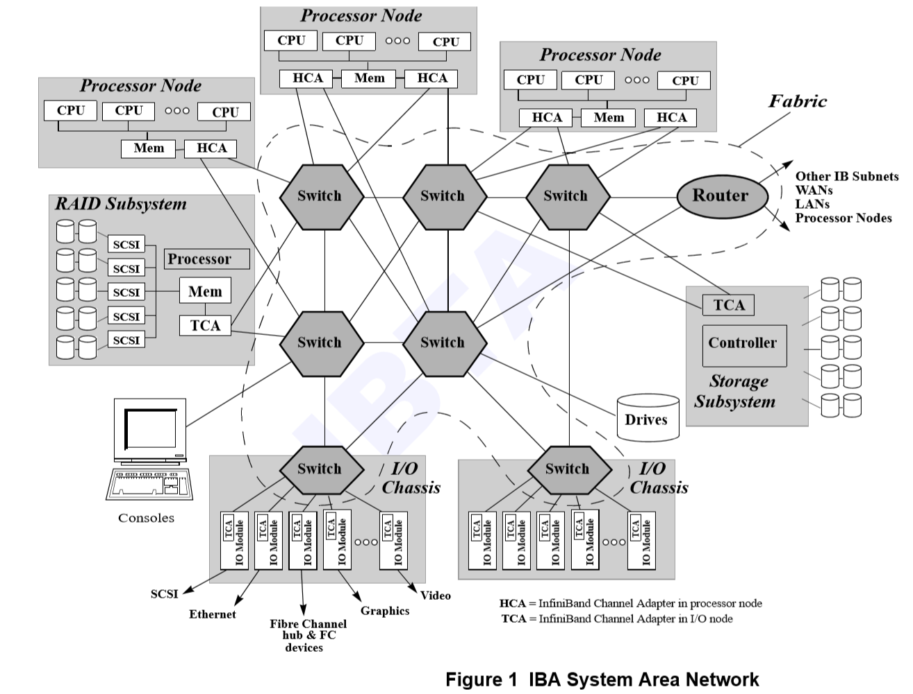
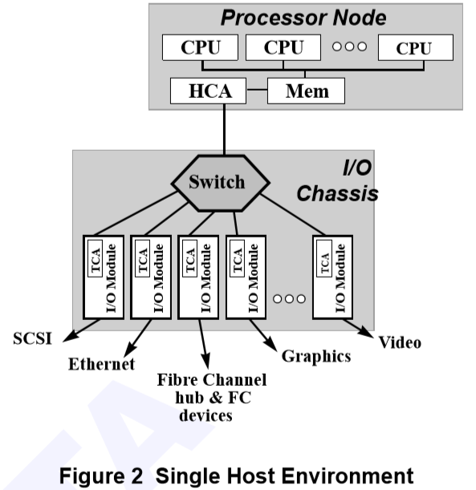
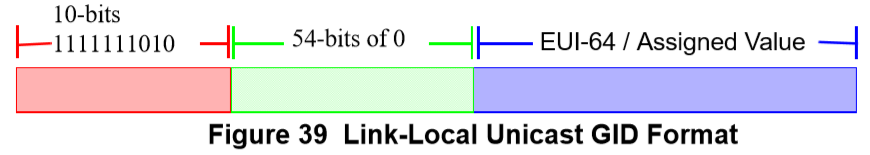
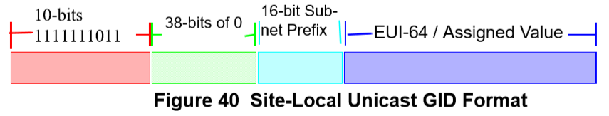

[TOC]

# 目录

## 1 介绍

### 1.2  IB概念概览

InfiniBand体系结构规范描述了一种用于互连处理器节点和I/O节点以形成系统区域网络的一阶互连技术。该体系结构独立于主机操作系统(OS)和处理器平台。

#### 1.2.1 问题

现有的互连技术已经跟不上计算机的发展，而且由于internet的成功普及，给数据服务器、应用程序处理和企业计算带来了越来越大的负担。集群、故障安全和24x7可用性等高端计算概念要求更大的能力在处理节点之间以及处理器节点和I/O设备之间移动数据。这些趋势要求更高的带宽和更低的延迟，它们将更多的功能下推到I/O设备，并且要求比当前可用的更大的保护、更高的隔离、确定性行为和更高的服务质量。

### 1.2.2 特性

InfiniBand体系结构(IBA)是围绕点对点的交换I/O结构设计的，通过级联交换设备连接终端节点设备(可以是非常便宜的I/O设备，如单片机或以太网适配器，也可以是非常复杂的主机)。IBA互连的物理特性支持两种主要的环境，具有适合于这些环境的带宽、距离和成本优化：

- 模块到模块，由支持I/O模块外接插槽的计算机系统所代表
- 底盘到底盘，由数据中心环境中的相互连接的计算机、外部存储系统和外部LAN/WAN访问设备(如交换机、集线器和路由器)所代表

IBA交换结构提供了一种可靠的传输机制，其中消息被编入队列以便在终端节点之间传递。一般来说，InfiniBand体系结构并不指定消息内容和含义，而是将其留给终端节点设备和承载在终端节点设备上的流程的设计者。IBA定义了硬件传输协议，足以支持可靠的消息传递(发送/接收)和内存操作语义(例如远程DMA)，而无需软件干预数据移动路径。IBA定义了允许IBA的保护和错误检测机制，允许IBA事务从特权内核模式(支持遗留I/O和通信需求)或用户空间(支持新兴的进程间通信需求)发起和终止。

**IBA规范还解决了对丰富的可管理性基础设施的需求，以支持来自许多供应商的多代IBA组件之间的互操作性**。该基础设施为高容量、高成本的部署环境提供了易用性和一致的行为。**IBA还为行业标准管理指定接口**，这些接口与企业类管理工具互操作，用于配置、资产管理、错误报告、性能度量收集和IBA数据中心部署所需的拓扑管理。

### 1.2.3 优点

对于IBA的所有革命性方面，体系结构都经过精心设计，以最小化对主流市场范式和业务实践的破坏。通过同时支撑板和底盘互联技术，预计供应商能够采用InfiniBand体系结构技术，在当前的业务实践中，在现有产品的未来几代中使用，从而最好地支持他们客户的需求。

**IBA可以支持预计仍比主流I/O媒体(SCSI、光纤通道、以太网)大一个数量级的带宽**。这确保了它作为使用这些技术附加I/O媒体的公共互连的角色。强化这一点的是IBA对IPv6报头的原生使用，它支持IBA结构与传统internet和intranet基础设施之间的高效连接。

IBA支持与单个计算机系统一样简单的实现，并且可以扩展到包括:用于提高系统可靠性的组件冗余、级联交换结构组件、用于可伸缩I/O容量和性能的额外I/O单元、用于可伸缩计算的额外主机节点计算元素，或任何组合。InfiniBand体系结构是一种革命性的体系结构，它使计算机系统能够满足不断增长的客户需求，包括更高的可伸缩性、更高的带宽、更低的CPU利用率、更高的可用性和更高的隔离性和对Internet技术的支持。

IBA被设计为一阶网络，主要负责将数据移入和移出节点的内存，并针对单独的控制和内存接口进行了优化。**这允许硬件与节点的内存紧密耦合，甚至集成，从而消除任何性能障碍**。IBA足够灵活，可以实现为允许遗留和迁移的二阶网络。即使实现为二阶网络，IBA的内存优化操作也允许最大限度地利用可用带宽并提高CPU效率。

## 1.3 适用范围

IBA支持多种应用程序，从单个主机的背板互连到由多个独立的集群主机和I/O组件组成的复杂系统区域网络。对于单个主机环境，如图2所示，每个IBA fabric作为其主机的私有I/O互连，并在主机的CPU/内存复合体和许多I/O模块之间提供连接。对于这种环境，所有设备都是主机专用的。

对于多主机连接，如图1所示。在这里，一个织物甚至多个织物互连许多主机和各种I/O单元。一些主机可能共享I/O设备，而其他主机则不共享。主机之间的进程间通信成为一个非常重要的目标。简单的结构管理已经不够了，因为网络管理员需要额外的特性来维护分离和确保确定性行为。

架构不仅指定了I / O机制和进程间通信,它还指定了一组广泛的管理机制,足够灵活来允许单个主机环境没有过度的负担和昂贵的结构管理和同时支持非常复杂系统区域网络(SAN)和功能丰富的结构管理。

## 4 寻址

本章定义了IBA的Addressing术语和概念。为便于理解，请参考以下图表。

### 4.1 术语和概念

- Endport：a CA port, a router port, or a switch management port
- SM (Subnet Manager): 子网管理器
- GRH (global routing header )

#### 4.1.1 GID的使用和属性

1. 默认的GID前缀定义为(0xFE80::/64)。一个包含目标GID以这个前缀开头的GRH的包绝不能被路由器转发，也就是说，它被限制在本地子网中

2. 子网管理器可以为endport配置非缺省GID前缀。子网在任何给定的时间都应该有0个或一个非默认的分配GID前缀

3. 每个endport至少应有一个单播GID。endport单播gid是使用以下机制创建的:
   
   1. 对于每个endport GUID(在GUIDInfo属性中列出)，使用与GUID连接的缺省GID前缀
   
4.  单播保留GID地址：0:0:0:0:0:0:0:0。它永远不会被分配到任何endport。它不能用作目标地址或全局路由头

5.  单播回环GIP地址:   0:0:0:0:0:0:0:1。并且回环地址只给在原生IPv6上使用 —— IB传输服务不会用到它。它永远不会被分配到endport或出现在任何IBA包中 

6. 单播GID范围：

   1. Link-local - 使用缺省GID前缀在本地子网中使用的单播GID。路由器不能在本地子网之外转发任何带有链路本地源或目标gid的包。链接本地GID的格式如下

      

   2. Site-local - 在子网集合中使用的单播GID，它在该集合中是惟一的(例如，数据中心或校园)，但不一定是全局惟一的。路由器不能在站点外部转发任何带有站点本地源GID (SGID)或站点本地目标GID (DGID)的包
   
      
   
   3. Global - 具有全局前缀的单播GID，即路由器可以使用此GID在整个企业或internet中路由数据包。全局GID格式是
   
      
   
   4. 多播GID格式
   
      
   
      1. GID的前8bit为11111111表示这是一个多播GID
   
      2. 4bit的标志位前3位为保留位，T标志位的含义如下：
   
         1. T = 0表示这是一个永久分配的组播GID(即众所周知的组播GID)。对于这些永久分配的gid，请参阅RFC 2373和RFC 2375作为参考
         2. T = 1表示这是非永久分配的组播GID
   
      3. Scope是一个4位的多播范围值，用于限制多播组的范围。
   
         
   
      4. sdfafd
   
   5. 阿斯顿发放到

#### 4.1.2 CHANNEL ADAPTER, SWITCH, AND ROUTER ADDRESSING RULES

寻址规则是：

1. 一个端口应连接到一个链路上
2. 一个Endport应支持一系列由Base LID和LMC（ LID Mask Control ，LID掩码控制，3位，即取值范围为0-7）定义的LID。LID应按顺序排列，从一个Base LID开始，并以base LID加((2^LMC)-1)结束。SM可以将Endport的LMC编程为0到7之间的任意值，以允许在寻址端口号时使用多个LIDs (1-128)。<!-- 即每个Endport可以对应多条物理路径，每条物理路径对应一个LID -->
   1. Base 交换端口0应分配一个单播LID，即LMC = 0
3. 单播LID只能映射到一个endport
4. 一个组播LID应该映射到一个或多个endport——一个endport可能是零个、一个或多个组播流的目标
5. Unicast GIDs shall be assigned on a per endport basis
6. 一个多端口CA(即，一个路由器)可以连接到一个或多个子网——一个endport一次只能连接到一个子网

####  Local identifier

Local identifier (LID): 具有以下属性的16位标识符：

1. LID是由子网管理器(SM)分配的，并且是子网唯一的，也就是说，它不能用于子网之间的路由
2. LID地址空间分为预留地址空间、单播地址空间和多播地址空间
3. LIDs包含在LRH(Local Route Header，本地路由报头)中
4. 源LID(SLID)是指向第一个将数据包注入子网的endport
5. SLID只能与单播地址相关联
6. 单播目标LID(DLID)应指向目标endport。组播DLID指向子网中参与给定组播组的目标endport集合
7. 如果目标端口号不在同一子网上，DLID应指负责将数据包转发到目标端口号的下一跳的路由器端口
8. 从子网中的任何点开始，给定的endport都可以通过子网中的多个物理路径接收数据包。每个物理路径可以由一个或多个目标LID标识。为了方便多路径操作，同时最小化通道适配器的复杂性，子网管理器应该为每个endport分配一个base LID和一个LID掩码控制(LID Mask Control, LMC)值。LMC是一个3位字段，表示2^LMC路径(最多128条路径)。
9. LID的地址空间定义如下：
   1. 0x0000是保留地址
   2. 0xFFFF被定义为一个permissive DLID。permissive DLID表示数据包将在接收它的endport上发送到QP0。LMC没有为这个地址定义
   3. 单播LID的地址空间是：0x0001 ~ 0xBFFF
   4. 多播LID的地址空间是：0xC000 ~ 0xFFFE
      1. 任何包含组播GID的数据包的DLID都应在上述指定的组播LID范围内

