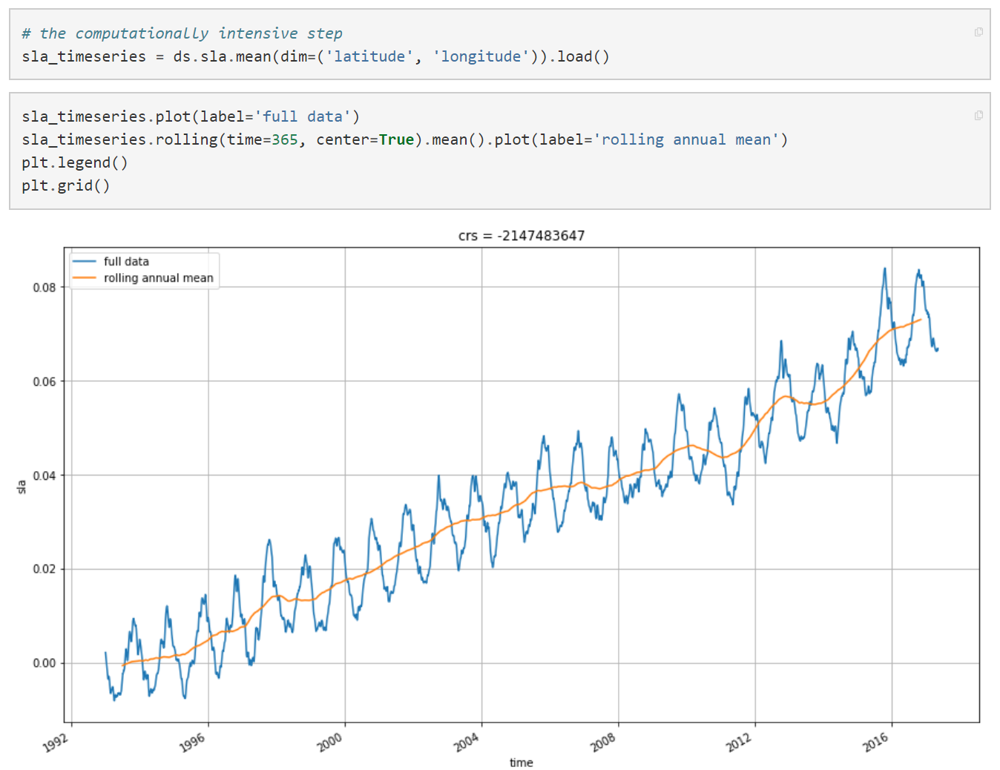

[TOC]

# Pangeo简介

## 简介

Pangeo是一个由许多开发者合作开发软件和基础设施，以支持大数据地球科学（geoscience）研究的软件生态。

## 目标

- 培育一个生态系统，在这个生态系统中，下一代用于海洋、大气和气候科学的开源分析工具可以被开发、分发和持续使用。这些工具必须是可扩展的，以满足当前和未来的大数据挑战。
- 围绕海洋/大气/陆地/气候科学的开源科学python生态系统促进合作
- 支持特定领域的地球科学包的开发
- 改进这些工具的可伸缩性，以便在HPC和云平台上处理pb级的数据集

总结：Pangeo是一个生态系统，上面已经有许多用于地球科学领域的工具（大部分是Python包），并支持开发者将开发出来的工具共享到这个生态系统上。从用户（地球科学领域的研究人员）的角度看，主要作用就是用于地理科学数据的分析处理和可视化。

## Pangeo项目的架构

上图包含了Pangeo的几大核心组件：

- ZARR：ZARR是一种针对云场景进行优化过的数据格式，将传统格式（一般为NetCDF）的数据转换成ZARR格式存储在云上的对象存储中
- DASK：Dask是一个Python并行计算框架，能够将远远超出计算机内存的数据切分成许多小的簇（chunk），将这些数据发送到多个计算节点上进行分布式的并行处理。Dask可以通过HPC的作业调度系统（如slurm）或Kubernetes来调度。
- Xarray：为地球科学领域设计的用于操作多维(N-Dimension)带标签(labeled)数据的数据结构，底层基于Python的NumPy和Pandas
- PyViz：用于科学计算领域的可视化Python包，让科学数据的可视化更强大，更方便
- Jupyter：提供交互式的Python可视化环境，使用户可以在浏览器上直接访问和操作云上（或HPC上）的大数据处理和可视化环境

### Dask

Dask是Pangeo的核心组件之一，为地球科学领域的数据提供了分布式并行计算支持。

Dask可以通过HPC的作业调度系统（如slurm）来调度，也可以通过Kubernetes来调度。

#### 通过slurm调度

在HPC场景下，Dask可以通过向slurm提交job来扩展它的计算节点(dask-worker)的规模，从而根据实际数据的计算需求来动态扩展它的集群规模。

#### 通过Kubernetes调度

在云场景下，Dask通过向Kubernetes集群提交任务，申请更多的容器来作为它的节点（dask-worker），从而根据实际数据的计算需求来动态扩展它的集群规模。

总结：Dask为地球科学领域的数据提供了分布式并行计算支持，其计算节点实际上是一个一个的job（HPC场景）或容器（云场景），可以通过HPC的作业调度系统或者Kubernetes来动态扩展它的集群规模。目前Dask能够支持PB级数据的分析处理（只要能够通过Slurm或Kubernetes申请到足够的计算资源）。

## UserCase

以下例子均可以直接通过浏览器访问Pangeo应用进行。

### 海面测高数据分析

数据集：pangeo-data/dataset-duacs-rep-global-merged-allsat-phy-l4-v3-alt (在谷歌云上，大小约74G)

最简单的例子，分析海平面高度的变化情况：

其中，`ds.sla.mean(dim=('latitude', 'longitude')).load()` 这行代码将会把数据集加载到Dask的各个计算节点上，进行分布式的并行计算，这里只是简单的求平均值。

分析各维度海平面高度的变化情况：

### 美国的气温和降水预测

数据集：https://www.earthsystemgrid.org/dataset/gridded_precip_and_temp.html （大小约5TB）

