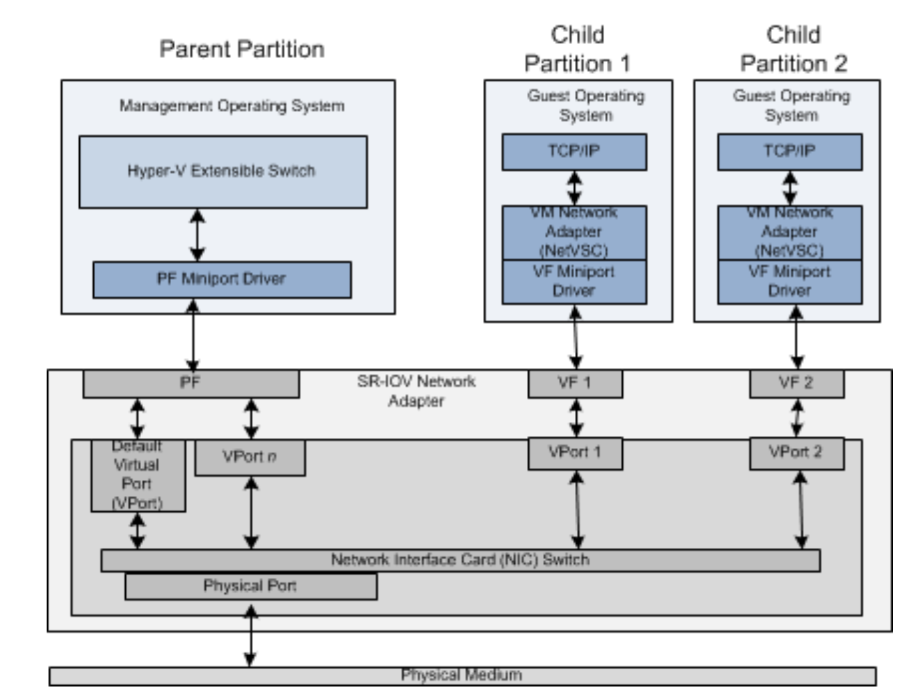

[TOC]


## 简介

当前，主流的网络I/O虚拟化技术有三种：软件模拟、网卡直通和SR-IOV。这三种虚拟化技术在不同程度上实现了网络I/O设备的虚拟化功能。其中，软件模拟是通过虚拟化Hypervisor层模拟虚拟网卡，实现与物理设备完全一样的接口，虚拟机操作系统无须修改就能直接驱动虚拟网卡，其最大的缺点是性能相对较差；网卡直通支持虚拟机绕过Hypervisor层，直接访问物理I/O设备，具有最高的性能，但是，在同一时刻，物理I/O设备只能被一个虚拟机独享；SR-IOV是Intel在2007年提出的解决虚拟化网络I/O的硬件技术方案，该技术不仅能够继承网卡直通的高性能优势，而且同时支持物理I/O设备的跨虚拟机共享，具有较好的应用前景。

### 

I/O Memory Management Unit (IOMMU) support is not enabled by default in Red Hat Enterprise
Linux 7.0 distribution 

可以通过在/etc/default/grub的GRUB_CMDLINE_LINUX参数项中添加intel_iommu=on开启。

Linux Kernel version 3.8.x and above — VF can be created by writing an appropriate value to the
sriov_numvfs parameter via sysfs interface.

```shell
# echo 4 > /sys/class/net/device name/device/sriov_numvfs 
```


每次重启后配置都会被重置，需要将配置命令写到开机自启动命令中：

> Module options are not persistent from one boot to the next. To ensure that the desired number of
> VFs are created each time the server is power-cycled, append the above command to the rc.local
> file, which is located in the /etc/rc.d/ directory.  


On Linux Kernel version 3.8.x and above, VF can be destroyed or disabled by writing the value 0 to
the sriov_numvfs parameter via sysfs interface. 

``` shell
echo 0 > /sys/class/net/device name/device/sriov_numvfs
```


检查是否支持SR-IOV： 

 ```shell
lspci -s <NIC_BDF> -vvv | grep -i "Single Root I/O Virtualization"
 ```

## 架构



SR-IOV包括以下组件：

### Physical Function (PF)

PF是一个支持SR-IOV接口的网络适配器的PCI Express (PCIe)函数。PF在PCIe配置空间中包含SR-IOV扩展能力。该功能用于配置和管理网络适配器的SR-IOV功能，如启用虚拟化和暴露VFs。

### PF Miniport Driver

PF miniport driver负责管理一个或多个VFs使用的网络适配器上的资源。因此，在为VF分配任何资源之前，PF迷你端口驱动程序被加载到管理操作系统中。在为VFs分配的所有资源释放后，PF迷你端口驱动程序将停止

### Virtual Function (VF)

VF是网络适配器上支持SR-IOV接口的轻量级PCIe函数。VF与网络适配器上的VF相关联，并表示网络适配器的虚拟化实例。每个VF还与PF和其他VFs共享网络适配器上的一个或多个物理资源，例如外部网络端口。


### VF Miniport Driver

VF迷你端口驱动程序安装在了VM中，用来管理VF。VF迷你端口驱动程序执行的任何操作都不能影响同一网络适配器上的任何其他VF或PF。


### Network Interface Card (NIC) Switch

网卡交换机是支持SR-IOV接口的网络适配器的硬件组件。网卡交换机在适配器的物理端口和内部虚拟端口(VPorts)之间转发网络流量。每个VPort都附加到PF或VF。

### Virtual Ports (VPorts)

VPort是一个数据对象，它表示支持SR-IOV接口的网络适配器的NIC交换机上的内部端口。与物理交换机上的端口类似，NIC交换机上的VPort将数据包发送到PF或VF，并将其连接到该端口。

### Physical Port

物理端口是支持SR-IOV接口的网络适配器的硬件组件。物理端口提供适配器到外部网络媒体的接口。


## NIC交换机

 

支持单根I/O虚拟化(SR-IOV)的网络适配器必须实现一个硬件桥，以便在适配器的物理端口和内部虚拟端口(vport)之间转发网络流量。每个NIC交换机包含以下组件:

- 一个提供到外部物理网络连接的外部或物理端口
- 在网络适配器上提供PCI Express (PCIe)物理功能(PF)的内部端口，可以访问外部物理网络。内部端口称为虚拟端口(VPort)。PF总是有一个创建并分配给它的VPort。这个VPort称为默认VPort，由DEFAULT_VPORT_ID标识符引用。
- 在网络适配器上提供PCIe虚拟功能(VF)的一个或多个vport，可以访问外部物理网络。


## VF数据通道

如果物理网络适配器支持单根I/O虚拟化(SR-IOV)接口，则可以启用一个或多个PCI Express (PCIe)虚拟函数(VFs)。每个VF都可以连接到一个Hyper-V子分区。发生这种情况时，虚拟化堆栈执行以下步骤：

- 一旦分配了VF的资源，虚拟化堆栈就会在来宾操作系统中暴露VF的网络适配器。这将导致在来宾操作系统中运行的PCI驱动程序启动VF迷你端口驱动程序。该驱动程序由独立硬件供应商(IHV)为SR-IOV网络适配器提供。注意：在将VF附加到Hyper-V子分区之前，VF的资源必须由用于PCIe物理功能(PF)的miniport driver分配。VF资源包括将NIC交换机上的虚拟端口(VPort)分配给VF。
- 加载并初始化VF miniport驱动程序后，NDIS将客户操作系统中的网络虚拟服务客户机(NetVSC)的协议edge绑定到驱动程序。注意：NetVSC只绑定到VF迷你端口驱动程序。客户操作系统中的其他协议栈不能绑定到VF迷你端口驱动程序。

在NetVSC成功地绑定到驱动程序之后，客户操作系统中的网络流量将通过VF数据路径发生。数据包通过网络适配器的底层VF发送或接收，而不是基于软件的合成数据路径。

使用VF数据路径有以下好处:

- 所有数据包都直接在来宾操作系统和VF中的网络组件之间流动。这消除了合成数据路径的开销，其中数据包在Hyper-V子分区和父分区之间流动。
- VF数据路径绕过管理操作系统在来自Hyper-V子分区的包通信中的任何介入。VF为它所连接的子分区提供独立的内存空间、中断和DMA流。这实现了几乎与非虚拟化环境相近的网络性能。
- 数据包在VF数据路径上的路由由SR-IOV网络适配器上的NIC交换机执行。包通过适配器的物理端口在外部网络上发送或接收。包也被转发到其他子分区或从其他子分区转发过来（注：附加了VF的子分区）。没有附加VF的子分区的包被NIC switch转发到Hyper-V extensible switch module。此模块在Hyper-V父分区中运行，并使用合成数据路径将这些包传递给子分区。

## Synthetic Data Path

当启动Hyper-V子分区并运行来宾操作系统时，虚拟化堆栈将启动Network Virtual Service Client(NetVSC)。NetVSC公开一个虚拟机(VM)网络适配器，该适配器向在来宾操作系统中运行的协议栈提供一个miniport driver edge。NetVSC还与Hyper-V的extensible switch通信，该switch运行在Hyper-V父分区的管理操作系统中。可扩展的交换机组件作为Network Virtual Service Provider(NetVSP)运行。NetVSC和NetVSP之间的接口提供了一个称为合成数据路径的软件数据路径。下图显示了SR-IOV网络适配器上的合成数据路径的组件：


如果底层的SR-IOV网络适配器为PCI Express (PCIe)虚拟函数(VFs)分配资源，虚拟化堆栈将附加一个VF到Hyper-V子分区。一旦附加，子分区内的包流量将出现在硬件优化的VF数据路径上，而不是合成的数据路径上。

如果下列条件之一为真，虚拟化堆栈仍然可以为Hyper-V子分区启用合成数据路径:

- SR-IOV网络适配器没有足够的VF资源来容纳所有启动的Hyper-V子分区。将网络适配器上的所有VFs附加到子分区之后，其余分区使用合成数据路径。从VF数据路径故障转移到合成数据路径的过程称为VF故障转移。
- 一个VF被附加到一个Hyper-V子分区上，但是被分离了。例如，虚拟化堆栈可以从一个子分区中分离VF并将其附加到另一个子分区。当运行的Hyper-V子分区多于底层SR-IOV网络适配器上的VF资源时，可能会出现这种情况。
- Hyper-V子分区被动态迁移到不同的主机上

尽管SR-IOV网络适配器上的合成数据路径不如VF数据路径有效，但仍然可以对其进行硬件优化。例如，如果配置了一个或多个虚拟端口(VPorts)并将其附加到PCIe物理功能(PF)，则数据路径可以提供类似于虚拟机队列(VMQ)接口的offload功能

