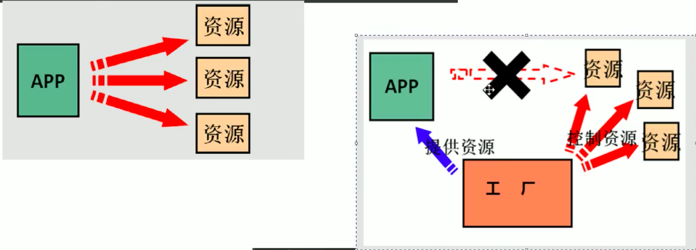

[TOC]

# MyBatis

## CURD是如何实现的

通过代理DAO,关键是把反射，动态代理的知识搞清楚。

首先，需要把数据库的地址，用户名密码等信息放在xml配置文件中，SqlSessionFactoryBuilder可以通过xml配置文件构建一个SqlSessionFactory（构建者模式），SqlSessionFactory通过xml里的mappers信息可以生产出一个SqlSession对象，SqlSession可以通过getMapper(Class<T> dao)方法获取到dao的代理对象， 这个dao是通过反射（代理模式）生成的。

getMapper如何得到代理dao所需要的信息（如何生成目标dao实现类）？

有两种方式：通过xml配置方式和通过注解

但两种包含的信息是一样的,xml配置信息如下：

```java
<mapper namespace="com.itheima.dao.IUserDao">
    <!-- 配置 查询结果的列名和实体类的属性名的对应关系 -->
    <resultMap id="userMap" type="uSeR">
        <!-- 主键字段的对应 -->
        <id property="userId" column="id"></id>
        <!--非主键字段的对应-->
        <result property="userName" column="username"></result>
        <result property="userAddress" column="address"></result>
        <result property="userSex" column="sex"></result>
        <result property="userBirthday" column="birthday"></result>
    </resultMap>

    <!-- 查询所有 -->
    <select id="findAll" resultMap="userMap">
        <!--select id as userId,username as userName,address as userAddress,sex as userSex,birthday as userBirthday from user;-->
        select * from user;
    </select> 
      
    <update id="updateUser" parameterType="USER">
        update user set username=#{userName},address=#{userAddress},sex=#{userAex},birthday=#{userBirthday} where id=#{userId}
    </update>
</mapper>
```

主要信息：

- 接口类型
- 方法名: updateUser
- 返回值：UESR
- SQL语句
- 对象属性和数据库字段的对应关系（可选）


## 代理dao代理的目标对象是什么

目标对象不用人为创建，但是它是什么呢，即具体执行sql是通过那个类进行的呢？

org.apache.ibatis.executor.Executor接口中定义了db操作相关的方法：

```java
package org.apache.ibatis.executor;

public interface Executor {
    ResultHandler NO_RESULT_HANDLER = null;

    int update(MappedStatement var1, Object var2) throws SQLException;

    <E> List<E> query(MappedStatement var1, Object var2, RowBounds var3, ResultHandler var4, CacheKey var5, BoundSql var6) throws SQLException;

    <E> List<E> query(MappedStatement var1, Object var2, RowBounds var3, ResultHandler var4) throws SQLException;

    <E> Cursor<E> queryCursor(MappedStatement var1, Object var2, RowBounds var3) throws SQLException;

    List<BatchResult> flushStatements() throws SQLException;

    void commit(boolean var1) throws SQLException;

    void rollback(boolean var1) throws SQLException;

    CacheKey createCacheKey(MappedStatement var1, Object var2, RowBounds var3, BoundSql var4);

    boolean isCached(MappedStatement var1, CacheKey var2);

    void clearLocalCache();

    void deferLoad(MappedStatement var1, MetaObject var2, String var3, CacheKey var4, Class<?> var5);

    Transaction getTransaction();

    void close(boolean var1);

    boolean isClosed();

    void setExecutorWrapper(Executor var1);
}
```

SimpleExecutor等实现类实现了该接口。但是该接口只有update,query操作，insert,delete操作怎么办呢？事实上insert和delete都是通过update来操作的。


# Spring

## Spring Framework


### IoC

 控制反转：把创建类对象的控制权交给了框架，由框架来负责对象的创建，可以降低耦合,IoC是一种思想。




### DI

[参考教程](https://www.bilibili.com/video/BV1mE411X7yp?p=99)

依赖注入：当对象需要用到其他对象时，由Spring为我们提供，我们只需在配置文件中说明，即依赖关系的管理交给了Spring框架。

注入的数据类型可分为3大类：基本数据类型和String,其他bean(Spring容器管理的对象)，集合

注入的方式有3种：通过构造函数，通过set方法，通过注解。


### AOP

参考视频：[Spring AOP](https://www.bilibili.com/video/BV1mE411X7yp?p=135)

- JointPoint：连接点，指被Spring拦截的方法（但不一定被Spring做了增强，做了增强的叫切入点）
- PointCut：切入点，指需要增强的方法（连接点）
- Advice：通知，拦截到方法之后要做的事就是通知，有前置通知，后置通知，异常通知，最终通知，环绕通知
- Target：目标对象，被增强的对象
- Proxy：代理对象，增强后的对象
- Weaving：给方法增强的过程（可以认为是代理对象在调用invoke方法前后添加增强逻辑的过程）
- Aspect：切面，切入点和通知对应关系的集合