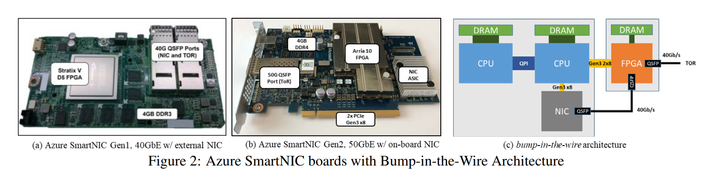
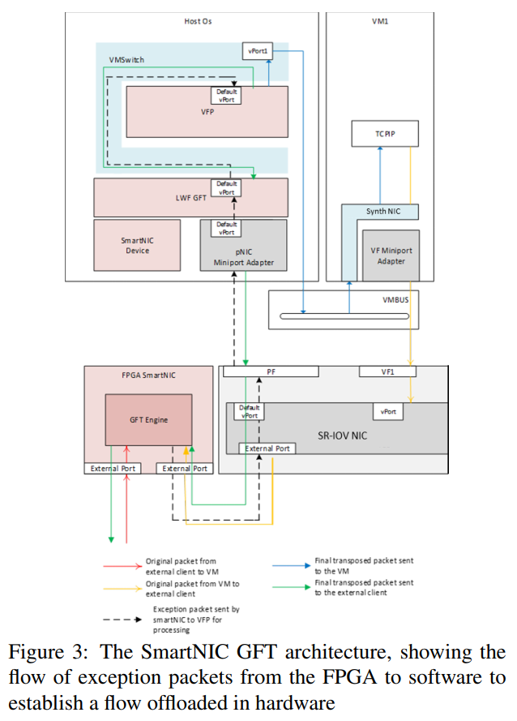
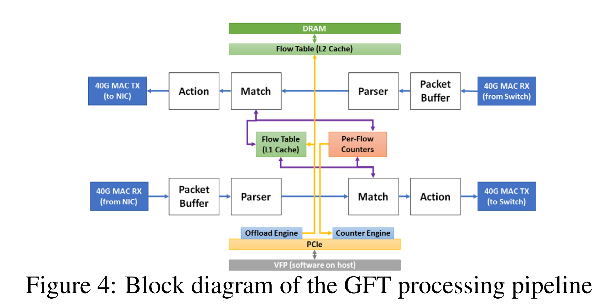
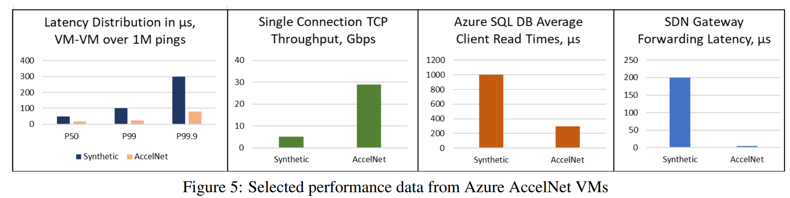
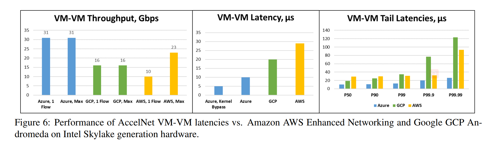
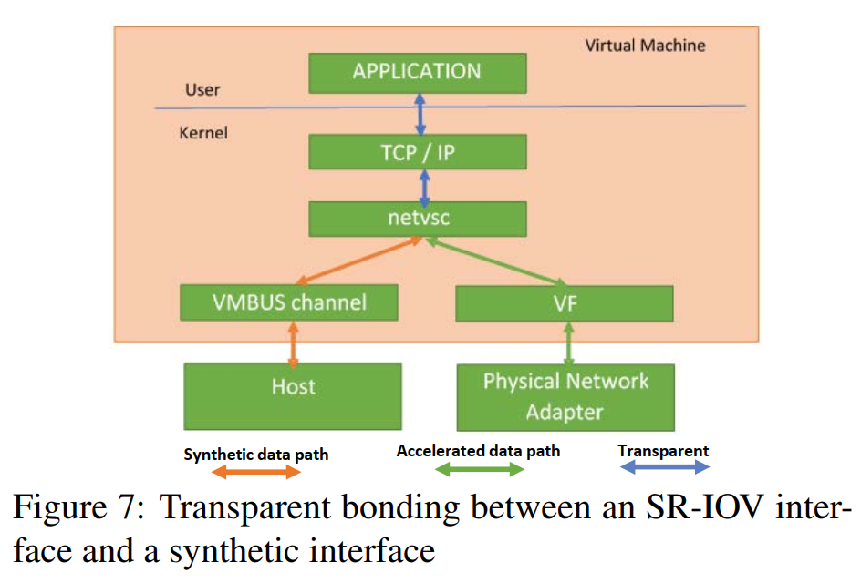

[TOC]

# 概要

现代云架构依赖每个服务器运行自己的网络堆栈，以实现诸如虚拟网络隧道、安全和负载平衡等策略。然而，随着网络速度的提高和特性的增加，这些网络堆栈变得越来越复杂。在CPU核心上运行这些堆栈会占用vm的处理能力，增加运行云服务的成本，并增加网络性能的延迟和可变性。我们提出了Azure加速网络(AccelNet)，这是我们的解决方案，使用基于fpga的定制Azure智能网卡将主机网络转移到硬件上。我们定义了AccelNet的目标，包括可编程性可与软件相比，性能和效率可与硬件相比。我们知道fpga是目前最好的卸载网络堆栈的平台，因为它提供了非常高效的可编程性，而ASIC不提供可扩展的性能，尤其是在单一网络流上。

自2015年底以来，实现了AccelNet的Azure SmartNICs已经部署在所有新的Azure服务器上，拥有100万台>主机。AccelNetservice已用于Azure客户自2016年以来,提供一致的< 15µs VM-VM TCP延迟和32 gbps吞吐量。们相信，在公共云计算中，这是用户可以使用的最快网络。我们介绍了AccelNet的设计，包括硬件/软件协同设计模型，关键工作负载下的性能结果，以及在基于fpga的Azure SmartNICs上开发和部署AccelNet的经验和教训。

# 1 引言

公有云是大量快速增长的在线软件服务背后的支柱。仅在Microsoft Azure云上，这些服务就消耗了数百万个处理器内核、exabytes的存储空间和pb级的网络带宽。网络性能，包括带宽和延迟，对于大多数云工作负载来说都是至关重要的，尤其是交互式的面向客户的工作负载。

作为一家大型的公共云提供商，Azure已经在基于主机的软件定义网络(SDN)技术上构建了自己的云网络。使用它们来实现几乎所有的虚拟网络特性，例如带有客户提供的地址空间的私有虚拟网络、可伸缩的L4负载平衡器、安全组和访问控制列表(acl)、虚拟路由表、带宽计量、QoS等。这些特性由主机平台负责，这通常意味着软件在管理程序中运行。

提供这些服务的成本继续增加。在短短几年的时间里，我们将网络速度提高了40倍甚至更多，从1GbE到40GbE+，并添加了无数的新功能。虽然我们构建了越来越优化和高效的主机SDN包处理功能，但是在主机上的软件中运行这个堆栈需要额外的CPU周期。为这些服务消耗cpu占用了客户vm可用的处理能力，并增加了提供云服务的总体成本。

SR-IOV 建议通过允许从VM直接访问NIC硬件来降低CPU利用率。但是，这种直接访问将绕过主机SDN堆栈，使NIC负责实现所有SDN策略。于这些策略变化很快(从几周到几个月)，所以我们需要一种解决方案，既能提供类似软件的可编程性，又能提供类似硬件的性能。

在本文中，我们提出了Azure加速网络(AccelNet)，我们的主机SDN栈是在fpga Azure SmartNIC。在虚拟环境中，AccelNet提供了接近本机的网络性能，将包处理从主机CPU转移到Azure SmartNIC。构建在基于软件的VFP主机SDN平台上，***AccelNet提供了专用硬件的性能，以及在管理程序中运行的软件的可编程性。们的目标是展示我们的设计和我们在大规模生产中运行AccelNet的经验，以及我们学到的教训。

# 2 背景

## 2.1 传统主机网络处理

在公共云等虚拟化环境的传统设备共享模型中，进出物理设备的所有网络I/O都只在系统管理程序的主机软件分区中执行。每个包，VM发送和接收的数据由主机网络栈中的虚拟交换机(vSwitch)处理。接收数据包通常涉及到虚拟机监控程序将每个数据包复制到vm可见的缓冲区中。模拟虚拟机的软中断，然后允许虚拟机的操作系统堆栈继续网络处理。发送数据包与此类似，但顺序相反。与非虚拟化环境相比，这种额外的主机处理：降低性能，需要在特权级别上进行额外的更改，降低吞吐量，增加延迟和延迟可变性，并增加主机CPU利用率。

## 2.2 Host SDN 

除了销售虚拟机，云供应商出售的基础设施即服务(IaaS)必须提供丰富的网络语义，如具有客户提供的地址空间的私有虚拟网络、可伸缩的L4负载平衡器、安全组和acl、虚拟路由表、带宽计量、QoS等。这些语义足够复杂，变化太频繁，在传统的交换机硬件中大规模实现它们是不可行的。相反，它们是在vSwitch中的每个主机上实现的。这可以很好地扩展服务器的数量，并允许物理网络变得简单、可伸缩和非常快。

虚拟过滤平台(VFP)是我们的云级可编程vSwitch，为Azure提供可伸缩的SDN策略。它被设计来处理Azure的许多SDN应用程序的可编程性需求，为多个SDN控制器提供了一个平台，通过match-action表来探测复杂的、有状态的策略。VFP以及它是如何在Azure中实现软件中的虚拟网络的参考[6]。

## 2.3 SR-IOV

通过使用支持SR-IOV的硬件，可以克服在hypervisor中进行包处理所导致的许多性能瓶颈。容sr-iov的硬件为在多个vm之间高效、安全地共享PCI Express (PCIe)设备硬件提供了一个基于标准的基础。主机连接到一个有特权的物理函数(PF)，而每个虚拟机连接到它自己的虚拟函数(VF)。VF作为惟一的硬件设备公开给每个VM，允许VM直接访问实际的硬件，但仍然将VM数据与其他VM隔离。如图1所示，SRIOV-NIC包含一个根据mac地址把包转发到正确的VF的嵌入式交换机，所有数据包直接在VM操作系统和VF之间流动，完全绕过主机网络栈。这提供了更好的吞吐量、更低的CPU利用率、更低的延迟和更好的可伸缩性。

但是，绕过虚拟机监控程序会带来一系列新的挑战，因为它还会绕过所有主机SDN策略，比如VFP中实现的策略。如果没有附加的机制，这些重要的功能将无法执行，因为主机中的SDN堆栈不会处理这些包。

## 2.4 Generic Flow Table Offload 

One of AccelNet’s goals was to find a way to make VFP’s complex policy compatible with SR-IOV.  我们在VFP中用于在SR-IOV环境中执行策略和过滤的机制称为通用流表(GFT)。GFT是一种匹配操作语言，它定义了对一个特定网络流的数据包的转换和控制操作。从概念上讲，GFT是由一个大表组成的，该表对主机上的每个活动网络流都有一个入口。GFT流是基于VFP统一流(UF)定义定义的，匹配唯一的源和目标L2/L3/L4元组。可能跨越多个封装层，以及指定如何添加/删除/更改标题字段的标题换位(HT)操作。

当GFT表不包含网络流的条目时（例如，当一个新的网络流启动时），可以将流定向到运行在主机上的VFP软件。然后VFP处理流的第一个包的所有SDN规则，使用即时流操作编译器为每个UF（如TCP/UDP流）创建有状态的精确匹配规则。并为该流创建一个所有已编程策略的复合操作。然后，VFP填充GFT表中的新条目，并交付包进行处理。

方法中填充了流的操作之后GFT表中，每个后续的数据包都将被GFT硬件处理，提供了性能上的好处SR-IOV，但具有完整的策略和过滤执行VFP的软件SDN栈。

# 3 设计目标和原理

我们在2013-2014年定义了GFT模型，但是在硬件和软件之间构建完整的解决方案有许多选择。在我们开始为主机SDN构建硬件卸载时，我们有以下目标和约束：

## Don’t burn host CPU cores 

Azure与其竞争对手一样，将vm作为IaaS产品直接销售给客户，竞争这些vm的价格。IaaS的盈利能力是客户为VM支付的价格与我们托管VM的成本之间的差额。因为每个服务器的成本是固定的，降低VM成本的最佳方法是在每台服务器上打包更多的VM。因此，大多数云通常在给定的2-socket(经济且高性能的标准)刀片服务器上合理地部署尽可能多的CPU内核。写这篇论文的时候，一个物理核心(2个超线程)的售价为0.10-0.11美元/hr1，或者最高潜在收入约为900美元/年，
在服务器的生命周期内为$4500(服务器通常持续时间为3至5年)。即使考虑到某些核心在任何时候都是未售出的，而且云通常为客户承诺的容量购买提供折扣，即使使用一个物理核心来进行主机联网，与专用硬件相比也是相当昂贵的。我们的业务从根本上依赖于向客户vm出售尽可能多的每个主机的核心，因此我们将尽最大努力减少主机开销。因此，应该避免使用主机CPU内核运行高速SDN数据路径。

## 维持VFP的主机SDN可编程性

VFP是高度可编程的，包括一个多控制器模型，有状态流程处理，针对大量规则的复杂匹配功能，复杂的规则处理和匹配操作，以及轻松添加新规则的能力。这种级别的可编程性是Azure能够为客户提供高度可配置且功能丰富的虚拟网络的关键因素，并随着时间的推移，通过新的虚拟网络功能实现创新。**我们不想为了SR-IOV的性能而牺牲这种可编程性和灵活性**。事实上，我们希望SDN控制器在不知道策略被卸载的情况下继续以VFP为目标。这也将在没有AccelNet需要的硬件主机服务器上保持兼容性。

把所有规则都交给硬件既不可行也不可取，因为它要么约束SDN策略，要么要求在每次创建新规则时更新硬件逻辑。然而，我们的结论是，卸载所有规则是不必要的。大多数SDN策略在流的持续时间内不会更改。因此，所有的策略都可以在VFP软件中对新包的第一个包执行TCP/UDP流，然后可以将该流的操作缓存为精确匹配查找。即使对于短流，我们通常也会观察到至少7-10个包，包括握手，所以只处理软件中的第一个包仍然可以卸载大多数包（如果卸载动作迅速有效）

## 实现SRIOV硬件的延迟、吞吐量和利用率

基本的SR-IOV nic设置了硬件虚拟化网络的初始标准，完全绕过主机SDN堆栈和调度器，实现低(和一致的)延迟、高吞吐量和无主机CPU利用率。只卸载具有相关操作的精确匹配流，这使得硬件设计易于处理，除了每个流的第一个包之外，其他所有流都具有本地SR-IOV硬件解决方案的全部性能。

## 随着时间的推移，支持新的SDN工作负载和原语

VFP继续发展，支持新的需求和新的策略，AccelNet必须能够与VFP一起发展。我们过去是，现在仍然是，非常警惕那些把我们锁在一套固定的流动动作中的设计。AccelNet不仅需要支持添加/更改操作，而且底层平台还应该允许新的工作负载，这些工作负载不能整齐地映射到单个精确匹配表。

## 向整个机队推出新功能

与前面的需求相对应，AccelNet平台需要在现有的硬件舰队中频繁地部署新功能，而不仅仅是在新服务器上。客户不应该为了启用新特性而将现有部署迁移到新的VM类型。类似地，跨硬件代维护相同的SDN功能使开发、鉴定和部署变得更容易。

## 提供高单连接性能

根据我们使用基于软件的SDN的经验，我们知道单CPU核上的网络处理通常无法实现40Gb或更高的峰值带宽。**将吞吐量扩展到一个核心所能处理的极限的一个好方法是将单个连接拆分为多个并行连接，利用多个线程将负载分散到多个核心**。然而，跨多个连接传播流量需要对客户应用程序进行大量更改。甚至对于实现多个连接的应用程序，我们也看到许多应用程序不能很好地扩展许多流，因为流常常是爆发性的——应用程序会将大量消息转储到一个流中，而其他流则保持空闲状态。AccelNet的一个明确目标是允许应用程序在不并行网络处理的情况下实现接近峰值的带宽。

## 有一个办法来扩大到100GbE+

我们为2015年将要广泛部署40GbE的服务器一代设计了AccelNet。但我们知道，每台服务器的核心数量和网络带宽在未来几代将继续增加，在不久的将来可能达到100GbE以上的速度。我们想要一个智能网卡的设计，可以继续有效地扩展网络的速度和增加虚拟机数量。

## 保持正常使用

VFP被设计为在不丢失任何流状态的情况下在后台完全可服务，并且支持在迁移VM时动态迁移所有流状态。我们希望SmartNIC软件和硬件堆栈具有相同的可服务性。

# 4 SmartNIC硬件设计

## 4.1 硬件选项

基于以上目标，我们开始评估SmartNIC架构的不同硬件设计。传统上，微软与网络ASIC供应商合作，如Intel、Mellanox、Broadcom等，在Windows中为主机网络实现卸载。例如，1990年代的TCP校验和和分段卸载，2000s用于多核可伸缩性的接收端扩展(RSS)[10]和虚拟机队列(VMQ) 。以及2010s，Azure虚拟网络场景的NVGRE和VxLAN封装无状态卸载。事实上，GFT最初被设计成一个由ASIC厂商实现的配合SR-IOV的精确匹配动作表，我们在业界广泛分享了早期的设计理念，看看供应商是否能满足我们的需求，着时间的推移，我们对这种方法的热情逐渐消退，因为没有任何设计可以满足第3节中列出的所有设计目标和约束。

对于SmartNIC供应商来说，一个主要的问题是SRIOV是一个全有或全无卸载的例子。如果有一个需要的SDN特性无法成功在SmartNic中处理，SDN堆栈必须回退到通过基于软件的SDN堆栈来发送流，几乎失去了SR-IOV卸载的所有性能优势。

我们看到了四个可能的发展方向:asic, soc, fpga，和现有的cpu。

### 4.1.1 基于ASIC的NIC

用于SDN处理的定制ASIC设计提供了最大的性能潜力。然而，随着时间的推移，它们缺乏可编程性和适应性。特别地，需求规格说明和硅的到来之间的长时间跨度大约是1 - 2年，在这个跨度中，需求不断变化，使得新的硅已经落后于软件需求。ASIC设计必须继续为服务器的5年寿命提供所有功能（在我们的规模上改造大多数服务器是不可行的）。all-or-nothing的卸载意味着ASIC设计必须满足未来7年SDN的所有要求。

ASIC供应商经常添加嵌入式CPU核心来处理新的功能。与其他NIC处理硬件相比，这些核心可能很快成为性能瓶颈。此外，随着时间的推移，随着新功能的添加，这些核心可能会承担越来越大的处理负担，从而加剧性能瓶颈。这些核心通常也通过固件更新到网卡进行编程，有供应商处理，减慢新特性的部署。

### 4.1.2 多核基于SoC的NIC

### 4.1.3 FPGAs 

现场可编程门阵列(Field programmable gate arrays ,FPGAs ),是由小型通用逻辑块和内存组成的可重构硬件设备，所有这些设备都通过静态配置的网络连接。程序员编写代码将通用逻辑和内存组装成“软逻辑”电路，形成自定义的特定于应用程序的处理引擎——平衡asic的性能与SoC的可编程性。

与基于socket的nic上的cpu不同，一个FPGA的编程只包含完成应用程序所需的基本元素，甚至可以利用应用程序的特性(如数据的最大大小)来减少总线宽度和存储需求。有许多研究表明，对于从微处理器模拟[15]、基因组学[16]、机器学习[17]、网络、模式匹配、图形处理等广泛的应用空间，FPGA可以比纯软件实现加速几个数量级的应用程序。

FPGAs吸引AccelNet的关键特性是可编程性，以适应新特性，定制硬件的性能和效率，以及创建深度处理管道的能力，这可以提高单流性能。

当我们评估SmartNIC选项时，微软已经为Catapult 项目做了部署fpga作为数据中心加速器的工作。我们有一个成功的数千节点的网络FPGAs集群为Bing做搜索排名，性能有了很大的提高，成本也降低了，并且在机架内的FPGAs之间有一个网络传输层。

这让我们相信fpga是SmartNIC的一个可行的选择，因为他们有潜力解决我们想要ASIC的性能特征但又有像SoC这样的软件解决方案中固有的可编程性和可重构性的困境。

### 4.1.4 Burn host cores 

我们仍然对所有选项进行了评估，与我们最初使用主机核心来运行SDN堆栈的策略相反，特别是像DPDK[18]这样的技术表明，我们可以通过绕过操作系统网络栈和在轮询模式下运行内核来显著降低包处理的成本。

## 4.2 评估FPGAs作为智能网卡

从我们最初的分析来看，FPGAs似乎是一个不错的选择，但是我们的主机网络组(在此之前一直完全作为一个软件组进行操作)最初对此表示怀疑——尽管fpga在路由器、蜂窝应用程序和设备中广泛应用于网络，它们通常不用作nic或数据中心服务器，并且这个团队没有在生产环境中编程或使用fpga的丰富经验。在我们决定沿着这条路走下去之前，必须回答以下几个问题:

### 是否fpga不比asic大多少

由于可编程存储器(查找表或LUTs)被用来代替门，并且可编程网络的电线和muxes被用来代替专用的电线连接在一起的组件，fpga的通用逻辑部分一般比ASIC相同的逻辑大10-20倍，如果FPGA设计是简单的通用逻辑，那么我们需要比ASIC多10-20倍的硅面积。但是，FPGAs有许多经过加固的块，比如嵌入式SRAMs、收发器和I/O协议块，所有这些都是自定义组件，与自定义asic中的组件几乎相同。

看看现代的NIC，包处理逻辑通常不是最大的部分。相反，大小通常由SRAM内存(例如用于保存流上下文和包缓冲区)、支持I/O的收发器(40GbE、和驱动这些接口的逻辑(MAC+ pc用于以太网，PCIe控制器，DRAM控制器)，所有这些都可以在FPGA上实现硬逻辑。现代的ASIC设计通常包含大量额外的逻辑和可配置性(甚至嵌入式CPU核心)，以适应不同客户的不同需求。需要这种额外的逻辑来最大化容量、处理变化的需求和解决不可避免的bug。以前的工作表明，这种可配置性可以增加一个数量级的面积的ASIC逻辑。因此，fpga的发展趋势是越来越多的定制逻辑，而asic的可编程逻辑越来越多，从而缩小了两者之间的效率差距。

在实践中，我们认为对于这些应用程序，fpga应该比类似功能的fpga大2-3倍左右，我们认为这是大大增加可编程性和可配置性的合理代价。

### FPGAs很贵吗

虽然我们不能公开披露供应商的定价，FPGA市场竞争很激烈（有两个强大的供应商），我们能够以我们的规模大量采购。根据我们的经验，我们的规模允许非可回收的工程成本被摊销，硅的成本由硅的面积和产量决定。服务器中的总硅区往往由cpu、flash和DRAM控制，由于它们的常规结构，产量通常适合FPGAs。

### FPGAs编程很难吗

这个问题引起了主机网络团队的极大怀疑，因为他们当时并不从事数字逻辑设计或Verilog编程，fpga可以提供难以置信的性能相比起CPU的可编程逻辑，但是，只有当硬件设计人员真正考虑到应用程序的有效管道设计并将其设计出来时，才会这样。该项目最初由微软研究院的Catapult团队协助，但最终我们为SmartNIC建立了自己的Azure网络FPGA团队。这个团队比典型的ASIC设计团队要小得多，AccelNet团队平均在任何时候都少于5个FPGA开发人员。我们在AccelNet以及微软其他项目上的经验，比如Bing在网络搜索中的排名，用于数据压缩的LZ77，以及机器学习的BrainWave，演示编程fpga对于生产级云工作负载非常容易处理。这四个应用程序使用了完全相同的硬件，这表明Azure SmartNIC的可编程性和灵活性远远超出了SDN和网络处理能力。这是一个好兆头，因为我们希望在未来几年添加新的功能。对强大的开发团队、基础设施、模拟能力和工具的投资是必不可少的，但是其中的大部分可以在不同的团队之间共享。我们发现成功编程FPGAs最重要的元素是让硬件和软件团队在一个组中一起工作，并使用软件开发方法(如敏捷开发)而不是硬件模型(如瀑布模型)。FPGA的灵活性允许我们以比任何其他类型的硬件设计更快的时间间隔进行编码、部署、学习和修改。这种硬件/软件协同设计模型使硬件性能具有软件般的灵活性。

### FPGAs能超大规模部署吗

让fpga进入我们的数据中心并非易事——当project Catapult开始时，这对于FPGAs来说并不是一个常见的用例，并且团队不得不处理许多技术、后勤和团队结构的问题。然而，在我们开始使用SmartNIC的时候，Catapult已经解决了许多超大规模部署所需的公共基础设施细节。Catapult shell和相关的软件库抽象了底层特定于硬件的细节，并允许SmartNIC的硬件和软件开发主要关注应用程序的功能。虽然现在FPGA厂商普遍支持许多这样的功能，而以前没有。如果没有先前Catapult的工作，这个项目是不可能的。

### 我的代码不是锁定在一个FPGA供应商

今天的FPGA开发几乎完全是用SystemVerilog这样的硬件描述语言完成的，如果最初的开发是为了方便移植而进行的，则是可移植的。有特定于供应商的细节，例如，Intel FPGAs有40b宽的SRAMs，而Xilinx有36b的SRAMs，但是一旦考虑到这些细节，为不同的FPGA编译代码就不是那么困难了。作为可移植性的一个证明点，project Catapult最初是在Xilinx FPGAs上开发的，但是在我们最初的使用之前被移植到Altera FPGAs上。

## 4.3 SmartNIC的系统架构

即使选择FPGAs作为未来的发展方向，如何进行FPGAs的集成仍然是一个很大的问题——对于我们的第一个SmartNIC, FPGA应该放在系统架构的什么位置，它应该包括哪些功能?最初的Catapult FPGA加速器[7]是故意不连接数据中心网络，以避免成为一个可以关闭服务器的组件。而是通过机架内的后端环面网络连接。这对于SDN卸载并不理想，因为FPGA需要在网络路径上才能实现VFP功能。

另一个选择是在FPGA里构建一个完整的NIC，包括SR-IOV——但这本来是一项意义重大的任务（包括让驱动进入我们所有的VM sku），并且需要我们实现当前部署的nic处理的不相关功能，比如RDMA。相反，我们决定用FPGA来扩充当前的NIC功能，并且最初只将FPGA开发的重点放在卸载SDN所需的特性上。

融合架构将FPGA作为网卡和机架(TOR)开关顶部之间的缓冲器，使FPGA成为网络上的一个滤波器。一条电缆将网卡连接到FPGA，另一条电缆将FPGA连接到TOR。2 Gen3x8 PCIe连接到cpu，用于加速工作负载，如AI和web搜索。

当用作加速器时，网络连接（连同使用DCQCN[21]的类似于rdma的无损传输层）允许扩展到不适合一个芯片的大型DNN模型等工作负载。由此产生的第一代从2015年开始部署在所有Azure计算服务器上的Azure SmartNIC如图2(a)所示：

运行50GbE的第二代SmartNIC，图2(b)是为Azure项目Olympus OCP服务器设计的。我们集成了一个标准的NIC与SRIOV在同一板作为FPGA，保持相同的线中波架构，但消除了独立的网卡板和网卡和FPGA之间的电缆。降低成本，并升级到一个较新的英特尔Arria 10 FPGA。

# 5 AccelNet系统设计

AccelNet的控制平面与[6]中最初的VFP设计基本没有变化，并且几乎完全保留在管理程序中。它仍然负责从流表中创建和删除流，以及确定每个流的相关策略。AccelNet的数据平面被卸载到FPGA SmartNIC。NIC的驱动程序被一个叫做GFT轻量级过滤器(LWF)的过滤驱动程序增强，它从VFP中抽象出分离的NIC/FPGA硬件的细节，使SmartNIC作为一个完整的NIC出现SR-IOV和GFT支持，并有助于提高适用性，如第7.1节中详细讨论的。

## 5.1 软件设计

虽然GFT的大部分包处理工作负载都落在FPGA硬件上，但是软件仍然负责控制操作，包括流的设置/销毁、健康状况监视和启用可服务性，以便在更新到VMs和FPGA硬件。我们的体系结构的高级视图如图3所示：

流表可能不包含给定包的匹配规则。在这些情况下，卸载的硬件将把包作为一个异常包发送到软件层。当网络流刚刚建立时，异常包在网络流的第一个包上最常见。为异常包建立专用于管理程序的特殊虚拟端口(vPort)。当FPGA收到一个异常包时，它会重载802.1Q包中的VLAN ID标记，以指定它是一个异常路径包，并将包转发到管理程序vPort。VFP监视此端口，并在确定包的流的适当策略后执行必要的流创建任务。如果异常包的目的地是同一主机上的VM，则VFP软件可以将该包直接发送到VM。

为异常包建立专用于管理程序的特殊虚拟端口(vPort)。当FPGA收到一个异常包时，它会重载802.1Q
包中的VLAN ID标记，以指定它是一个异常路径包，并将包转发到管理程序vPort。VFP监视此端口，并在确定包的流的适当策略后执行必要的流创建任务。**如果异常包的目的地是同一主机上的VM，则VFP软件可以将该包直接发送到VM**。如果异常包是出站的（由VM发送到远程目的地），然后，VFP软件必须重新发送数据包到SmartNIC，它可以使用相同的专用虚拟机监控程序vPort来完成这项工作。

VFP还需要知道已终止的连接，这样陈旧的连接规则就不会与新的网络流匹配。当FPGA检测到设置了SYN、RST或FIN标志的TCP包等终止包时，它会复制该包—将原始包发送到指定的目的地，并将该包的相同副本发送到专用的管理程序vPort。VFP使用这个包来跟踪TCP状态并从流表中删除规则。

## 5.2 FPGA Pipeline Design 

GFT数据路径设计是在4.3中描述了Azure SmartNIC硬件中实现的。本节的其余部分，我们专注于SmartNIC Gen1的实现，尽管相同的结构(具有不同的值)适用于第2代。	

FPGA上的GFT实现设计可分为2个深度流水线化的数据包处理单元，每个包括四个主要的流水线阶段：(1)存储和转发包缓冲区（2）解析器 （3）一个流查找和匹配（4）一个流行动。系统架构的高级视图如图4所示：

解析器阶段解析来自每个包的聚合头信息，以确定其封装类型。我们目前支持最多3组L2/L3/L4标头(总共9个标头，310个可能的组合)的解析和操作。解析器的输出是每个网络流唯一的键。第三个处理阶段是Match，它基于来自解析器阶段得到 的key，匹配计算键的Toeplitz散列[23]，并将其用作缓存索引。我们使用2级缓存系统，L1缓存存储在芯片上，L2缓存存储在fpga附加的私有DRAM中。L1缓存是一个支持2048个流的直接映射缓存。我们尝试了两路关联缓存和比Toeplitz哈希更简单的哈希算法，但发现计算强度更大而冲突可能性更小的Toeplitz hash加上更简单的直接映射缓存结果在总体性能上更好。

二级缓存的结构是一个8路集关联缓存。支持O(1M)个流。受支持的流的总数仅受DRAM容量的限制。

最后一个部分是动作阶段，它接受从流表中查找出来的参数，然后对包报头执行指定的转换。操作块使用微代码来指定操作的确切行为，从而可以轻松地更新操作，而无需重新编译FPGA映像。只有在添加了全新的操作之后，FPGA才需要重新编译并加载新的位流。

重要的软件可编程服务质量保证可以作为处理管道的可选组件实现。例如，速率限制可以在每个流的基础上使用DRAM中的包缓冲区来完成。对我们的QoS框架和操作的完整描述超出了本文的范围。总的来说 ，使用了大约1/3 Intel Stratix V D5芯片（Gen1 SmartNICs使用该芯片）的逻辑电路。

## 5.3 流跟踪与调节

VFP用于覆盖控制器和监视层，以跟踪每个流的连接状态和数据。GFT跟踪每个连接的字节/流计数器，例如TCP序列/ack编号和连接状态，以及流最后一次获得包的时间戳。**它通过PCIe上的DMA传输，周期性地将所有流状态传输到VFP，允许VFP确保正确的流配置，并执行诸如清理非活动流之类的操作**。

GFT还必须执行调节，以便在VFP策略更改时更新流操作。与VFP的统一流表一样，GFT在系统上维护策略状态的generation ID，并跟踪在为每个流创建规则时生成的generation ID。当控制器将新策略探测到VFP时,智能网卡上的ID会递增。**然后通过将每个流的第一个包标记为一个异常包来延迟更新流**，并让VFP使用新的策略操作更新流。

# 性能结果

Azure加速网络从2016那时起就可用了.性能结果是在普通的Azure AccelNet VM上测量的，运行在Intel Xeon E5-2673 v4 (Broadwell at 2.3 Ghz) CPUs，使用40Gbps Gen1 SmartNICs.  发送方和接收方vm位于同一个数据中心，并跨越由5个标准交换专用集成电路组成的Clos网络。我们没有创建任何特殊的配置和结果，图5应该能被任何Azure的客户使用Dv2 or
Dv3 系列的VM复现。应用于这些vm的VFP策略包括网络虚拟化，有状态的NAT和有状态的acl、计量、QoS等。

通过在活跃的TCP连接上发送100万个4字节的ping来测量相应时间，在没有AccelNet的情况下使用我们的调优软件堆栈，平均延迟是50us，P99是100us，P99.9是300us。使用AccelNet后，平均延迟是17us，P99是25us，P99.9是80us，延迟和方差都更低。

Azure提供最多32Gbps网络容量的VM大小。我们测量到主机中CPU使用率为0%的vm之间的单个连接上的带宽达到31Gbps。在没有AccelNet的时候，我们看到单个连接大概能达到5Gbps，在足够多的连接（大约8个）和利用多个核时能达到线性速率。因为我们不需要扩展多个核心，我们相信，我们可以使用当前的架构将单连接性能扩展到50/100Gb的线路速率，因为我们将继续使用更大的vm来提高网络速度。

平均端到端读取时间从∼1ms到∼300us（1us-300us???）。

图6显示了AccelNet与我们在最新一代基于Intel skylak实例上测量的其他公共云产品的比较性能。我们使用开源工具sockperf和iperf分别测量延迟和吞吐量。在我们的测量中，AccelNet具有最低的延迟、最高的吞吐量和最低的尾延迟（）

我们在FPGA GFT实现中使用可编程转发和QoS来卸载所有转发到智能网卡上（在流上的第一个包之后），包括encap/decap、有状态的acl /NAT和计量、QoS和转发，我们看到网关转发线性速率32Gbps的流量（即使只有一个流），并且持续保持小于5s的延迟以及0的CPU利用率。我们之前的网关需要多个连接才能达到线性速率，跑满
CPU核心，并可能峰值到100-200us的延迟。我们相信这个平台将让我们创造更多的加速可编程设备。

在我们的SmartNIC上使用可配置的电源调节器，我们已经测量了Gen1主板的功耗，包括运行服务器中的所有组件，功耗为17-19W，具体取决于流量负载。这远远低于一个典型的PCIe扩展槽所允许的25W功率，与我们所见过的其他SmartNIC设计相当或更低。

# 7 Operationalization 

## 7.1 Serviceability 

与正在为公共云构建的任何其他特性一样，可服务性、诊断和监视是加速联网的关键方面。软件和硬件都是可服务的，这一事实使我们可以部署这个特定的场景。如[6]所述，在保持现有TCP连接的同时，VFP已经完全可用，并且支持使用现有连接进行VM动态迁移。使用AccelNet，我们还需要扩展这种可服务性——CP流和vnic应该在FPGA重新配置、FPGA驱动程序更新、NIC PF驱动程序更新和GFT驱动程序更新之后才能正常工作。我们通过关闭硬件加速并切换回合成的vnic来实现在线可服务性，从而在我们需要为驱动它们的智能或软件组件提供服务时，或者在实时迁移VM时，保持连接。但是，由于AccelNet直接以VF形式暴露到VM中，当VF被撤销并且数据路径被切换到合成模式时，我们必须确保没有任何应用程序中断。为了满足这个需求，我们不直接将VF暴露给VM中的上层协议栈。相反，当VF出现时，我们的合成网卡驱动程序，Hyper-V网络虚拟服务消费者(NetVSC)将VF标记为它的奴隶，我们称之为透明绑定——TCP/IP堆栈仅绑定到合成NIC。**当VF处于活动状态时，合成适配器将自动通过VF适配器发送，而不是通过合成路径发送到主机**。对于receive，合成适配器将来自VF和合成路径的所有接收转发到堆栈上。当为服务而撤销VF时，所有的传输流量开关都会自动转到合成路径，而上层堆栈甚至不知道VF的撤销或以后的重新分配。图7显示了加速数据路径和合成数据路径：

网络栈对于当前数据路径是完全透明的，因为NetVSC提供了透明的绑定。

SR-IOV的优点之一是，vm可以使用像DPDK(Data Plane Development Kit) 或RDMA这样的内核旁路技术通过VF与硬件直接连接，但是，当VF被撤销，VM可能被迁移到其他地方时，我们还需要考虑它们的可服务性。我们需要这些应用程序在这段短暂的时间内透明地退回到非加速代码路径。

我们发现许多DPDK应用程序没有内置的回退机制。所以，我们使用故障安全PMD(Poll Mode Driver)，它充当VF PMD和合成接口上PMD之间的纽带。当VF是活动的，故障安全PMD在VF PMD上运行，从而绕过VM内核和主机软件堆栈。当VF因可服务性而被撤销时，故障安全PMD开始在通过VMBUS通道的合成路径和包流上进行操作。由于故障安全PMD公开了所有DPDK api ，除了短时间内性能下降外，应用程序看不到任何区别。

对于RDMA应用程序，这种形式的可服务性比较困难，并且可能涉及更多的队列。在实践中，**我们发现所有常见的RDMA应用程序都被设计成优雅地退回到TCP**，因此我们发出补全关闭所有RDMA队列对，并让应用程序故障转移到TCP。**对于目前已知的工作负载来说，这不是问题，但是如果应用程序依赖于RDMA QPs来维持运行，那么应用程序级别的RDMA可服务性透明性在未来仍然是一个开放的问题**。

在Linux内核的上游已经提交了对透明VF绑定的支持（NetVSC ），在Windows2012和后来的VM是原生可用的。我们已经向AccelNet栈的所有部分发布了定期的fleetwide更新，发现透明绑定在实践中对我们的客户很有效。虽然在合成路径处于活动状态时，会出现短暂的性能下降，但应用程序仍然保持活动状态，并能很好地处理这一问题，因为它们没有看到绑定到的网络适配器或活动的TCP连接发生变化。如果应用程序对此敏感，则让vm订阅发送关于即将到来的维护和更新时间的通知的实例元数据服务，使它能够准备或移动流量到其他地方。如果一个VM运行在Azure负载平衡器之后，我们可以在更新期间将它从活动负载平衡设置中移除，这样在更新窗口期间新的外部TCP/UDP流就会被导向其他地方。

## 7.2 监控和诊断

监控是像AccelNet这样的大规模系统可靠性的关键。从硬件和软件中检测早期预警信号并以自动化的方式进行纠正是实现生产质量可靠性所必需的。我们从每个组件收集度量包括VFP, GFT, SmartNIC和它的驱动，以及SR-IOV NIC和它的驱动——每个主机有500多个指标（其中许多是针对vm的）收集在我们的可扩展的中央监控系统。警报和操作是由这些组合触发的，随着时间的推移，随着系统获得更多的经验和数据，我们不断调整阈值和操作。

对于诊断，我们在SmartNIC的每个接口上都建立了可编程的包捕获和跟踪服务——数据包报头和数据可以在入口/出口的NIC/ToR端口采样。我们在SmartNIC内部的网络总线上构建了一个元数据接口，这样任何模块都可以发出诊断数据，了解该模块的包究竟发生了什么，这些数据包含在捕获中。例如，**在GFT中，我们可以跟踪包是如何解析的，它匹配什么流，它采取了什么操作**，等等。我们可以为这些数据收集硬件时间戳，以进行准确的延迟分析。我们还公开关键状态机和大量计数器上的诊断信息，并在出现错误时自动转储所有关键的内部状态。

# 8 经验

Azure SmartNICs和AccelNet已经大规模部署多年，在我们的车队中有成千上万的客户vm。根据我们的经验，AccelNet在不影响可靠性和可服务性的情况下全面提高了客户的网络性能，提供比我们在公共云中测量到的任何东西更好的吞吐量和延迟，我们相信我们的设计达到了我们在第三部分设定的所有目标：

1. 停止使用CPU用于运行AccelNet VM的数据通道，主机核心显示用于异常处理的使用率不到1%
2. SDN控制器继续在VFP中添加和编写新的策略，
3. 我们测量了FPGA在延迟上的开销小于1us(和单独使用SR-IOV NIC相比)，并实现线速度。这比单独使用CPU内核要好得多
4. 我们继续添加新的操作和原语到FPGA上的GFT来支持新的工作负载，以及新的QoS原语等
5. 变化已经在多种类型的服务器和SmartNIC硬件上展开
6. **我们可以在单个连接上实现线路速率**
7. 我们相信我们的设计可以很好地扩展到100Gb+
8. 多年来，我们定期为FPGA映像和驱动程序提供生产服务，没有对vm或应用程序造成负面影响

## 8.1 Are FPGAs Datacenter-Ready? 

我们经常被问到的一个问题是，fpga是否已经准备好在微软之外的更大范围内充当智能产品的角色。我们当然不会说FPGAs总是所有云环境中加速网络的最佳和唯一解决方案。FPGA编程的开发工作当然要比软件高——尽管可以通过一个有才能的硬件团队和来自多个涉众的支持变得非常容易处理和敏捷。

当微软开始Catapult的时候，fpga离上云还很远。因为SmartNIC与Catapult共享一个共同的开发环境和历史，所以许多开发工作是在团队之间共享的。我们注意到，在过去几年中，必要的工具、基本IP块和一般支持都有了显著的改进。但对于一个新团队来说，这仍然是一项艰巨的任务。我们没有发现用于我们实验的FPGA的更高级语言并在设计中取得了良好的效果，但是我们训练有素的硬件开发人员可以快速迭代SystemVerilog代码。

Azure的规模足够大，足以证明大规模的开发工作是值得的——我们的性能和效率达到了cpu无法达到的水平，可编程性也远远超过了ASIC，由于我们的体积，我们的成本是合理的。但是，在生态系统进一步发展之前，我们不认为这是除了大型云供应商之外的任何人的自然选择。

## 8.2 Changes Made

正如我们预期的一样，随着SDN堆栈的发展，我们不断地添加各种各样的操作，这些操作是我们在开始时根本无法预料的，例如新的有状态隧道模式和状态跟踪。我们相信，在ASIC开发流程中，对这些快速变化的需求做出响应是行不通的。一小部分例子包括:

- 我们不断地扩展我们的TCP状态机，对系统中的每个TCP流进行更精确的seq/ack跟踪，以实现各种功能和诊断目的。例如，根据空闲超时和其他必要的参数，要求将TCP重置注入活动流，这使得VFP必须知道每个流的最新有效序列号。
- 我们创建了许多新的包转发和复制操作，例如支持tap接口，它们有自己的封装和SDN策略，为将网关和软件路由器卸载到硬件上而创建的复杂转发操作，以及在单播基础上使用快速硬件复制的多播语义
- 我们为内部工作负载添加了自定义转换逻辑的SDN操作(如NAT46)、对RDMA虚拟化的支持和新的覆盖头格式。
- 当我们看到改善连接设置性能的压力时，我们在卸载路径上反复迭代，根据生产遥测，随着时间的推移，将许多功能(如散列和流的表插入)从软件转移到硬件
- 我们使用FPGA以行速率添加了恒定的新的数据路径诊断，包括可编程的数据包捕获、在我们的FPGA中进行延迟和正确性分析的各个阶段的数据包跟踪，以及在数据路径中需要硬件支持的大量计数器和遥测。这是我们最稳定的迭代源

## 8.3 经验教训

自从Azure加速网络项目开始以来，我们还学到了很多其他有价值经验:

- 提前为可服务性进行设计：它们之所以能够工作，只是因为从硬件到软件再到VM集成，整个系统从第一天起就被设计为可维护和可监视的。可服务性不能在以后添加
- 使用统一的开发团队：如果您希望硬件/软件协同设计，硬件开发人员应该与软件开发人员在同一个团队中。我们明确地在现有的Azure主机网络组中构建了我们的硬件团队，而不是传统的为HW和SW创建单独组的方法，以鼓励频繁的协作和知识共享
- 为FPGAs使用软件开发技术：我们尽可能地把硬件逻辑当作软件来对待和交付
- 更好的性能意味着更好的可靠性：AccelNet对于vm的最大好处之一是，网络数据路径不再与主机的其他部分共享核心或资源，并且不会出现暂时的问题——结果，我们看到了更可靠的性能和更低的方差
- 迭代时，HW/SW协同设计是最好的：
- 失败率保持低水平：并且与系统中的其他被动部件保持一致，最常见的故障部件是DRAM。总的来说，fpga在全球数据中心都是可靠的
- Upper layers should be agnostic of offloads ：因为VFP从控制器和上层抽象出SDN策略是否被卸载，AccelNet对部署的干扰要小得多
- 减轻Spectre的性能影响：我们的AccelNet客户发现对网络性能的影响要小得多，为了避免这些影响，许多老租户重新部署到支持AccelNet的硬件上

# 9 相关工作

自从我们第一次部署Azure SmartNICs并在2015年的开放网络峰会上发布以来，我们已经看到许多不同的可编程网卡解决方案与vSwitch涌向市场（最近，其中许多也被贴上了“智能nic”的标签），大多数遵循我们在4.1中讨论的趋势。有些[30]是基于带有内部匹配动作表的asic——这些措施往往不是很灵活，也不支持我们在GFT中长期实施的一些更先进的行动，而且在行动和政策变化方面几乎没有增长空间。其他的[13,14]则完全在嵌入式核心中进行数据路径处理，无论是通用的cpu还是特定于网络的cpu，但是我们发现这个模型的性能不是很好，我们没有看到将其扩展到100G并且不需要很多核心的途径。一个较新的趋势是将支持某些匹配操作功能的ASIC与支持用于核上包处理的dpdk风格数据路径的小型SoC相结合。但是，我们并没有最终看到这解决了ASICs与cpu之间的困境——如果您有一个ASIC无法处理的广泛应用的操作，那么您必须将所有的数据包发送到cpu，现在您的cpu必须处理行速率处理。

其他的[31]表明它们可以完全在主机上提高软件栈的性能，并建议燃烧核心来做主机SDN，但是我们认为在实践中，对于我们的工作负载，需要以行速率运行多个内核，在IaaS中，即使只使用非常少量的内核，其成本也非常高，这对我们来说是没有意义的，而且性能和延迟也不是最优的。通过FPGAs，我们发现我们能够在实践中实现足够的可编程性和敏捷性。

