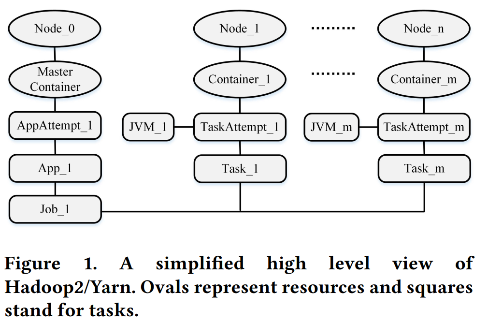
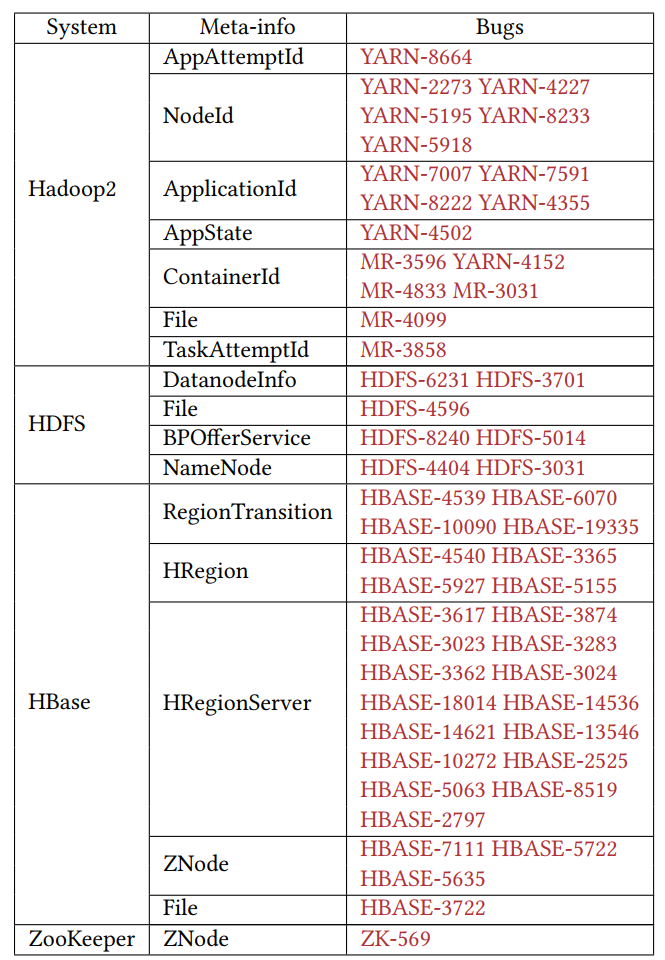
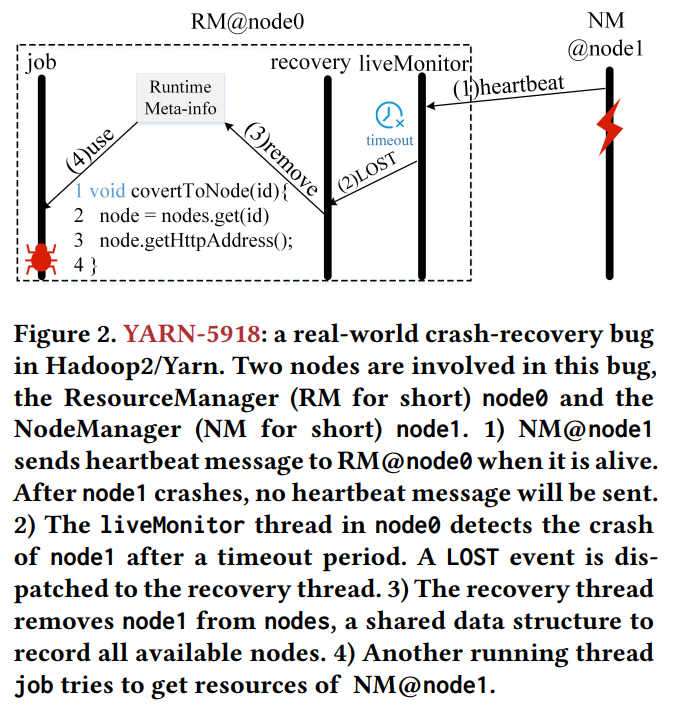
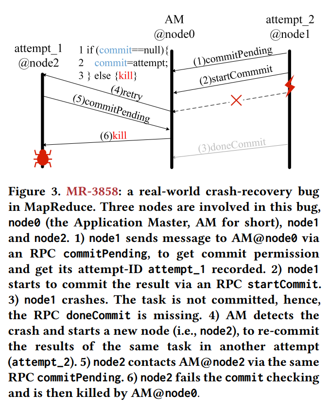
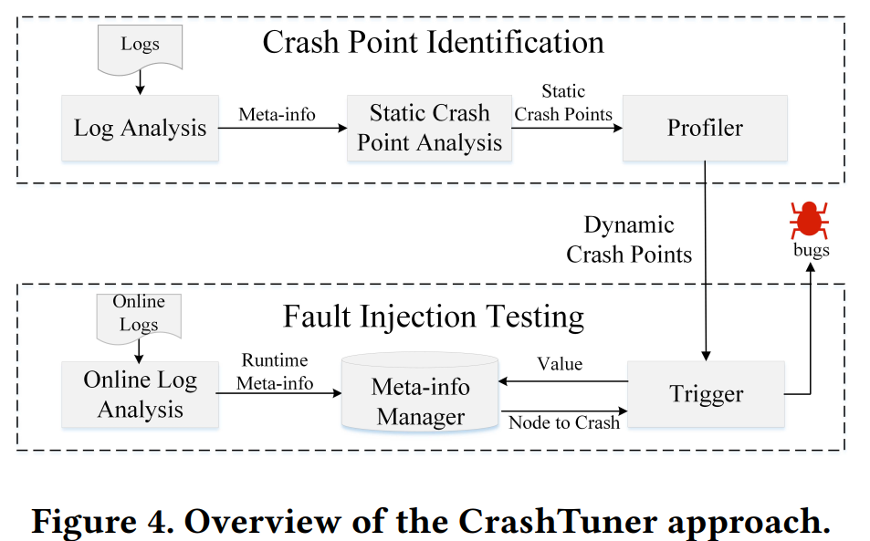
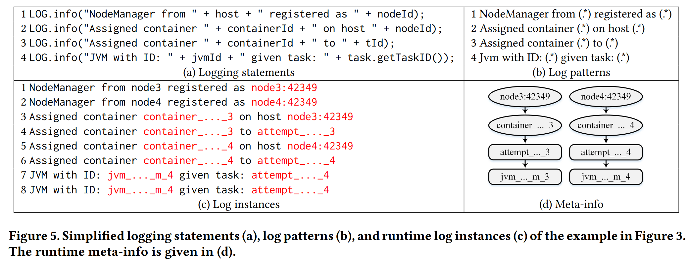
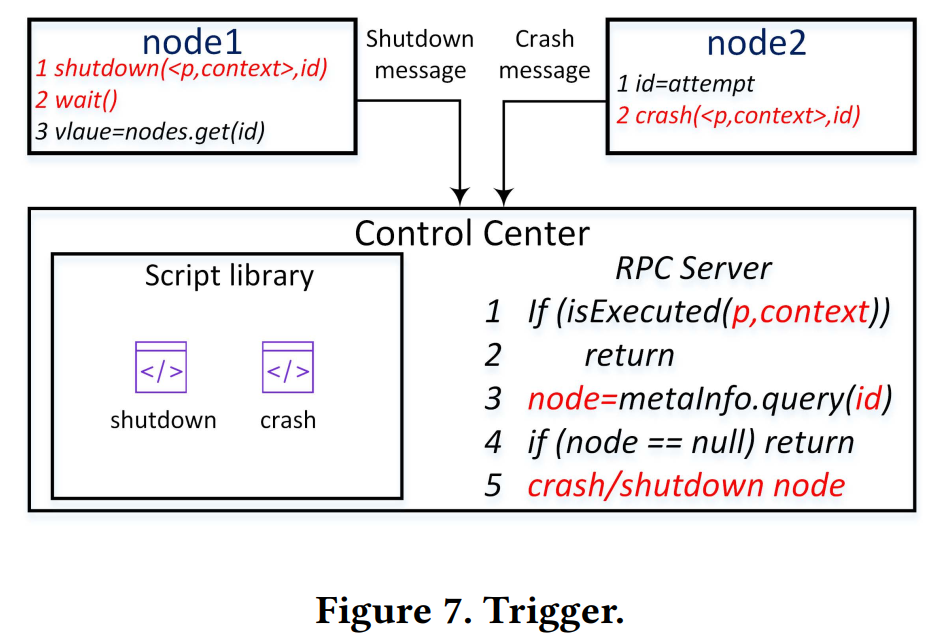

[TOC]

Crash-recovery bugs : 故障恢复相关机制中的bug

## 翻译
### 4
#### 4.1
##### 4.1.2 检测新bug

##### 4.1.3 超时

## 背景

分布式系统的高可用性很大程度上取决于这些系统如何容许节点故障。

很多分布式系统成熟的容错机制可以恢复故障的节点。但故障恢复中的bug会很容易导致系统失败，而且这种bug很难发现，需要在特定时间注入节点故障事件来触发这些bug。

state-of-the-art技术是通过“注入错误测试”来检测错误恢复的bug。但由于系统的状态空间巨大，测出bug很有挑战性。根据我们的实验和先前的工作，随机的错误注入是效率很低的。

> 错误注入测试：
> FATE and DESTINI: A Framework for Cloud Recovery Testing 
> Towards Automatically Checking Thousands of Failures with Micro-specifications 
> Perturbation-based Testing Framework for Scalable Distributed Systems 
> PREFAIL: A Programmable Tool for Multiple-failure Injection
> On Fault Resilience of OpenStack

系统的方法，如distributed system model checkers，受限于状态爆发式增长的问题。

> 系统方法：rs [28, 35, 37, 38, 48, 54, 59])
> Practical Software Model Checking via Dynamic Interface Reduction
> Life, Death, and the Critical Transition: Finding Liveness Bugs in Systems Code
> SAMC: A Fast Model Checker for Finding Heisenbugs in Distributed Systems(Demo)
> SAMC: Semantic-aware Model Checking for Fast Discovery of Deep Bugs in Cloud Systems
> FlyMC: Highly Scalable Testing of Complex Interleavings in Distributed Systems
> dBug: Systematic 
> Evaluation of Distributed Systems
> Detecting Large-scale System Problems by Mining Console Logs

还有研究人员应用一些方法，或制定一些人为的规范来限制状态空间的大小。虽然已经有了很大的进展，但还是被困在探索分布式系统巨大的状态空间上。99.9%注入的错误都是不必要的，并且很少新的故障恢复bug被发现。

## 实现

CrashTuner，一种精确定位bug的触发点的方法，通过在该方法定位出的触发点注入节点故障事件，可以有效发现bug。CrashTuner通过推断meta-info变量（引用高层系统状态信息的变量）来精确定位故障点。meta-info变量的访问点是可能暴露错误的故障注入点。这是通过基于日志的静态程序分析实现的，并且是全自动的。

### 如何找到故障点

我们应用日志分析结合基于类型的静态程序分析方法，来自动推断meta-info变量。故障点在读meta-info变量之前或写meta-info变量之后。

那么什么是meta-info变量呢？

首先，节点的引用变量是meta-info变量，从运行时日志这个也很容易识别出来（包括它的值）。

定位到故障点后，CrashTunner会在每个故障点应用错误插入测试。

高层系统状态：分布式系统中的节点以及它们关联的任务和资源

## 贡献

已应用到5个有代表性的分布式系统：Hadoops/Yarn，HBase，HDFS，ZooKeeper和Cassandra。

可以在17.39小时内对每个系统进行测试，复现了66个现有故障恢复bug中的59个，并发现21个之前从来没发现过的bug。所有bug都经开发者确认了，并有16个已经修复（14个本文作者修复的）。

主要贡献：

- 提出了一种新的故障恢复bug检测方法
- 开发了CrashTunner程序。分析对系统是非侵入性的。
- 使用5种代表性的分布式系统评估了CrashTunner程序。发现了21个新的bug，有8个是严重bug（有开发者确定）。并提供了20个补丁用于修改bug，有14个已经被采纳

## 细节

66个bug有14个bug是对时间不敏感的，它们可以使用任何错误注入技术进行触发。其他52个分为以下两种场景：

- 预读：一个节点挂了，另外一个节点仍然使用该节点之前的状态，导致任务失败（37个bug）
- post-write ：一个节点写完状态就挂了，别的节点就会用到不正确的状态信息（15个bug）？？？

本文焦聚于4个分布式系统，在2个数据库中找到了关于这4个系统的116个故障恢复bug，由于本文只关注由一个故障事件引发的bug，有50个是不符合要求的，所以只剩66个（后续研究可以扩展到多个故障事件引发的bug）。有14个是和时间无关的，可以用现有的方法检测出来，所以本文只讨论剩下的52个bug。

节点故障后默认的检测时间过长，测试的时候为了方便可以把这个超时时间调小。本文开发了一个在线日志分析工具，用于把meta-info变量和其相关的node的关联起来，这样在读meta-info之前就可以查询到meta-info对于的哪个节点（测试的时候就把那个节点挂掉，就可以复现bug了~~~~）。

如何找到meta-info变量？3.1

如何定位动态故障点？ 3.1

局限性：

有效性依赖于测试的系统日志的质量，有些bug相关的值没有在日志中打印出来，CrashTuner就检测不到

测试环境：

3个节点，CentOS6.5系统，Intel(R) Xeon(R) E7-4809 处理器，32G内存

## 结论

故障点是程序访问meta-info变量的时刻，故障恢复bug是在一个节点在故障点发生故障时触发的

有效性：

使用CrashTunner找到相应的故障点，在故障点插入宕机事件，如果能触发bug表明成功检测出bug。

找出了表1中52个bug的45个，7个没找出来，其中有3个因为相关日志没打印出来，另外3个没能把meta-info和对于的node关联起来。还有一个是因为访问一个MD5文件，它的名字没有和任何node实例关联起来。

我们在向开发者提交bug时，需要提供复现bug的单元测试。但很尴尬，我们没有办法在源代码的故障点处插入宕机事件。如图8，只能在line2之后，line4之前触发宕机事件才能复现bug。我们只好通过在调用方法之前手动设置currentAttempt的值来模拟异常。

bug修改：15个被接受的bug修复中，有8个是引入了sanity checks  ，另外7个是增加了异常的处理。

## 图

### 图1

在实践中，上述高级系统状态信息存储在不同节点的堆内存中，并通过堆引用进行访问。节点崩溃或恢复事件将改变系统状态。相应地更新这些元信息变量是至关重要的。否则可能触发故障恢复bug。

### 表1 故障发生的时间点

### 图2  pre-read

### 图3 post-write

### 图4 CrashTuner方法概览

第一步，先找到故障点

第二步，一个点一个点地进行触发

通过Online Logs，我们可以在故障点正确地挂掉相关节点。

#### 日志分析

我们研究的所有4个分布式系统都使用公共日志库，如Log4j[10]和SLF4J。

a) 通过日志接口名（如fatal,error,warn,info）和方法调用点的方法名，可以找到日志语句

b) 由日志语句可以得到相应的正则表达式，变量运行时的值用*表示

c)  匹配到的日志实例，检测变量的值，如果该值包含了主机名或IP地址（在配置文件中指定）则认为该变量是引用了node的变量。

d) 运行时meta-info的值，并关联起来。这个图精确地反映了图1的状态

#### 静态日志分析

本文开发了一种基于类型的分析方法来推导meta-info fields。有如下定义：

> 定义2：假设T是meta-info类型，则其子类性和T的集合都是meta-info类型。如果类C包含有一个meta-info类型的成员变量C.f，并且C.f仅在构造函数中创建，则类C也是一个meta-info类型

类C的定义是为了处理C.f用于唯一索引类C的情况，比如C.f是C的id字段（eg:ContainerId）。

读引用的值前进行健康检查(sanity-checked)可以避免出现问题，所有有些做过健康检查的read references被我们过滤掉。（我们修复17个已有bug和7个新bug的方式就是引入健康检查）

#### Profiler 

Profiler生成动态故障点，例如，执行静态故障点+调用栈。我们在每个静态崩溃点检测系统。在分析期间，插装代码将记录每个命中的静态崩溃点及其相应的调用堆栈。

#### Online Log Analysis 

在集群中的每个节点安装Logstash agent用来实时收集日志，可以设置成只收集必要的日志。为了效率，没有用图5(d)的数据结构来存储节点的运行时值，而是存在HashSet里，并通过一个HashMap关联起来，如图6所示：

#### Trigger 

pre-read故障点（node1）和post-write故障点（node2）的处理是不一样的。在我们实现时，每次只会测量一个故障点。

出现以下3种情况之一我们认为出现了bug：

1. 任务失败
2. 系统挂起
3. 日志中出现不正常的异常信息

运行时的meta-info的值通过toString等方法获取

- Log Analysis ：通过分析日志可以找到日志中打印出来的meta-info变量。

- Static Crash Point Analysis：进一步找出其他meta-info变量（如成员变量中有含有meta-info变量的对象也被认为是meta-info），The program points before reading (after writing) metainfo variables are then identified as static crash points 
- Profiler ：运行任务来记录运行时的动态故障点（静态故障点+唯一的调用栈），没有被执行的静态故障点则被丢弃

  

