[TOC]


由于虚拟化的各种优势，它在数据中心中变得越来越普遍。然而，如何在不同的平台(包括软件和硬件)之间进行选择是一个相当大的挑战。在这种情况下，评估不同平台的虚拟化功能非常重要。遗憾的是，现有的基准没有资格满足这一要求。不同的硬件机制和管理程序设计引入了许多不同的管理程序级事件，例如vm与管理程序之间的转换、二维页面遍历和二进制转换。这些事件是影响虚拟化性能的关键因素。现有的基准测试要么忽略了这些更改，要么与特定的管理程序紧密耦合。

在本文中，我们介绍了HyperBench，这是一种侧重于不同虚拟化平台功能的基准测试套件。目前，我们设计了15个hypervisor基准测试，包括CPU、内存和I/O。

每个基准测试中对虚拟化敏感的操作都会触发管理程序级的事件，从而检查平台在目标领域中的能力。HyperBench被设计成一个自定义内核，它可以适应不同的管理程序和体系结构。更重要的是，添加一个新的基准非常简单。

最后，我们在主机和几个流行的管理程序(如QEMU、KVM和Xen演示了HyperBench能够揭示硬件机制和hypervisor设计的性能含义。


## 1 INTRODUCTION 

构建虚拟化平台的硬件和软件选项对云提供商构成了挑战。各种各样的虚拟化平台使得租户很难做出选择。开发人员被迫不断改进体系结构和管理程序设计，以更好地支持虚拟机。在这种情况下，评估不同平台的虚拟化功能是必要的。

评估虚拟化平台的功能与传统的软件栈有很大的不同。虚拟机监控程序的引入极大地改变了传统的软件栈。在虚拟环境中，双重调度是一个不存在于原生系统中的显著现象。VM中的进程首先由操作系统调度然后通过hypervisor，这可能会增加同步延迟。内存虚拟化需要两步地址转换。一个是客户虚拟地址(GVA)到客户物理地址(GPA)的转换。另一个是GPA到主机物理地址(HPA)的转换。来宾I/O请求在访问实际设备之前经过来宾I/O堆栈和主机I/O堆栈。除了软件的变化之外，虚拟化的流行还在架构上引发了一场革命，特别是CPU和内存虚拟化的硬件扩展。

上述特定于虚拟化的问题是研究不同虚拟化平台功能的关键。然而，目前研究人员用于评估虚拟化性能的基准可能隐藏了这些问题造成的影响。应用程序基准测试，如mysql，执行许多复杂的事务，通常同时强调几个子系统。应用程序使用的指标，如延迟、吞吐量、利用率，对系统管理程序引起的更改没有足够的感知。更糟糕的是，一个方面的性能优化通常以其他方面的性能下降为代价，两者最终会相互抵消。这个问题的一个例子是，SPEC CPU 2006[18]中的一些基准测试在不同的QEMU版本之间出现了性能波动甚至下降。虚拟化基准测试，如SPECvirt是数据中心中几种常见应用程序基准测试的组合，它只关注服务器的整合能力。其他基准测试，如lmbench、Unixbench，最初是为非虚拟化系统设计的。特定于虚拟化的问题不在他们的考虑范围之内。更重要的是，几乎所有的基准测试都需要一个完整的Linux操作系统的支持。操作系统本身是否对测试有负面影响是不确定的。

为了弥补常用基准测试的不足，我们提供了HyperBench，这是一个用于评估不同平台的虚拟化功能的基准测试套件。它帮助开发人员研究管理程序和体系结构的性能，帮助租户和云提供商选择正确的虚拟化平台。HyperBench允许在不同的完全虚拟化的平台上运行。这个特性是通过将HyperBench设计为作为测试VM运行的自定义内核来实现的。我们在系统管理程序基准测试的设计和测量的准确性方面做了大量的工作。到目前为止，我们设计和开发了15个基准测试，包括CPU、内存和I/O。HyperBench中的每个基准测试都会触发一个或多个管理程序级别的事件，并且通常只执行几十行C或汇编测试代码。为了保证测量的准确性，我们考虑了无序执行和虚拟CPU (VCPU)调度的干扰。除此之外，我们还通过重复的基准测试来缓冲测量误差。有了目标基准和可靠的测量结果，就可以验证聚焦区域是否会导致性能下降。

本文的贡献有三:

- 我们提出了一个成本模型，它规定了处理管理程序级事件所花费的时间。
- 我们设计了一组管理程序基准来量化重要的管理程序级事件。每个基准测试都包含一种类型的虚拟化敏感操作，这种操作可以触发管理程序级事件，而不需要触及底层管理程序。
- 我们开发了一个HyperBench的原型。通过将HyperBench设计为自定义内核，它可以适应不同的管理程序。通过精心设计的内存布局，可以很容易地添加新的基准。通过为HyperBench (POSIH)定义一个可移植的操作系统接口，HyperBench可以从x86移植到其他体系结构

## 2 BACKGROUND

虚拟化是一种允许多个客户操作系统在一台物理机器中对硬件资源进行多路复用的技术。本节概述不同的虚拟化技术，包括CPU、内存和I/O虚拟化技术。

### 2.1 CPU Virtualization 

管理程序设计人员将指令分为敏感指令和非敏感指令。敏感指令包括控制敏感指令和行为敏感指令。控制敏感指令是那些试图改变系统中资源配置的指令，如修改页表基寄存器的指令。行为敏感指令是那些其行为或结果依赖于资源配置的指令，比如x86中的POPF。不同的CPU虚拟化技术，如trap-and-emulate，dynamic binary translation(DBT)，硬件机制(AMD的SVM，Intel的VT)，都是为了正确处理敏感指令而开发的。

在经典的可虚拟化架构中，所有与虚拟化相关的指令都是特权指令的子集。可虚拟化架构上的管理程序采用了trap-and-emulate策略，以特权模式驻留，并以低特权模式运行来宾操作系统。hypervisor拦截所有特权指令，并在完成特权指令的模拟之后返回。频繁的trap消耗了虚拟机的大量时间。

然而，有些架构，例如x86、ARM，最初并不是可虚拟化的。一个解决方案是DBT。DBT以相同的方式转换非敏感指令。当敏感指令试图改变特权状态时，翻译器引用相应的影子结构。有在即将执行来宾代码时才进行翻译，并缓存翻译后的代码。DBT消除了经典虚拟机监控程序中的陷阱，并用二进制转换替换它，并跳转到已转换的块。在不可虚拟化架构上进行虚拟化的另一个解决方案是硬件扩展。以英特尔的VT为例。英特尔引入了一种新的处理器操作，称为虚拟机扩展(VMX)操作。VMX操作有两种:VMX root操作和VMX non-root操作。除了VMX指令,这两个操作的行为非常相似。通常，虚拟机监控程序将在VMX根操作中运行，客户软件将在VMX非根操作中运行。因此，VMX操作消除了许多敏感指令的陷阱和转换。然而，一些内存和I/O相关的异常仍然需要管理程序的干预，这涉及到VMX非根操作和根操作之间的往返转换。转换到VMX非根操作称为VM entry。从VMX非根操作到VMX根操作的转换称为VM exit。使用驻留在普通内存中的虚拟机控制数据结构(VMCS)实现转换。转换的频率对虚拟机的性能有很大的影响。

虚拟中断是CPU虚拟化的一个组成部分。现代英特尔处理器中的中断交付是通过本地高级可编程中断控制器(APIC)来实现的。每个处理器核心都配备了一个本地APIC，该APIC可以连接到其他核心。每个本地APIC都有一组寄存器，用于控制中断到处理器核心的传递和IPI消息的生成。

...

### 2.2 Memory Virtualization 

对于内存虚拟化，几乎所有解决方案都需要两组页表。来宾操作系统维护来宾页表，其中包含从GVA到GPA的映射。因为
GVA最终映射到物理地址，从GVA到HPA的映射需要一组额外的页表。有两种方法可以做到这一点。一个是直接映射
从GVA到HPA，称为直接映射。另一种是从GVA映射到GPA/HVA，再从GPA/HVA映射到HPA，称为间接映射。直接映射的一个例子是影子分页。虽然影子页表(SPT)可以直接将GVA转换成HPA，但是在使用SPT之前需要进行许多管理程序级的操作。首先，hypervisor必须捕获交换页表根的来宾操作，并指向硬件内存管理单元(MMU)。其次，当来宾操作系统更新其页表时，系统管理程序必须拦截更新并修改相应的SPT条目。第三个是影子页表条目的构造。在一组额外的页表中构造页表项是这两种映射方法性能下降的常见原因。英特尔的扩展页面表(EPT)(AMD的嵌套页表(NPT)有许多相似之处)，一个间接的映射解决方案，消除了来宾页表和管理程序级页表之间的同步，但引入了二维(2-D)页遍历[27]造成的TLB的缺失。另一个间接映射的例子是QEMU中的软件MMU。QEMU通过mmap()系统调用[3]为虚拟机分配内存，在此期间完成主机虚拟地址(HVA)到HPA的映射。QEMU使用MMU软件将GVA转换成等同于主机虚拟地址的GPA。主机虚拟到物理地址的转换是由主机操作系统用硬件MMU来完成的。


### 2.3 I/O Virtualization 

有了标准的设备驱动程序，来自来宾操作系统的所有I/O请求都由虚拟机监控程序模拟，虚拟机监控程序将经历长数据路径和长控制路径。如何在虚拟机和设备之间有效地传输I/O请求和数据是优化虚拟机IO性能的关键。之前的工作也证实了这一点。virtio[32]是一个受欢迎的Guest IO解决方案。在管理程序中使用后端驱动程序，在vm中使用重新设计的设备驱动程序，虚拟机和虚拟机监控程序之间的交互具有高效的事件通知和数据传输功能。通过将后端移动到内核空间，vhost[35]避免了KVM和QEMU之间的信令。plitX[21]和ELVIS[16]分别采用硬件扩展和软件方案，实现了来宾机监控程序和虚拟机监控程序之间的exit-less通知。直接设备分配简化了VM到设备的访问路径，但是来自设备的中断仍然会影响来宾I/O的性能。ELI[15]和[36]提供了来自系统管理程序的exit-less通知，用于直接分配设备。


## 3 COST MODEL 

通过回顾主要的虚拟化技术，我们发现系统管理程序频繁地干预来宾执行。虚拟机监控程序的干扰消耗大量时间，这些时间用于处理虚拟机监控程序级别的事件，而不是在VM中运行应用程序。在此基础上，提出了一种描述虚拟机性能开销的成本模型。

成本模型将benchmark在主机上的执行时间作为基准，如方程1所示,我们定义GNR(Guest Native Ratio)的基准运行时比率。一般来说，GNR大于1。GNR越小，性能越好。接近1的GNR表示基准以本机速度运行。在某些情况下，GNR可能小于1，这意味着来宾程序的性能优于主机程序。

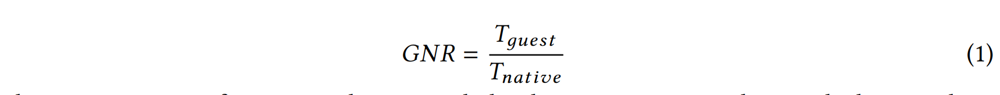

来宾应用程序的执行时间包括在主机上花费的必要时间和管理程序级事件消耗的额外时间，由公式2表示。Tdirect表示直接在主机上执行的指令上花费的时间。Tvirt表示需要在虚拟环境中特别处理的指令的运行时。


Tvirt的分解如式3所示。Tcpu、Tmemory和Tio分别表示处理CPU、内存和I/O虚拟化的时间。η表示这里没有提及的所有其他费用,例如,共存虚拟机之间的相互干扰。


Tcpu表示cpu虚拟化开销。


C表示虚拟敏感操作发生的次数。CPU虚拟化的成本包括敏感指令成本(Tsen)和虚拟化扩展指令成本(Text),由于常规指令直接在物理CPU上执行，所以CPU虚拟化的性能高度依赖于平台处理敏感指令的能力。除了敏感的指令外，虚拟化扩展指令还会产生纯粹的性能开销，因为它们只由系统管理程序使用，而不是由操作系统使用。

Tmemory表示内存虚拟化的成本。在直接映射中，额外的延迟来自于页面表根(Tswitch)的切换，管理程序中的来宾页表和页表之间的同步(Tsync)，以及一组额外的页表条目(Tcons)的构造。间接映射消除了同步，但引入了同二维页面遍历(Ttwo)。因此，Tmemory可以用公式5表示。对于SPT，一个直接的映射解决方案，Tswitch、Tsync和Tcons是主要的开销，而Ctwo是零。对于EPT, Tcons和Ttwo是主要成本，而Cswitch和Csync是零。


Tio表示I/O虚拟化的成本。虚拟I/O属性的延迟增加来自两个方向：从VM中的I/O驱动程序到管理程序中的I/O设备
(Tout),和相反的方向(Tin)。Tio可以由方程6表示。对于QEMU-KVM，从VM到设备的通知涉及VM exit，这是影响I/O虚拟化性能的重要事件。对于Xen，从VM到Dom0的通知涉及VM exit、硬件IPI和中断注入：

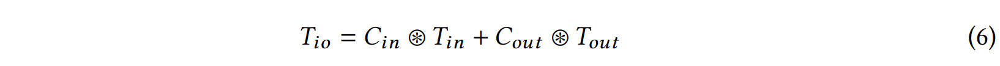

在第4节中，我们将按照成本模型来设计相应的基准。每个基准测试都使用成本模型的一个或多个组件。

## 4 HYPERBENCH BENCHMARKS 

根据第3节中的成本模型，我们设计了15个微基准，并在一些典型的虚拟化平台上对这些基准进行了深入分析。表1列出了这些基准测试，并将它们分为几个组，包括特权敏感指令、非特权敏感指令(关键指令)、异常、内存和I/O。表1还显示了每个基准测试使用的迭代计数的推荐范围。超出这个范围,HyperBench将运行很长时间，或者测量将不准确。现在，我们将讨论这些基准组中的每一个或每个组中的单个基准。Idle基准测试的目的是帮助确定其他基准测试的迭代计数，这将在5.2节中进行描述。

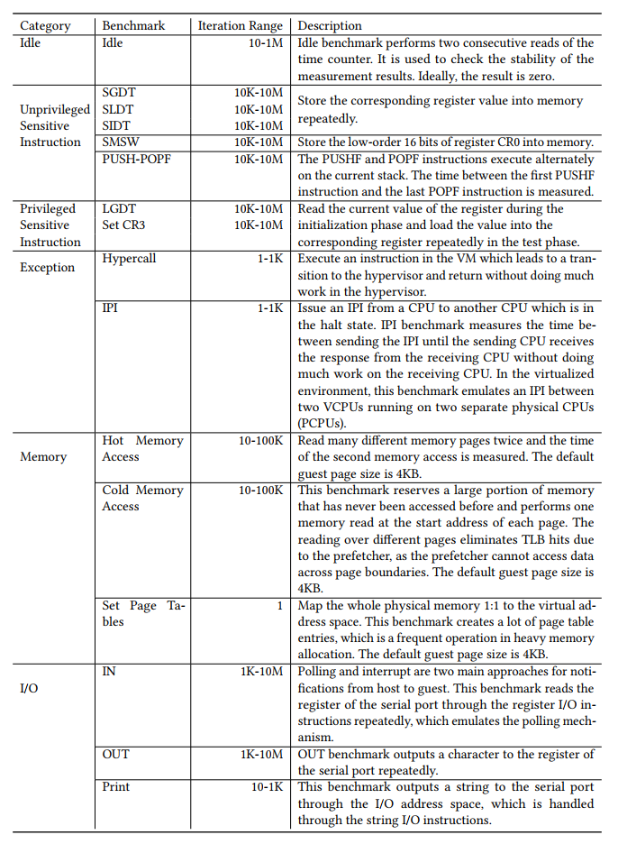

### 4.1 敏感指令

敏感指令基准测试主要测试由处理敏感指令引起的虚拟化事件。敏感指令可以分为两类：特权敏感指令和非特权敏感指令(关键指令)。我们选择一些特权敏感指令和非特权敏感指令作为基准，如表1所示。尽管敏感的指令基准测试是特定于体系结构的，但是可以很容易地添加敏感的指令基准测试(参见第5节)。

#### 非特权敏感指令 

非特权敏感指令只存在于不可虚拟化的架构中。在不可虚拟化的体系结构中，没有针对这些关键指令的陷阱。使用硬件辅助的虚拟化，VM执行关键指令，就像本机操作系统一样。使用DBT，关键指令的执行触发转换过程。

##### SGDT、SLDT、SIDT 

> 其实在保护模式下地址的表示方式与实模式是一样的，都是：段（segment）:偏移（offset），不过保护模式下，“段”的概念发生了根本性的改变。实模式下，段值还是可以看作是地址的一部分，比如段值为xxxxh表示以xxxx0h开始的一段内存。而保护模式下，虽然段值仍然由原来的cs、ds等寄存器表示，但此时它仅仅变成了一个索引，这个索引指向了一个数据结构的一个表项，表项中详细定义了段的起始地址、界限、属性等内容。这个数据结构就是全局描述符GDT
>
> 全局描述符表GDT（Global Descriptor Table）在整个系统中，全局描述符表GDT只有一张(一个处理器对应一个GDT)，GDT可以被放在内存的任何位置，但CPU必须知道GDT的入口，也就是基地址放在哪里，Intel的设计者门提供了一个寄存器GDTR用来存放GDT的入口地址，程序员将GDT设定在内存中某个位置之后，可以通过LGDT指令将GDT的入口地址装入此寄存器，从此以后，CPU就根据此寄存器中的内容作为GDT的入口来访问GDT了。GDTR中存放的是GDT在内存中的基地址和其表长界限。

- SGDT（Store Global Descriptor Table Register）：存储GDTR的值到内存中
- SLDT（）: 保存局部描述符(LDT)
- SIDT：存储中断描述符表寄存器

##### SMSW(Store Machine Status Word)

存储机器状态字。

##### PUSH/POPF


#### 特权敏感指令

除了允许特权指令直接在物理CPU上执行的硬件辅助虚拟化之外，特权指令以不同的方式对虚拟化系统造成压力。对于trap-and-emulate策略，特权指令触发陷阱。对于动态二进制转换，特权指令被转换成一个引用影子结构的规则指令序列。


##### LGDT

##### Set CR3

CR3是页目录基址寄存器，保存页目录表的物理地址，页目录表总是放在以4K字节为单位的存储器边界上，因此，它的地址的低12位总为0，不起作用，即使写上内容，也不会被理会。

### 4.2 Exception 

异常基准测试触发特定于虚拟化的异常，这些异常需要虚拟化扩展指令的干预。这些特定于虚拟化的异常包括，例如，超调用、虚拟处理器间中断(IPI)。

#### Hypercall 

Hypercall是VM和hypervisor之间的转换。对于x86，执行超调用时，硬件会自动保存和恢复vmcs。它是trap-and-emulate 虚拟机监控程序中的基本操作。任何需要hypervisor干扰的操作都涉及超调用，例如虚拟IPI。构开发人员致力于降低Hypercall的硬件成本，而hypervisor开发人员则致力于降低Hypercall的频率。

#### IPI 

IPI是多核系统中的一种常见操作。本地系统通过本地APIC接口执行IPI。当一个核心想要发送一个IPI时，它会用中断向量、目的地等写入ICR。写入完成后，IPI消息将出现在系统总线或APIC总线。接收核心确定它是否是指定的目的地。如果它是指定的目的地，它接受IPI消息并调用中断处理程序例程。一旦处理程序例程完成，接收核心将在本地APIC中写入中断结束(EOI)寄存器。除了必要的硬件IPI外，虚拟IPI还涉及许多世界间的交换VM和管理程序。首先，写入ICR导致的VM退出是必要的。


### 4.3 内存

内存基准测试主要激活GVA到HPA的转换过程和相关操作，例如，创建管理程序级的页表、来宾页表和管理程序级页表之间的同步。执行不同的内存访问模式是触发这些事件的简单方法。访问以前曾经访问过的页面可能会对虚拟TLB（Translation Lookaside Buffer）造成压力。访问以前从未访问过的内存区域可能会导致构建管理程序级的页表条目。然而，在不修改底层管理程序的情况下，准确地测量Tmemory是一个巨大的挑战。例如，Ttwo取决于许多因素，即TLB和缓存层次结构、客户机和主机中的页面映射大小、分页结构缓存和基准工作集大小。然而，通过检查本地和虚拟执行环境上的自定义微基准，我们可以粗略地评估成本模型中的项目。因为POSIH(参见第5节)提供了客户配置的功能，例如安装具有不同映射粒度的页表条目，所以我们可以通过控制变量来验证上面提到的因素的影响。

#### Hot Memory Access 

内存的空间局部性和时间局部性使得热内存访问在实际应用中具有普遍性。虚拟TLB应该确保热内存访问具有尽可能高的命中率。从直观上看，TLB的命中率越高，硬件TLB与虚拟TLB之间的性能差异就越小。在这个基准测试中，工作集大小、页面映射大小是可调的。随着工作集的大小变大，TLB将不堪重负，更多的内存访问将触发页面遍历。虽然使用大页面映射可以减少TLB遗漏，但是来宾和主机都必须使用2MB的页面，以允许处理器在虚拟化环境中使用2MB的TLB条目。可以通过调整来宾页面大小和hypervisor页面大小来验证这种效果。

#### Cold Memory Access 

冷内存访问的目的是触发TLB故障或管理程序级的页面故障。QEMU虚拟机中的冷内存访问只会导致二维页面遍历，因为虚拟机内存是在启动阶段分配的。由于一些管理程序级的页表(如SPT（Shadow Page Table）和EPT)在开始时是空的，所以冷内存访问会导致管理程序构造相应的页表项。以EPT/SPT为例。冷存储器访问导致二维页面遍历和EPT/NPT条目的构造。通过在本地和虚拟执行环境中运行这个基准测试，我们可以对EPT/NPT的Tmemory进行评估。

#### Set Page Table 

这个基准测试实际上是将大量的页表条目写入内存区域，这涉及到热内存访问和冷内存访问。Set Page表基准测试模拟了大量内存分配中的频繁操作。

### 4.4 I/O

#### IN

#### OUT

#### Print 


## 5 实现

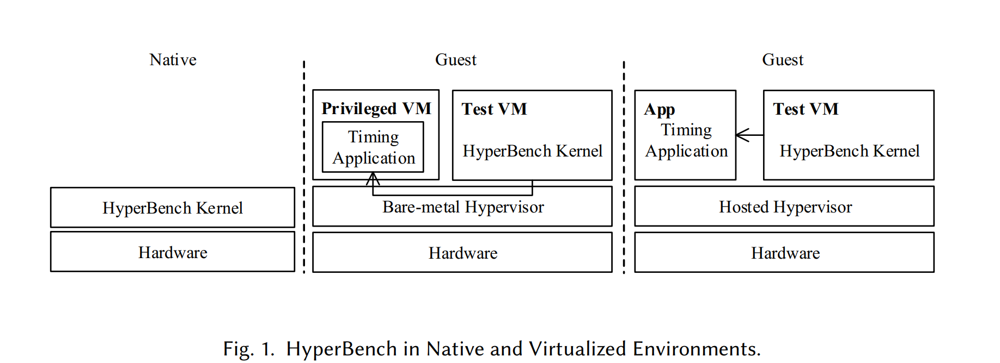


### 5.1 架构

第3节中描述的成本模型需要在本地和虚拟环境中运行HyperBench基准测试。图1显示了不同场景中的HyperBench。HyperBench内核是一个多引导格式的ELF文件，它允许grub直接引导它。HyperBench内核驻留在正确配置了grub的硬盘中。在原生环境中，HyperBench内核直接运行在硬件上，基准测试是在HyperBench内核中完成的，称为内部测量。

在虚拟环境中，HyperBench内核作为测试VM运行。在独立的裸机管理程序(如Xen)上，计时应用程序在特权VM中运行。在托管的管理程序(如KVM)上，计时应用程序作为常规应用程序在主机OS上运行。基准测试可以通过内部测量或定时应用程序来实现。后者被称为外部测量。

通过外部测量，HyperBench内核在基准测试之前和之后立即向UART发送计时信号。HyperBench内核在基准测试之前和之后立即向UART发送计时信号。UART通过进程之间的管道重定向到外部计时应用程序。对于QEMU，时序信号被输出到仿真的串行端口，该端口通过-nographic选项重定向到控制台。一旦接收到定时信号，定时应用程序将读取计数器的当前值。在虚拟环境中，内部度量主要针对普通用户，因为他们没有足够的权限在主机上启动计时应用程序。

我们将HyperBench内核设计和实现为独立的内核，而不修改底层的管理程序。为了降低开发难度，我们借用了kvm单元测试、xv6[和simbench的部分代码。有许多原因促成了一个独立的内核。

- 首先，每个微基准测试消耗的时钟周期非常少，并且容易受到常规Linux内核中资源争用的影响，比如锁争用[20]、包调度[19,40]。**使用独立的内核，我们可以确保当前的基准不会受到其他任务的干扰。** 
- 其次，自定义内核提供了许多特定于HyperBench的功能，例如基准测试、设置整个内存、访问I/O端口等。这使我们能够最大程度地定制微基准。
- 最后但同样重要的是，HyperBench不超过10K行C和汇编代码。

然而，将所有基准测试和支持功能构建为独立的内核会使HyperBench的可移植性降低，难于维护，并且不太可能支持新的处理器特性。我们用传统的UNIX方式解决了这个问题，为HyperBench (POSIH)定义了一个可移植的操作系统接口，实际上它是一个API。表2显示了POSIH中的一些重要函数。有四个POSIH类别:(1) symmetric multiprocessing (SMP), (2) interrupt, (3) memory, (4) I/O. 

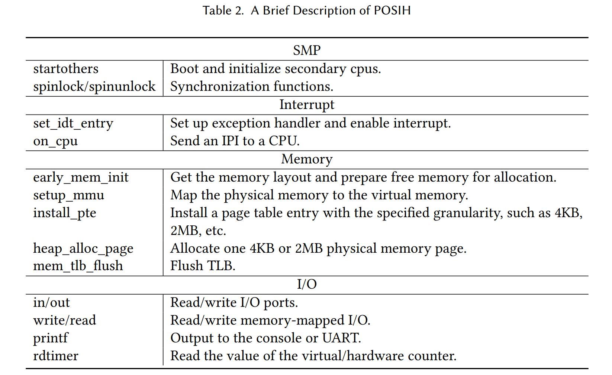


可移植性：HyperBench内核的体系结构如图2所示：

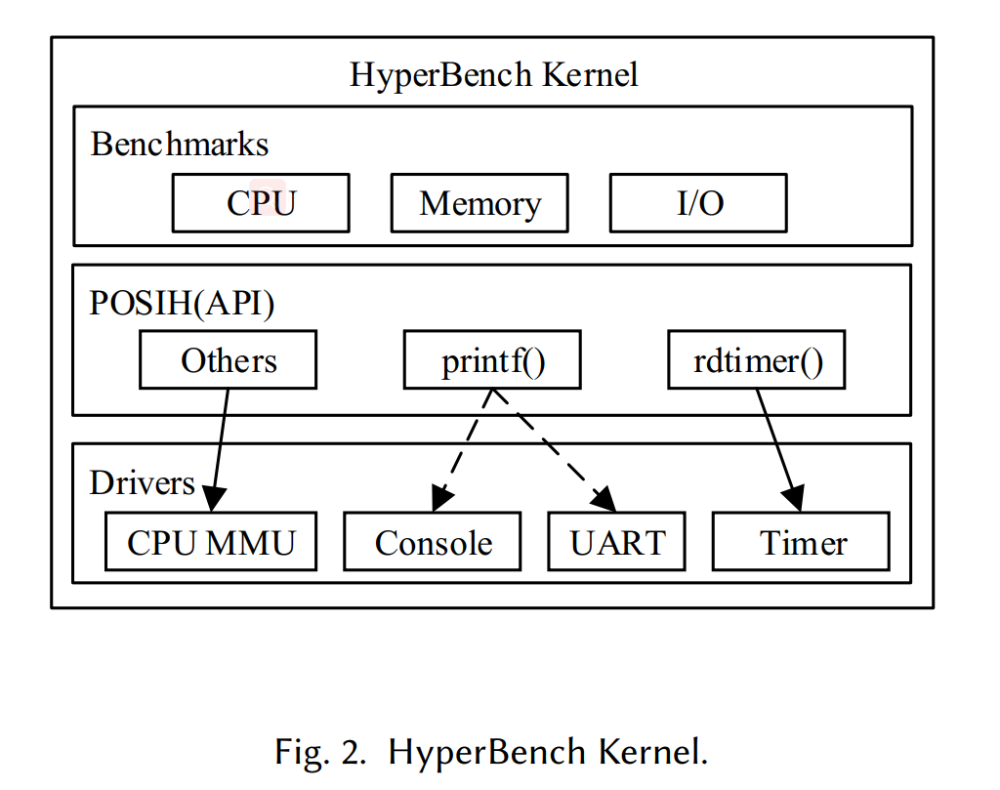

HyperBench基准测试跨越CPU、内存和I/O。虽然不同的基准测试关注不同的特性，但是所有的基准测试都共享底层POSIH。POSIH基于与硬件直接交互的底层驱动程序。因此，只要实现了目标体系结构上的驱动程序，HyperBench就可以在任何体系结构上运行。尽管与指令集体系结构(ISA)密切相关的一些基准测试需要修改，但基准测试通常只有几十行C或汇编测试代码。

可扩展性：与现有基准测试相比，Hyperbench的一个重要优势是添加一个新的基准测试非常容易。这一优势是通过POSIH和精心设计的内存布局实现的。基准是基于POSIH的。添加新基准时，POSIH中的许多函数都可以重用。在精心设计的链接器脚本的控制下，HyperBench内核的内存布局如图3所示。

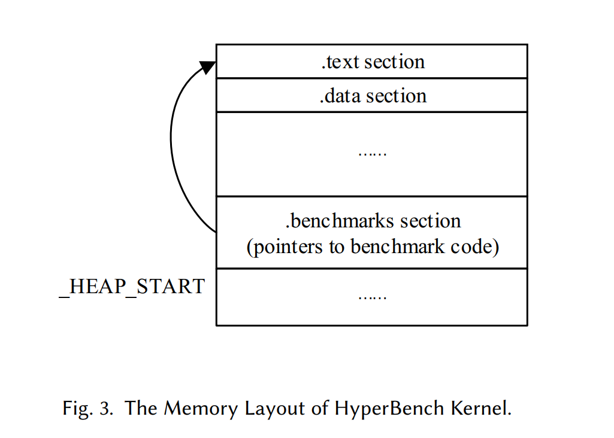

从_HEAP_START到结束的地址空间用于内存分配和内存测试。benchmark部分是一个描述符表，所有描述HyperBench基准测试的数据结构都映射到这个表中。基准测试结构如清单1所示：

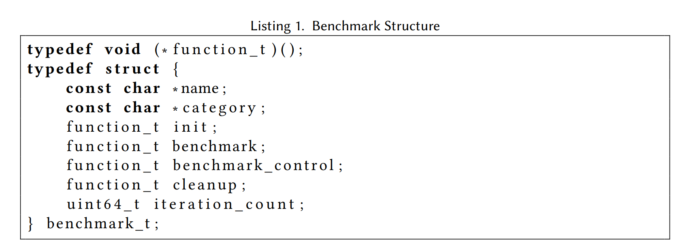

每个描述符包含基准的名称、类别、迭代计数和几个函数调用。init调用用于为基准测试准备运行时环境。benchmark调用重复触发管理程序级事件的虚拟化敏感操作。通常，对虚拟化敏感的操作在for循环里面，迭代次数由iteration_count确定。benchmark_control指向一个空闲循环函数，该函数的迭代计数与当前benchmark相同。它用于抵消循环语句的运行时，这些语句不能被计算到每个基准的运行时中。cleanup调用清理运行时环境。HyperBench内核中的主函数将检索本节中的每个描述符。因此，一个用.benchmark修饰的ready基准将被执行。


### 5.2 测量

两种方法可以测量基准，即内部测量和外部测量。然而，这两种方法都不是天生完美的。在虚拟环境中，HyperBench内核中的计时器可能不准确或无法充分校准。虽然主机计时器比虚拟计时器更精确，但是从HyperBench内核到计时应用程序的通知有一定程度的变化。HyperBench内核之间时间的稳定性发送一个定时信号，直到定时应用程序完成读取硬件计数器，确定测量结果的准确性。为了解决这个问题，我们设计了一个空闲基准来执行计数器的连续两次读取。根据空闲基准的结果，相同或更高数量级的迭代可以抵消波动。表3给出了每个基准使用的推荐迭代计数。这个值是通过在合理的时间内尽可能多地运行每个基准来获得的。

在测量多核系统性能时，由中断和调度引起的变化可能会使测量偏移数千个周期。为了进一步提高外部测量的精度，考虑了无序执行和多核调度的干扰。通过配置grub，我们隔离了物理cpu的一个子集，并将VCPU绑定到该子集的PCPU中。在执行时间戳之前和之后立即使用指令屏障，以避免无序执行或流水线扭曲我们的度量。

排除尽可能多的我们不感兴趣的操作，我们比较了benchmark函数和benchmark_control函数所消耗的时间。  这两个函数之间的惟一区别是它们是否包含对虚拟化敏感的操作。如图4所示，每个基准测试的运行时间分为八个阶段。

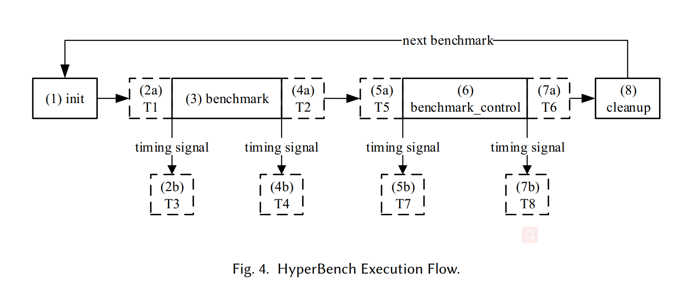

首先，init函数为每个基准测试准备运行时环境。在此之前，HyperBench内核引导和每个VCPU都被固定到一个特定的PCPU上，这个PCPU被放在一边以确保没有其他工作被调度到这个PCPU上。在第3步中，基准测试按预先定义的次数重复。在此之前和之后，当启用外部定时应用程序时，定时信号被发送到定时应用程序。一接收到定时信号，定时应用程序通过读取硬件计数器(步骤2b和步骤4b)获得循环计数。当启用内部计时应用程序时，HyperBench内核自己度量基准测试(步骤2a和步骤4a)。一个类似的计时过程应用于benchmark_control(步骤5、步骤6和步骤7)来消除支持操作的影响，如for语句。作为最后一步，HyperBench报告循环中的测试结果，并清理所有基准测试特定的环境。benchmark函数的运行时与benchmark_control函数之间的区别是我们关心的基准运行时。


## 6 评估

我们在本地和虚拟执行环境中运行HyperBench。测试的管理程序包括QEMU、KVM和Xen。在KVM中，我们还将EPT与SPT进行了比较。在介绍了实验环境之后，我们首先讨论在成本模型中的操作符⊛ ，它表示C和T之间的关系。然后，我们将演示HyperBench在感知虚拟化的硬件加速方面的有效性，以及hypervisor设计中的差异。最后，我们将HyperBench与lmbench进行比较，以突出HyperBench的优点。


### 6.1  实验设置

为了进行公平的比较，所有虚拟机监控程序的硬件设置都是相同的，使用的是同一台服务器机器，即一台具有四个八核2.0GHz Intel Xeon E7-4820v2处理器的联想RQ940，32GB of RAM, and three 1TB disks. Xen占一个磁盘，QEMU和KVM共享一个磁盘。主机使用Ubuntu14.04与Linux 4.2.0-27-generic内核和GNU GRUB 0.97。巨页大小为2MB，这是默认禁用的。正在测试的虚拟机监控程序的版本分别是QEMU 2.0.0、Linux 4.2.0-27-generic中的KVM和Xen 4.4.2。为了消除CPU频率的影响，所有CPU都固定在最大频率上。Xen被配置为使用HVM类型的客户机。所有的虚拟机都被配置成具有两个cpu的SMP系统4 gb的RAM。在QEMU和KVM中，HyperBench内核被分配在一个单独的集合上运行每个VCPU都固定在一个PCPU上。在Xen中，我们也配置了类似的DomU。此外，我们将Dom0配置为在专用的PCPU上运行一个VCPU。在KVM和Xen中，QEMU用作设备模拟器。测量由主机上的HyperBench内核本身和虚拟环境中的主机计时应用程序执行。

### 6.2  Operator Determination 

根据第3节描述的成本模型，我们可以得出结论，**虚拟机监控程序优化方法之一是减少与虚拟化相关的事件的数量**。将一些硬件虚拟化出口与软件技术合并会破坏出口与在完整管理程序中出现的出口数量之间的一对一关系。一个例子是para-virtual IPI[23]，它使用hypercall将IPIs发送到多个vcpu。一批IPIs只需要一个VM出口。因此，C和T之间的关系是虚拟机监控程序的一个重要特征，它在成本模型中由待定算子表示。为了验证所测试的虚拟机监控程序是否具有相似的特征，我们在主机和被测试的虚拟机监控程序上运行了具有可变迭代的HyperBench。图5显示了三个不同迭代的结果：

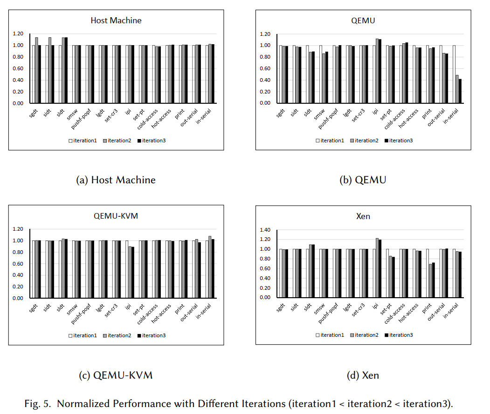

结果是相对于iteration1进行规范化的。直观地看，虚拟化开销与虚拟化敏感操作的数量成正比。图5a和图5c显示迭代次数的变化对每个虚拟化敏感操作消耗的平均周期影响不大。图5b中的IN基准测试和图5d中的print基准测试显示了明显的不一致。为了确定不一致性是否由测量噪声引起，我们进行了多次迭代的实验。随着迭代次数从1K增加到10K，步长为1K，IN的归一化性能最终稳定在0.4,Print稳定在0.7。因此，QEMU、KVM和Xen的成本模型大致是线性的。


### 6.3 效率

使用HyperBench，我们运行了15个基准测试来测量底层hypervisor性能的各个方面，表3显示了在物理机器和几个流行的管理程序上运行这些基准测试的结果。这些结果的格式如下:(每次迭代的周期)(相对于本机执行的减速)，**本机是啥？**

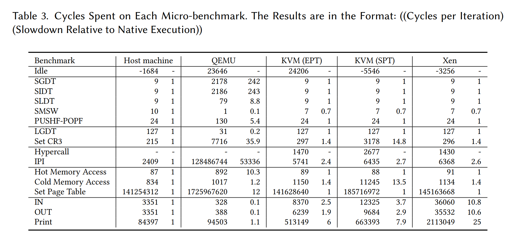

表3中的Idle基准测试结果表明，测量的波动在几千到几万个周期的水平。大多数基准的迭代计数超过100K，这在很大程度上减少了波动的影响。前面的研究表明，计算密集型基准测试在软件和硬件管理程序上几乎以本机速度运行。但这并不意味着虚拟化平台和本机系统的行为完全相同。件和硬件管理程序之间CPU虚拟化功能的差异可以反映在HyperBench基准测试中。主机、KVM和Xen的表现类似，在所有敏感的指令基准测试中都优于QEMU, SMSW除外。主机、KVM和Xen之间的相似性是由对CPU虚拟化的相同硬件支持决定的。QEMU与其他平台在敏感指令基准测试方面的巨大差异是由于代码转换和代码转换的量。SMSW的行为由vmcs中的CR0来宾/主机掩码和CR0读阴影决定。在KVM中，每一位都是在初始化期间的CR0来宾/主机掩码中设置的,SMSW返回KVM上CR0读映像的值，并正常地从主机上的CR0读。因此，SMSW基准测试在主机和KVM上的表现是不同的。

对于Hypercall基准测试，KVM和Xen没有显示出显著的性能差异，因为KVM和Xen都使用相同的x86硬件机制在VM和hypervisor之间进行转换。由于接收的VCPU处于挂起状态，KVM上的IPI要消耗一个以上的硬件IPI和一个Hypercall 。在KVM上的IPI和Hypercall的结果证实了这一点。我们还向KVM上正在运行的CPU发送一个IPI。IPI消耗3375个时钟周期，成本为一个Hypercall和一个硬件IPI。这表明在KVM x86上启用了后置中断处理特性。但是，对于IPI, Xen比KVM需要更多的周期。在相同的硬件支持下，这是由于系统管理程序设置的差异造成的。通过运行xl demsg命令，我们发现Xen无法启用中断重新映射，也不会启用x2APIC。对于QEMU, IPI操作比KVM和Xen昂贵得多，这表明DBT在处理IPI时表现很差。

HyperBench在显示平台的内存虚拟化功能方面也表现良好。当KVM和Xen都使用EPT时，由于EPT项的构造和二维页面遍历，它们的性能会有一定程度的下降。冷内存访问结果显示大约慢了1.4倍。对于冷内存访问，Tmemory在KVM和Xen上处于300个时钟周期的级别。对于QEMU，尽管从GPA到HPA的转换是由速度相对较慢的软件MMU和硬件MMU完成的，但是在内存访问期间没有VM出口。最后的结果是，与KVM和Xen相比，QEMU具有轻微的性能优势。Hot Memory Access基准测试表明，x86 KVM和x86 Xen在TLB虚拟化方面具有与主机相同的功能。在EPT的帮助下，从GVA到HPA的直接映射很可能被缓存[9]。在QEMU中，只有从主机虚拟地址(相当于GPA)到HPA的映射可以被缓存。对于QEMU的热内存访问，GVA到GPA的转换错过了TLB，而HVA到HPA的转换可能会命中TLB。因此，QEMU上的热内存访问性能仍然很差，但是它比冷内存访问占用的时钟周期更少。Set Page表基准测试(其中大多数是热内存访问)的成本QEMU比KVM和XEN要高一个数量级。

当KVM的EPT被关闭时，许多与内存相关的基准会出现性能下降。每次客户端加载CR3时，带有SPT的Set CR3基准测试都伴随着一个hypercall ，比EPT慢10倍左右。这个超调用指向影子页表上的硬件MMU，并且GVA到HPA的映射可能在内存访问期间被缓存。使用TLB中的GVA到HPA映射，关闭EPT 热内存访问不会受到太大影响。由于访问驻留在正常内存中的vmcs, IPI和Hypercall消耗了更多的时钟周期。因此，涉及IPI或Hypercall的I/O基准会受到不同程度的影响。

I/O基准测试反映了管理程序设计对平台虚拟化功能的影响。在KVM和Xen中，QEMU在用户空间模拟I/O设备。虽然QEMU模拟的串行端口的性能比物理端口好，但在KVM和Xen上的I/O基准测试比在主机上差得多。VM和hypervisor之间的信号机制抵消了QEMU的优势，导致了较大的差异。在KVM中，HyperBench内核发起I/O请求后，有两个主要的上下文切换:

- 首先，在同一物理内核上实现HyperBench内核和KVM之间的转换
- 第二,因为KVM在内核空间中运行，发出QEMU(在用户空间中运行)的信号需要另一个上下文切换

在Xen中，由于HyperBench内核和Dom0运行在不同的物理内核上，Xen必须将一个物理IPI从运行HyperBench内核的CPU发送到运行Dom0的CPU。Xen通知QEMU模拟I/O请求的路径比KVM长。因此，对于I/O基准测试，Xen比KVM慢得多。

HyperBench可以感知不同的CPU配置。在KVM中，随着迭代次数的增加，IPI所消耗的平均时间会不规律地变化，在没有任何VCPU固定的情况下。出现这种现象的原因是，VCPU被调度在不同的PCPUs上。在所有vcpu都固定的情况下，IPI的平均时间是稳定的。在Xen中，我们使用两种不同的配置进行实验:分别表示Dom0和HyperBench内核被固定在两个单独的物理CPU上，而共享表示Dom0和HyperBench内核共享同一个物理CPU。令人惊讶的是，共享配置的IPI消耗的时钟周期是单独配置的3021倍。图6比较了这两种设置下的其余基准测试。

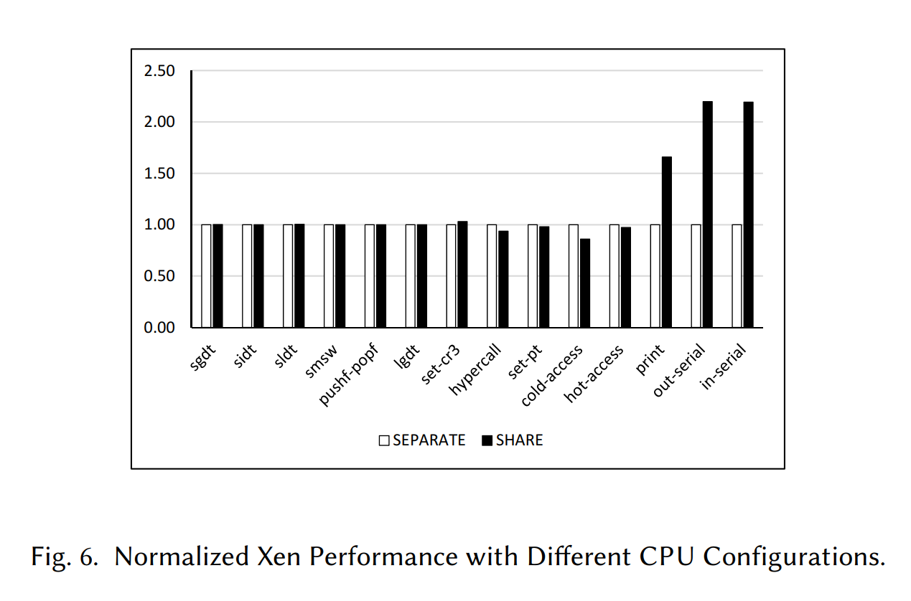

IPI是VM中的I/O驱动程序和Dom0中的QEMU之间的控制路径的一部分，这导致了大约50%的I/O基准性能下降。

### 6.4 与常规基准测试相比的优势

```c
for (int i = 0; i < 100M; i++)
    SGDT;

for (int i = 0; i < 100M; i++)
    ;
```


