[TOC]

# 摘要

许多现代的可伸缩云网络架构依赖于主机网络来实现VM网络策略。我们提出了虚拟过滤平台(VFP)，一个可编程的虚拟交换机，微软Azure的动力，Azure是一个大型公共云，它提供了这种策略。根据我们的操作经验，我们定义了可编程虚拟交换机的几个主要目标，包括支持多个独立的网络控制器、基于连接而非仅基于数据包的策略、高效的缓存和分类算法，以及高效地将流策略转移到可编程nic，并演示VFP如何实现这些目标。VFP已经部署在运行IaaS和PaaS工作负载的>1M主机上4年多了。我们介绍了VFP及其API的设计、用于流处理的流语言和编译器、性能结果以及在Azure中部署和使用VFP的多年经验。

# 1 引言

公共云计算工作量的增加，比如亚马逊Web服务、微软Azure和谷歌云平台[13-15]创建了一个新的数据中心计算规模，供应商定期报告的服务器数量为数百万。这些供应商不仅要提供规模和高密度/高性能虚拟机(vm)提供给客户，如具有客户提供的地址空间的私有虚拟网络、可伸缩的L4负载平衡器、安全组和acl、虚拟路由表、带宽计量、QoS等。

该策略非常复杂，通常无法在传统的核心路由器和硬件上大规模经济地实现。相反，一种常用的方法是在软件中实现该策略VM主机，在虚拟交换机(vswitch)连接虚拟机到网络，它可以很好地扩展服务器的数量，并允许物理网络变得简单、可伸缩和非常快。由于该模型将主机上的集中控制平面与数据平面分离，因此被广泛认为是软件定义的一个例子
网络(SDN)——特别是，基于主机的SDN。

作为一家大型的公共云提供商，Azure已经在基于主机的SDN技术上构建了自己的云网络，使用它们来实现我们提供的几乎所有虚拟网络功能。近年来，围绕SDN的关注主要集中在构建可伸缩、灵活的网络控制器和服务上，这一点至关重要。然而，可编程vswitch的设计同样重要。具有高性能和低开销，这是一个高度可编程的数据平面的双重且常常相互冲突的需求，因为云工作负载是对成本和性能敏感的。在本文中，我们介绍了虚拟过滤平台，或VFP——我们的云级虚拟交换机，它运行在我们所有的主机上。V**FP之所以这样命名，是因为它充当VM中每个虚拟网卡的过滤引擎，允许控制器对它们的SDN策略进行编程**。我们的目标是展示我们的设计和在生产上大规模运行VFP的经验，以及我们得到的教训。

## 1.1 相关工作

# 2 设计目标和原理

最初，我们在Windows’s Hyper-V hypervisor上为每个主机功能构建过滤驱动（Filter Driver），并把它们捆绑成一个vswitch，这样的驱动有：

- 用于ACL的有状态防火墙驱动
- 用于VL2 VNET的隧道驱动
- 用于Ananta负载均衡的NAT驱动
- QoS驱动等

在2011年，我们决定创建VFP。我们创建了一个基于Match-Action Table (MAT)模型的平台，OpenFlow等项目推广了这种模型。

## 2.1 最初的目标

1. 提供一个编程模型，允许多个独立的网络控制器同时对网络应用程序进行编程，最小化跨控制器的依赖性
2. 提供一个MAT编程模型，该模型能够使用连接作为基本元素，而不仅仅是包——有状态规则作为第一类对象。OpenFlow假定了包的分类必须是无状态的，但是我们发现我们的控制器需要连接层面的策略，而不仅仅是包层面。
3. 提供一个编程模型，允许控制器定义自己的策略和动作，而不是为预定义的场景实现固定的网络策略集。我们倾向于将所有功能都建立在MAT模型的基础上，尝试将尽可能多的逻辑推入控制器，而将核心数据平面留在vswitch中，我们发现，这大大减少了每次VNET定义更改时持续扩展dataplane的需要。

## 2.2 基于生产学习到的目标

基于VFP初始部署后的经验教训，2013-14 在升级中，加入了关于可服务性和性能的目标：

4. 供一个可服务性模型，允许频繁的部署和更新，而不需要重新引导或中断有状态流的VM连接，以及强大的服务监控
5. 通过广泛的缓存，即使有大量的表和规则，也可以提供非常高的包速率。随着流表以及流表中规则的增加，性能可能会下降，因为包必须遍历每个流表。我们需要找到一种方法，在不影响性能的情况下扩展到更多的策略。因此我们得出结论，需要对流动作进行编译并使用扩展的流缓存。这样现有流中的包会匹配预编译的动作而不需要遍历表。提供一种快速包分类算法，适用于规则和表数量较多的情况。在解决目标#5的同时，显著提高了现有流（如跟随在一个SYN包后的TCP包）的性能。
6. 在无需复杂规则处理的情况下，实现一种高效的机制来将流程策略卸载到可编程的nic。**当我们扩展到40G+ nic时，我们希望将策略转移到nic本身以支持SR-IOV**。让nic直接向VMs发送数据包的同时，应用相关的VFP策略。然而，由于控制器使用更多的规则创建了更多的流表，我们得出的结论是，直接卸载这些表将需要非常昂贵的硬件资源，因此，与其尝试卸载分类操作，我们想要一个能够很好地与我们预编译的精确匹配流一起工作的卸载模型，它只要求硬件支持访问DRAM中一个大的缓存流表，并支持我们关联的动作语言。

## 2.3 Non-Goals 

以下是我们在其他项目中看到的目标，基于我们的经验，我们选择不去追求：

1. 提供跨平台可移植性：我们完全在一个主机操作系统上运行，所以这不是我们的目标
2. 支持与VFP本身绑定的网络/远程配置协议：
3. 提供一套机制来检测或防止控制器编写冲突的策略：代表VM编程VFP是一种受保护的操作，只有我们的控制器才能执行，所以我们不担心恶意控制器。相反，我们关注于帮助开发人员验证他们的策略以及与其他策略的交互的工具

# 3 概览和比较

## 3.1 现有方案：OVS

- OVS本身并不支持真正独立的多控制器模型
- OVS本身并不支持像MAT模型中的NAT一样的有状态操作
- OVS的VTEP模式需要显式的通道接口来实现vl2风格的vnet，而不是允许控制器指定自己的encap / decap操作

## 3.2 VFP设计

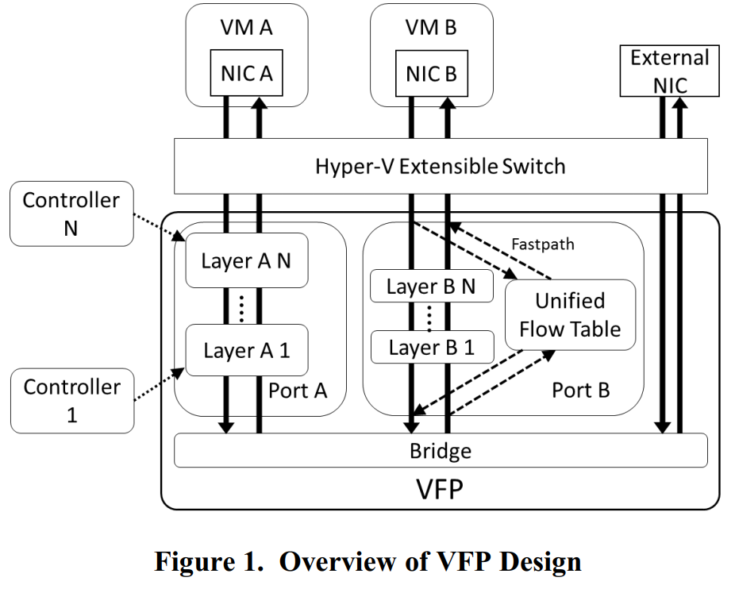

Match-Action Table (MAT) 

# 4 Filtering Model 

VFP通过MAT流表策略过滤操作系统中的数据包。

## 4.1 Ports and NICs 

核心VFP模型假设一个交换机具有多个连接到虚拟nic的端口。VFP过滤从VNIC到交换机的流量，以及从交换机到VNIC的流量。所有的VFP策略都附加到一个特定的端口。从VM的角度来看，进入交换机的流量是outbound的，从交换机出来到VM的流量的inbound的。VFP API及其策略是基于inbound/outbound模型。这个接口同时支持Hyper-V开关和本机主机的过滤器，如图2所示：

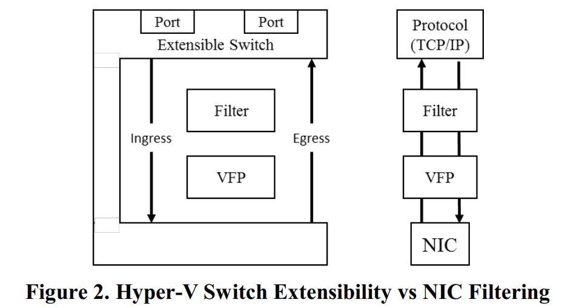

## 4.2 Hyper-V Switch Extensibility 

Hyper-V包括一个基本的vswitch[28]来桥接vnic到一个物理网卡。该开关是可扩展的，允许过滤器插入并过滤进出vnic的流量。

# 5 编程模型

VFP的核心编程模型基于VFP对象的层次结构，控制器可以创建并编程来指定它们的SDN策略。这些对象是：

- Ports: VFP策略过滤的基本单元
- Layers : 包含MAT策略的有状态流表
- Groups : 在一个层中管理和控制相关规则组的实体
- Rules : 匹配操作表条目本身

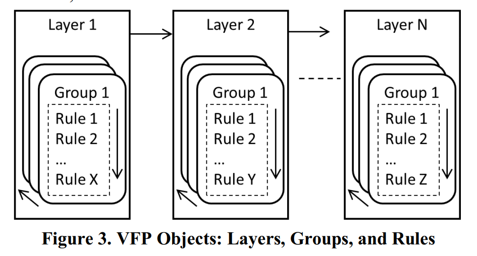

## 5.1 Ports

VFP的策略是在每个端口的基础上实现的，每个端口都有匹配操作表，这些操作表可以位于端口的入站或出站路径上，充当过滤器。因为我**们的控制器通常希望为了VM或VNIC来编写策略**，这种干净的端口分离允许控制器独立地管理不同vm上的策略，并且仅在需要的端口上实例化和管理流表。例如，虚拟网络中的VM可能有一些表来将流量封装和封装到隧道中，而虚拟网络中的另一个VM则不需要这些表。

所有对象都使用优先级值进行编程，按照优先级值的顺序通过规则匹配进行处理。

## 5.2 Layers

VFP将一个端口的策略划分为几层。**层是控制器用来指定其策略的基本匹配操作表**。每个层包含入站和出站规则和策略，它们可以过滤和修改数据包。从逻辑上讲，数据包逐个通过每一层，根据包的状态匹配每一层的规则。控制器可以在一个端口的管道中指定其层相对于其他层的顺序，并在操作期间动态地创建和销毁层。

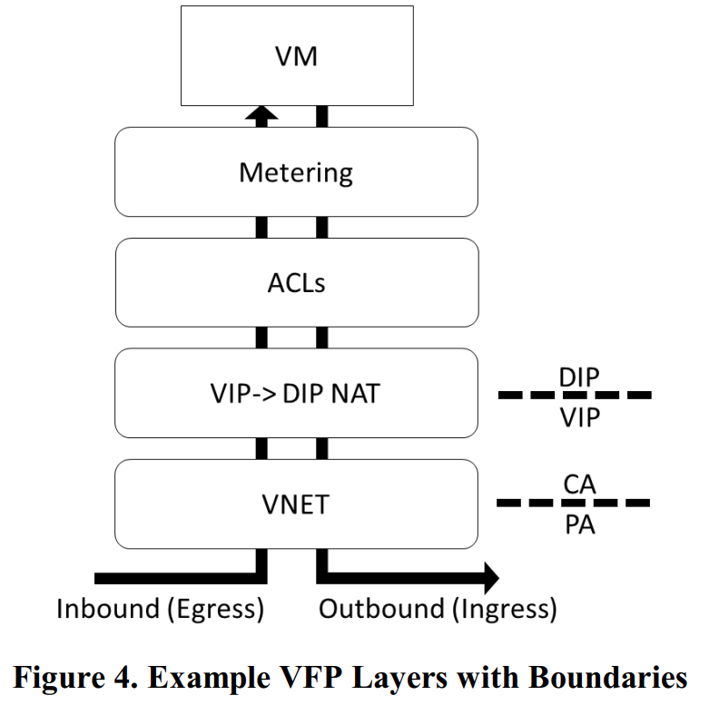

重要的是，数据包在入站时的顺序与出站时相反。

分层还为我们提供了实现有状态策略的良好模型。在匹配有状态规则时，它在层流表中创建入站和出站流，其中规则方向的流具有规则的操作，而相反方向的流执行相反的操作，以维护分层。这些入站流和出站流被认为是成对的——它们的操作只是将包更改为对中相反流的状态，而不是携带它们自己的操作上下文。

当处理数据包时，VFP在每一层中搜索一条规则来匹配，然后对包执行该规则的操作——**在给定的层中，只有一条规则可以匹配给定的包(忽略其他低优先级匹配规则)**。

## 5.3 规则

规则是对MAT模型中匹配的包执行操作的实体。规则由两部分组成:条件列表和Action。

### 5.3.1 条件列表

当VFPAPI客户机对规则进行编程时，它提供一个带有条件列表的描述符。条件有一个类型(如源IP地址)和一个匹配值列表(每个值可以是单例、范围或前缀)。对于要匹配信息包的条件，任何匹配的值都可以匹配(OR子句)。对于要匹配的规则，规则中的所有条件都要匹配(an和子句)

### 5.3.2 Actions

Action包含一个类型以及该类型执行规则所需的数据。action接口是可扩展的——图6中列出了示例条件和操作。

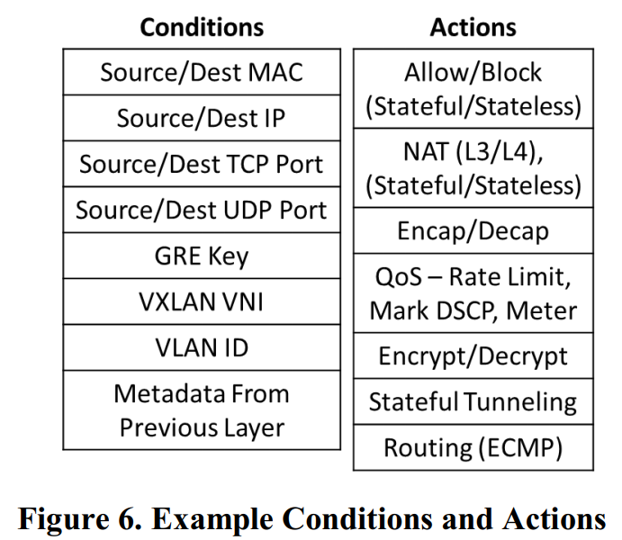

### 5.3.3 用户定义的Action

除了我们已经创建的大量动作外，允许控制器创建它们自己的规则类型

## 5.4 Group

出于管理目的，将层上的规则组织为逻辑组。VFP遍历一个层中的组，以找到每个组中与数据包匹配的最高优先级规则。默认情况下，VFP将选择列表中最后一个组匹配的规则。一个规则可以标记为“terminating”，这意味着如果它曾经匹配，它将立即被应用，而不需要再遍历更多的组。组可以具有与规则类似的条件—如果组的条件不匹配，VFP将跳过它

## 5.5 Resoures

MATs是一个很好的一般网络策略编程模型，但它们本身并不适合所有场景，特别是有异常事件的场景。

### 5.5.1 事件处理/查找

# 6 包处理器和流编译器

我们在不丧失VFPAPI灵活性和可编程性的情况下改进性能的工作如下所述：

## 6.1 元数据流水线模型

解析来自包的相关元数据并对元数据(而不是包)进行操作，只在做出所有决定后在管道的末端接触包。

### 6.1.1 Unified FlowID 

Unified FlowID (UFID)  是解析器的输出，由多个FlowID组成，FlowID由一个head group中的字段形成。一个header group是由一个L2/L3/L4头信息形成的（如表1所示）。

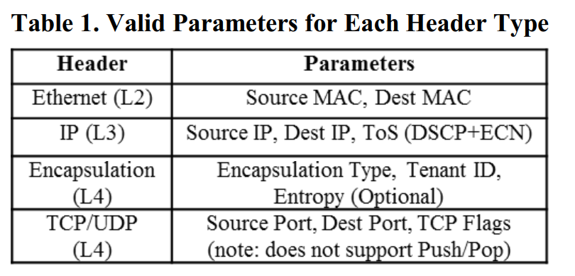

### 6.1.2 Header Transpositions 

我们的行动原语叫Header Transpositions (HTs) ，之所以这么叫，是因为它们在整个数据包中变换字段。行动元语是一个可参数化的header动作，每个原语作用于一个header上。HT中的操作被分组到header group里。

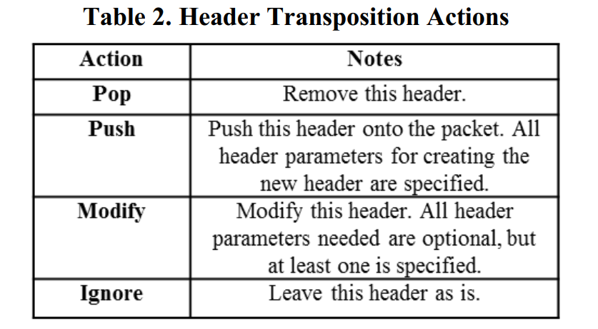

表3显示了被Ananta使用的NAT HT例子，以及被VL2用到的encap/decap。

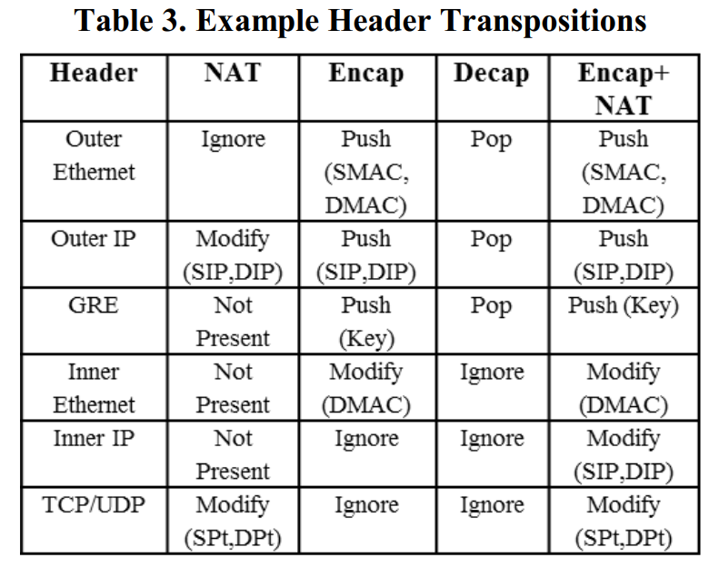

### 6.1.3 转换引擎

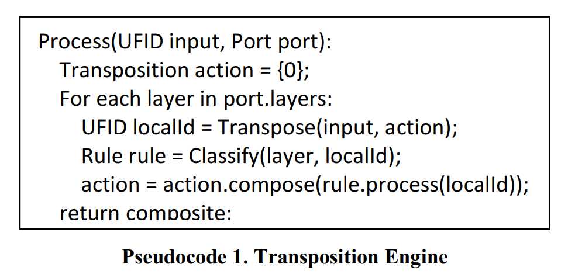

### 6.1.4 Unified Flow Tables and Caching 

们的流编译器背后的直觉是，UFID的操作在流的生命周期内是相对稳定的——所以我们可以把UFID和引擎产生的HT缓存起来。

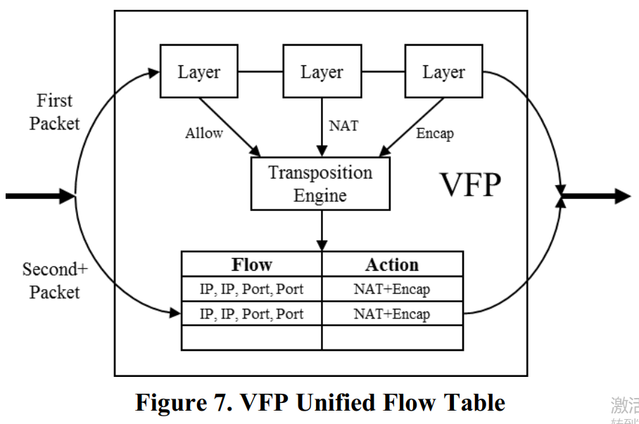

使用UFT，我们将数据路径分成快路径和慢路径。在TCP流的第一个包上，我们采用慢路径，运行换位引擎，并在每一层根据规则进行匹配。在随后的数据包中，VFP采用快速路径，通过UFID匹配一个统一的流，并直接应用一个HT。该操作独立于VFP中的层或规则。

## 6.3 Flow Reconciliation 

协调引擎在每个端口上维护一个全局generation号。当UF被创建时，它被标记为创建时的当前generation号。在策略更新时，将增加端口generation。VFP实现了延迟调节，只有当UF的generation小于端口当前的generation时，才会调节UF。The UF
is then simulated against the current rules on the port,
by running its UFID through the transposition engine,
and determining if the resulting HT has changed 

## 6.4 流状态追踪

# 7 交换模型

除了SDN过滤之外，VFP还将流量转发到端口。VFP的转发平面描述如下。

## 7.1 包转发

VFP还支持vm的动态迁移。在这种情况下，在迁移的VM中断期间，端口状态从原来的主机序列化，并在新主机上反序列化。VFP策略/规则由所有VFPAPI客户机根据迁移中可能更改的策略(如VM物理地址)在新主机上更新。

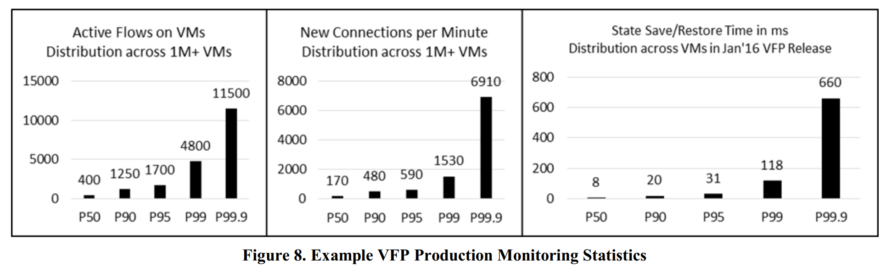

# 9 Hardware Offloads and Performance 

解析器解析包的头部信息得到UFID， 根据UFID去匹配每一个layer的规则，Transposition Engine把匹配到的所有规则对应的HT组合起来

Unified Flow Table (UFT) ：缓存了UFID和引擎产生的HT

State Save/Restore  （SSR） 