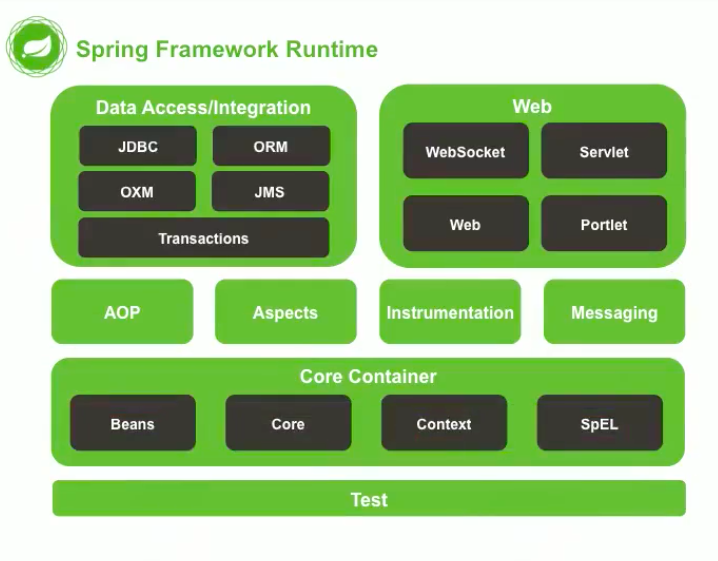

[TOC]

# Mybatis

## 核心步骤

1. SqlSessionFactoryBuilder接收一个XML配置文件流，构建出一个SqlSessionFactory
2. SqlSessionFactory通过配置文件中的数据库连接和mapper映射信息，生产出真正操作数据库的SqlSession对象

# Spring

Spring核心架构图：

Spring的核心容器(Core Container，ApplicationContext对象)是Spring的核心，用来创建和存放xml配置的对象，是IoC思想的体现。

ApplicationContext是个接口，有以下几个常用的实现类：

- ClassPathXmlApplicationContext：加载类路径下的配置文件，要求配置文件必须在类路径下（常用）
- FileSystemXmlApplicationContext：加载磁盘任意路径下的配置文件(必须有访问权限）

ApplicationContext在创建的时候就把所有对象加载起来，适合单例对象，默认情况下bean对象也是单例的。单例对象的生命周期和容器相同，多例对象的生命周期在使用时开始，到用完被GC回收结束。

## bean

我们可以从bean标签上的属性来知道Spring容器支持什么样的操作。

- class: 对象的全限定名
- id: 对象的唯一标识符
- scope: 对象的生命周期，默认是单例模式
- init-method: 对象创建完后的初始化方法
- destroy-method: 销毁对象时调用的方法

子标签：

- constructor-arg: 指定构造方法的参数
  - value:  指定基本数据类型或String的值
  - ref:  指定引用类型的bean对象id，以上二选一
  - name: 参数名（常用）
  - index: 参数的索引
  - type:  参数的类型，以上三选一

- property: 调用set方法为对象设置属性
  - name: 调用setXXX方法设置属性，XXX为name的值第一个字母大写
  - value/ref: 要设置的值
  - 集合属性需要使用子标签：
    -  array
    - set
    - list: 用于设置list集合，以上三选一，没有区别
    - map
    - props: 用于设置Map和Properties对象，以上二选一，没有区别

## 注解

使用注解需要在bean.xml配置扫描范围。

### Component

生命该类的对象要被放到Spring容器里面，默认的bean ID为类名首字母小写

- value:  显式指定bean的名字

#### Autowired

  标记在类的成员变量上，自动从bean容器中找到合适的对象注入到该变量上（传说中的依赖注入）

### Controller

一般用于表现层

### Service

一般用于业务层

### Repository

一般用于持久层

### Resource

用于指定bean id 注入

### Value

用于注入基本数据类型。集合数据类型只能通过xml注入