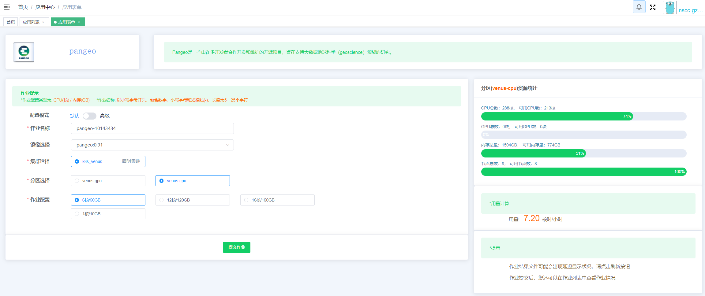
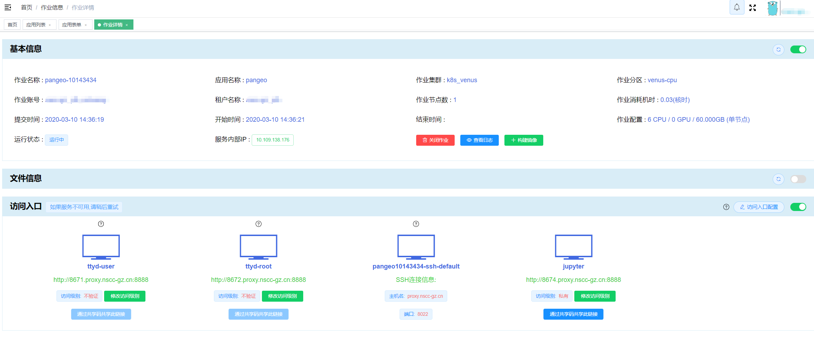
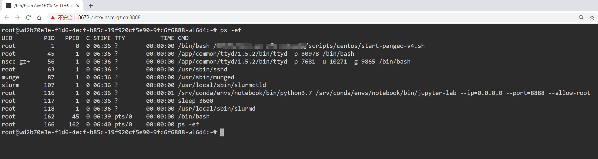
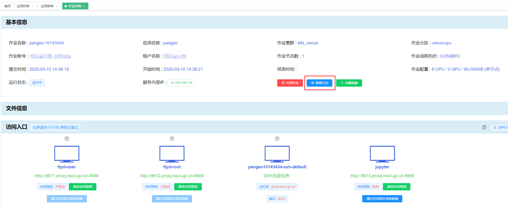
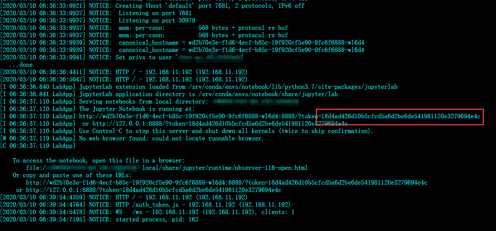
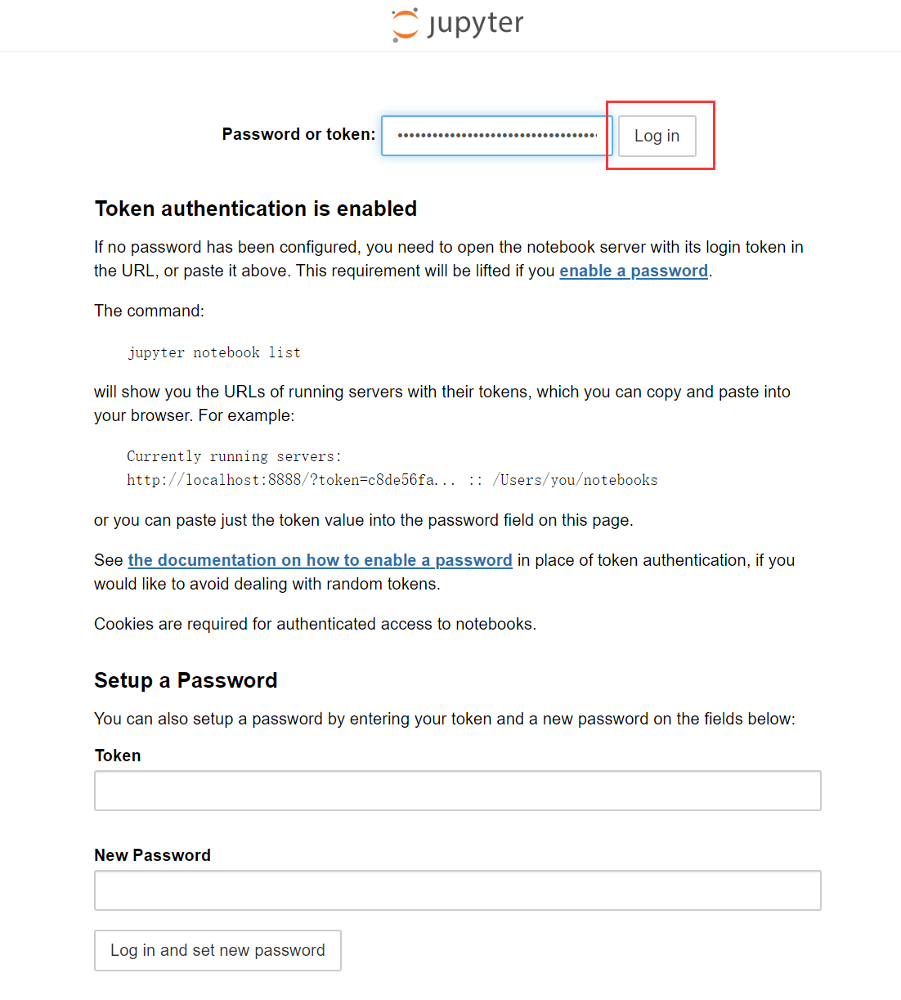

[TOC]

## 简介

Pangeo是一个由许多开发者合作开发和维护的开源项目，旨在支持大数据地球科学（geoscience）领域的研究。Pangeo构建了一个围绕海洋/大气/陆地/气候科学的开源科学python生态系统，促进该领域研究者进行合作。目前Pangeo项目中已经集成了众多支持地球科学领域进行数据分析、计算、可视化的相关工具，并且仍在不断完善中，这些工具具有很强的扩展性，以便支持研究者在HPC和云平台上处理PB级的数据集。


## Pangeo应用创建步骤

和星光上的其他应用类似，首先在“应用列表”中找到Pangeo应用，点击进入“应用表单”填写相应的信息（主要是分区选择和作业配置）后，点击“提交作业”按钮即可提交作业到系统中运行：



提交成功后自动进入作业详情界面：



点击上图访问入口中的“ttyd-root”访问入口可以以root身份进入到应用的容器环境中：



## 通过Jupyter访问应用

点击“jupyter”访问入口：


使用jupyter登录需要token信息，token信息需要到“基本信息”的“查看日志”中查看：



点击“查看日志”按钮，把日志拉到最后，可看见类似下面的token信息：



在Jupyter中将token输入后点击“登录”按钮：



出现类似以下界面则表明登录成功：


## Pangeo使用示例

### 使用模拟数据集

Pangeo主要用于地球科学领域的大数据分析、计算和可视化，数据集往往非常大（TB级以上），为了快速体验Pangeo的使用和测试相关API的功能，我们可以使用程序生成的模拟数据集来进行，以下是一个Demo程序，可以直接在Jupyter将代码一行一行输入执行。

```python
###### 生成模拟数据集 ######
import dask.array as da
import xarray as xr
import xarray.ufuncs as xu
dask_array = da.random.random((100000, 100000), chunks=(1000, 1000)) # 生成一个100000*100000的float类型二维dask数组， 数据量大约80G左右
dask_array # 查看生成数组的信息
xr_array = xr.DataArray(dask_array, dims=('x','y')) 
ds = xr_array.to_dataset(name="foo") # 这两行使用dask数组的数据创建出一个xarray的数据集（DataSet）

###### 创建用于数据分析计算的dask集群 ######
from dask_jobqueue import SLURMCluster
from dask.distributed import Client
# cores和memory属性指定了dask集群中每个worker节点的CPU和内存配置
cluster = SLURMCluster(cores=1,
                       processes=1,
                       memory="10G",
                       project="woodshole",
                       walltime="01:00:00",
                       queue="debug")
# 将dask集群的worker节点规模扩大至5个，dask集群将使用5*1=5个CPU核，5*10=50G内存，注意不要超过可用的资源，如创建应用时选择的作业配置是6核/60G，那么将worker节点扩大至6个以上时则超出了可用资源
# 此时在容器里执行squeue命令可以看到slurm集群上运行的5个dask worker节点
cluster.scale(5)
client = Client(cluster) # 创建一个客户端连上集群，后续的数据计算任务会被调度到集群上进行分布式的并行计算

###### 执行数据计算操作 ######
# 执行计算：exp为求自然常数e的n次方，sum为求和
# 该操作为计算密集操作，数据会被调度到dask集群上进行
# 可以在容器中执行top命令查看CPU的使用
# persist命令为异步计算命令，会马上返回
# 其他常用数据计算的使用可以参考API文档： http://xarray.pydata.org/en/stable/api.html#universal-functions
result = xu.exp(ds).sum().persist()            
result.load() # 查看结果，在本例中可能需要1分钟左右才能算出结果
                  
###### 删除dask集群，释放占用的资源 ###### 
client.close()
cluster.close()
```

在notebook上跑上述示例程序的效果类似下图：


在进行数据计算时可以在容器内查看CPU的使用情况：


### 使用真实数据集

本节使用了一个美国气温和降水预测的数据集，完整数据集约有5TB，下载地址： https://www.earthsystemgrid.org/dataset/gridded_precip_and_temp.html 。为了方便起见，本节只使用了该数据集的一小部分，下载地址：http://47.113.94.144/dataset/conus_daily_eighth_19800101_19801231_001.nc4 ，数据集文件大小约225MB，下载到工作目录下即可使用，以下为本示例程序的代码，可在notebook上执行：

```python
import numpy as np
import xarray as xr
import matplotlib.pyplot as plt

# 打开数据集，确保数据集conus_daily_eighth_19800101_19801231_001.nc4在jupyter当前工作目录下
ds = xr.open_mfdataset('conus_daily_eighth_19800101_19801231_001.nc4',
                       engine='netcdf4', 
                       concat_dim='ensemble', 
                       chunks={'time': 366}, 
                       combine='by_coords')
print('ds size in MB {:0.2f}\n'.format(ds.nbytes / 1e6)) # 查看一下数据集大小
ds.info() # 查看数据集的变量和属性

# 将数据集中的海拔高度信息绘制出来
ds['elevation'].plot()
plt.title('elevation')

# 计算所有时间内气温的平均值
# 由于数据量不大，此步骤耗时并不多，这里忽略了dask集群的创建，直接使用单个进程即可很快得到结果
# 若使用完整数据集，则需要使用集群来进行计算，集群的创建参考上一节“使用模拟数据集”
da_mean = ds['t_mean'].mean(dim='time').compute() 
da_mean.plot() # 将计算出来的平均气温信息绘制出来
```

在Jupyter上执行上述程序的效果类似下图：


