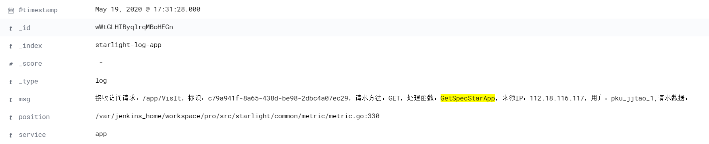
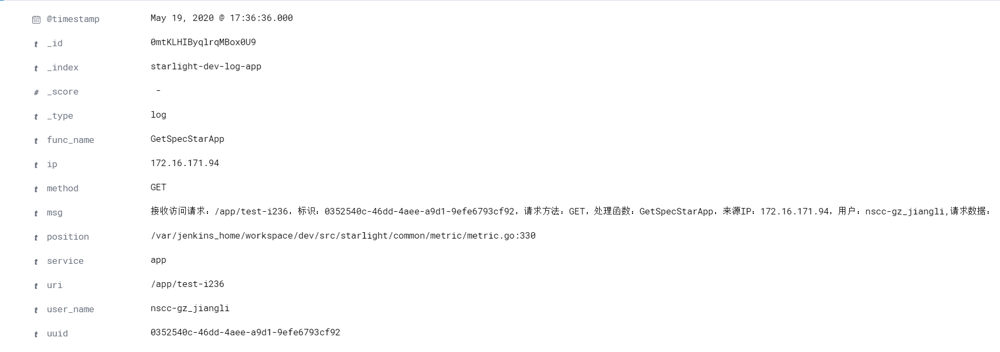

ElasticSearch的pipeline功能可以对写入到es的原始字符串进行一些处理，其中grok processor可以使用正则表达式从原始字符串中提取关键信息，并将这些信息保存到指定字段中，我们可以使用grok来将写入到es的非结构化日志转成结构化的日志，方便在kibana查看。

目前，星光日志使用"starlight"这个pipeline对日志进行处理，可以在kibana的dev tools中使用命令` GET _ingest/pipeline/starlight`查看该pipeline的信息：

```json
{
  "starlight" : {
    "description" : "starlight",
    "processors" : [
      {
        "grok" : {
          "field" : "msg",
          "patterns" : [
            "接收访问请求：%{NOTSPACE:uri}，标识：%{NOTSPACE:uuid}，请求方法：%{NOTSPACE:method}，处理函数：%{NOTSPACE:func_name}，来源IP：%{NOTSPACE:ip}，用户：%{NOTSPACE:user_name},请求数据：",
            "响应访问请求：%{NOTSPACE:uri}，标识：%{NOTSPACE:uuid}，请求方法：%{NOTSPACE:method}，处理函数：%{NOTSPACE:func_name}，来源IP：%{NOTSPACE:ip}，用户：%{NOTSPACE:user_name}，请求数据：%{GREEDYDATA:input}，请求结果：{{%{NOTSPACE} %{NOTSPACE:code}  %{NOTSPACE:kind} %{NOTSPACE:other} %{GREEDYDATA:spec}}，耗时：%{SECOND:duration}s，错误信息：\n%{MILTI_LINE_TEXT:err}",
            "%{MILTI_LINE_TEXT:msg}"
          ],
          "pattern_definitions" : {
            "MILTI_LINE_TEXT" : """(.*
)*"""
          }
        }
      }
    ]
  }
}

```


该pipeline的创建语句为：

```shell
PUT _ingest/pipeline/starlight
{
  "description" : "starlight",
  "processors" : [ 
    {
      "grok": {
        "field": "msg",
        "patterns": ["接收访问请求：%{NOTSPACE:uri}，标识：%{NOTSPACE:uuid}，请求方法：%{NOTSPACE:method}，处理函数：%{NOTSPACE:func_name}，来源IP：%{NOTSPACE:ip}，用户：%{NOTSPACE:user_name},请求数据：","响应访问请求：%{NOTSPACE:uri}，标识：%{NOTSPACE:uuid}，请求方法：%{NOTSPACE:method}，处理函数：%{NOTSPACE:func_name}，来源IP：%{NOTSPACE:ip}，用户：%{NOTSPACE:user_name}，请求数据：%{GREEDYDATA:input}，请求结果：{{%{NOTSPACE} %{NOTSPACE:code}  %{NOTSPACE:kind} %{NOTSPACE:other} %{GREEDYDATA:spec}}，耗时：%{SECOND:duration}s，错误信息：\n%{MILTI_LINE_TEXT:err}","%{MILTI_LINE_TEXT:msg}"
        ],
        "pattern_definitions" : { 
          "MILTI_LINE_TEXT" : "(.*\n)*"
      	}
      }
    }
  ]
}
```

其中，field表示报存原始日志信息的字段，patterns为处理日志规则，可以有多条，pattern_definitions为自定义的正则匹配规则。目前一共有3条。

第1条为：

```shell
"接收访问请求：%{NOTSPACE:uri}，标识：%{NOTSPACE:uuid}，请求方法：%{NOTSPACE:method}，处理函数：%{NOTSPACE:func_name}，来源IP：%{NOTSPACE:ip}，用户：%{NOTSPACE:user_name},请求数据："
```

用于把旧框架中请求开始时打印的日志信息结构化到url、uuid、method、func_name、ip、user_name字段中。结构化前的日志类似于：



结构化后的日志类似于：



第2条为：

```shell
"响应访问请求：%{NOTSPACE:uri}，标识：%{NOTSPACE:uuid}，请求方法：%{NOTSPACE:method}，处理函数：%{NOTSPACE:func_name}，来源IP：%{NOTSPACE:ip}，用户：%{NOTSPACE:user_name}，请求数据：%{GREEDYDATA:input}，请求结果：{{%{NOTSPACE} %{NOTSPACE:code}  %{NOTSPACE:kind} %{NOTSPACE:other} %{GREEDYDATA:spec}}，耗时：%{SECOND:duration}s，错误信息：\n%{MILTI_LINE_TEXT:err}"
```

用于把旧框架的响应日志格式化到url、uuid、method、func_name、ip、user_name、code等字段中

第3条为：

```shell
"%{MILTI_LINE_TEXT:msg}"
```

用于匹配上述规则都不匹配的日志，这些日志按照原来的样子输出。


## 内置的正则匹配规则

https://github.com/elastic/elasticsearch/blob/7.7/libs/grok/src/main/resources/patterns/grok-patterns


## 自定义正则匹配规则


