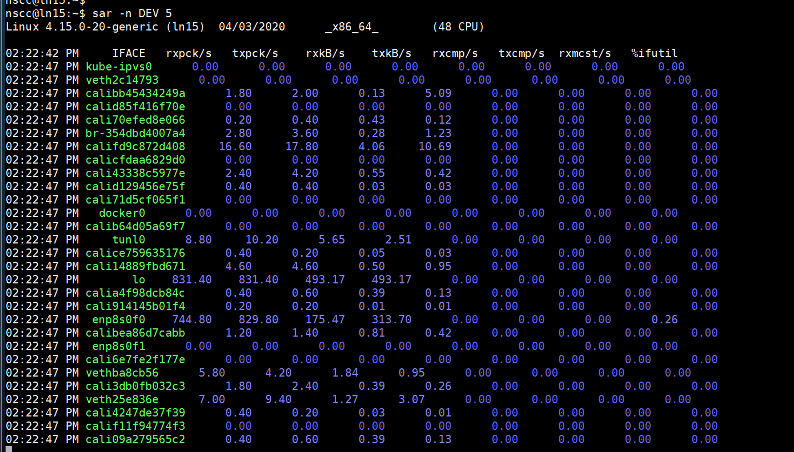
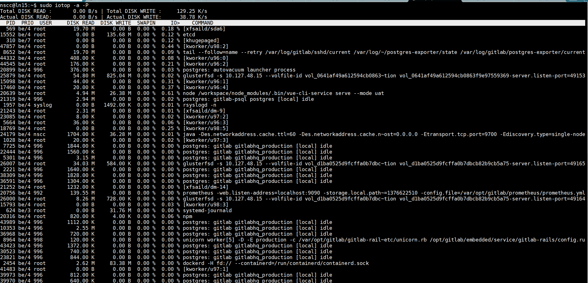

应该是IO瓶颈，没有做raid阵列

#### 网络



enp8s0f0(10.127.48.15)平均几百KB每秒





## IO性能测试

```shell


# sda读写都有300+MB/s
nscc@ln15:~/tmp$ sudo dd if=/dev/zero bs=1024 count=1000000 of=1Gb.file
记录了1000000+0 的读入
记录了1000000+0 的写出
1024000000 bytes (1.0 GB, 977 MiB) copied, 2.774 s, 369 MB/s
nscc@ln15:~/tmp$ dd if=1Gb.file bs=64k | dd of=/dev/null
记录了15625+0 的读入
记录了15625+0 的写出
1024000000 bytes (1.0 GB, 977 MiB) copied, 2.96551 s, 345 MB/s
记录了2000000+0 的读入
记录了2000000+0 的写出
1024000000 bytes (1.0 GB, 977 MiB) copied, 2.96576 s, 345 MB/s

nscc@ln15:~/tmp$ dd if=/dev/zero bs=32k count=1000000 of=32Gb.file
记录了143034+0 的读入
记录了143034+0 的写出
4686938112 bytes (4.7 GB, 4.4 GiB) copied, 41.9929 s, 112 MB/s

# sda io负载
nscc@ln15:~/tmp$ iostat -d -h -x sda  3 3
Linux 4.15.0-20-generic (ln15)  04/10/2020      _x86_64_        (48 CPU)

Device            r/s     w/s     rkB/s     wkB/s   rrqm/s   wrqm/s  %rrqm  %wrqm r_await w_await aqu-sz rareq-sz wareq-sz  svctm  %util
sda
                 5.27   31.60     80.6k      1.2M     0.04     1.55   0.7%   4.7%   32.13   11.89   0.55    15.3k    39.8k   4.53  16.7%


```

#### fio

```shell
# 随机读
fio -name=randread -direct=1 -iodepth=64 -rw=randread -ioengine=libaio -bs=4k -size=1G -numjobs=1 -runtime=1000 -group_reporting -filename=/dev/sda
Run status group 0 (all jobs):
   READ: bw=1217KiB/s (1246kB/s), 1217KiB/s-1217KiB/s (1246kB/s-1246kB/s), io=300MiB (314MB), run=252081-252081msec

Disk stats (read/write):
  sda: ios=77035/9167, merge=64/471, ticks=16166680/2210852, in_queue=18379616, util=100.00%

# 随机读（对比）
Run status group 0 (all jobs):
   READ: bw=101MiB/s (105MB/s), 101MiB/s-101MiB/s (105MB/s-105MB/s), io=1024MiB (1074MB), run=10178-10178msec

Disk stats (read/write):
  sda: ios=260993/1, merge=0/0, ticks=22815/0, in_queue=22784, util=96.52%

 
# 随机写
fio -name=randwrite -direct=1 -iodepth=64 -rw=randwrite -ioengine=libaio -bs=4k -size=1G -numjobs=1 -runtime=1000 -group_reporting -filename=/dev/sda  
  Run status group 0 (all jobs):
  WRITE: bw=1187KiB/s (1216kB/s), 1187KiB/s-1187KiB/s (1216kB/s-1216kB/s), io=160MiB (168MB), run=138060-138060msec

Disk stats (read/write):
  sda: ios=337/46101, merge=20/315, ticks=44088/11128640, in_queue=11175392, util=100.00%
 
 # 随机写（和台式电脑上的虚拟机对比）
 Run status group 0 (all jobs):
  WRITE: bw=52.0MiB/s (54.5MB/s), 52.0MiB/s-52.0MiB/s (54.5MB/s-54.5MB/s), io=1024MiB (1074MB), run=19686-19686msec

Disk stats (read/write):
  sda: ios=317/259323, merge=933/1553, ticks=2112/783284, in_queue=786147, util=100.00%

# 顺序读
sudo fio -name=read -direct=1 -iodepth=64 -rw=read -ioengine=libaio -bs=4k -size=1G -numjobs=1 -runtime=1000 -group_reporting -filename=/dev/sda
Run status group 0 (all jobs):
   READ: bw=89.9MiB/s (94.3MB/s), 89.9MiB/s-89.9MiB/s (94.3MB/s-94.3MB/s), io=1024MiB (1074MB), run=11388-11388msec

Disk stats (read/write):
  sda: ios=110672/228, merge=150660/11, ticks=267336/38852, in_queue=308348, util=99.17%
```


### IO负载较高的进程

```shell
nscc@ln15:~$ sudo iotop  -P
 
15552 be/4 root        0.00 B/s   60.13 K/s  0.00 %  0.08 % etcd
 8652 be/4 root        2.86 K/s    0.00 B/s  0.00 %  0.04 % tail --follow=name --retry /var/log/gitlab/sshd~/state /var/log/gitlab/postgres-exporter/current
25879 be/4 root        5.73 K/s    0.00 B/s  0.00 %  0.02 % glusterfsd -s 10.127.48.15 --volfile-id vol_064~612594cb0863f9e97559369-server.listen-port=49153
  624 be/3 root        0.00 B/s    5.73 K/s  0.00 %  0.00 % systemd-journald
 2454 be/4 root        0.00 B/s   25.77 K/s  0.00 %  0.00 % dockerd -H fd:// --containerd=/run/containerd/containerd.sock
 21728 be/4 root        0.00 B/s   58.45 M/s  0.00 %  0.00 % rsync -av --progress /GPUFS/17620035939/starlight/weixin.m~4_enterprise.iso /GPUFS/17620035939/starlight/weixin.ms/api
 
 # 进程操作的文件
sudo opensnoop-bpfcc -p 25879
/var/lib/heketi/mounts/vg_7fcc41ee8843a4b07a08d9d548c989ce/brick_1852a9ec75c6feb85ae3f38221dd96ed/brick/gitlab/git-data/repositories/starlight/

 sudo opensnoop-bpfcc -p 8652
 /var/log/gitlab/*

# IO负载
nscc@ln15:~$  iostat -d /dev/sda -x 3
Linux 4.15.0-20-generic (ln15)  04/10/2020      _x86_64_        (48 CPU)

Device            r/s     w/s     rkB/s     wkB/s   rrqm/s   wrqm/s  %rrqm  %wrqm r_await w_await aqu-sz rareq-sz wareq-sz  svctm  %util
sda              5.39   31.65     81.96   1258.03     0.09     1.65   1.62   4.96   35.24   12.74   0.59    15.20    39.75   4.52  16.76

```


### 带宽测试

```shell
iperf3 -c 10.127.48.27 -b 1G -t 15 -P 2 -p 10000
[ ID] Interval           Transfer     Bandwidth       Retr
[  4]   0.00-15.00  sec   828 MBytes   463 Mbits/sec    0             sender
[  4]   0.00-15.00  sec   827 MBytes   463 Mbits/sec                  receiver
[  6]   0.00-15.00  sec   804 MBytes   450 Mbits/sec    0             sender
[  6]   0.00-15.00  sec   802 MBytes   448 Mbits/sec                  receiver
[SUM]   0.00-15.00  sec  1.59 GBytes   913 Mbits/sec    0             sender
[SUM]   0.00-15.00  sec  1.59 GBytes   911 Mbits/sec                  receiver
```

